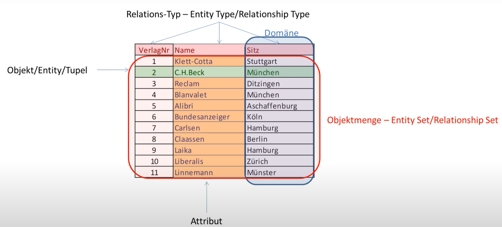

Datenbanken
===========

<!-- START doctoc generated TOC please keep comment here to allow auto update -->
<!-- DON'T EDIT THIS SECTION, INSTEAD RE-RUN doctoc TO UPDATE -->
**Inhaltsverzeichnis**

- [Grundlagen](#grundlagen)
  - [Begriffe](#begriffe)
    - [Vorteile von Datenbanken](#vorteile-von-datenbanken)
    - [Aufgaben von DBMS](#aufgaben-von-dbms)
  - [Architekturen von DBMS](#architekturen-von-dbms)
    - [Drei-Ebenen-Konzept](#drei-ebenen-konzept)
    - [Weitere Komponenten eines DBMS](#weitere-komponenten-eines-dbms)
    - [DBMS im Schichtenmodell](#dbms-im-schichtenmodell)
  - [Datenzugriffe](#datenzugriffe)
- [Datenmodelle](#datenmodelle)
  - [Hierarchisches Datenmodell](#hierarchisches-datenmodell)
    - [Datenspeicherung](#datenspeicherung)
    - [Grenzen](#grenzen)
  - [Netzwerkmodell](#netzwerkmodell)
  - [Das relationale Datenmodell](#das-relationale-datenmodell)
    - [Begriffe](#begriffe-1)
    - [Operationen](#operationen)
  - [Objektorientiertes Datenmodell](#objektorientiertes-datenmodell)
  - [Objektrelationale Systeme](#objektrelationale-systeme)
- [Sprachschnittstellen zu DBMS](#sprachschnittstellen-zu-dbms)
  - [Grundlagen von Datenmanipulations- und Abfragesprachen](#grundlagen-von-datenmanipulations--und-abfragesprachen)
    - [Relationenalgebra-Sprachen](#relationenalgebra-sprachen)
    - [Relationenkalkül-Sprachen](#relationenkalk%C3%BCl-sprachen)
    - [Abbildungsorientierte Sprachen](#abbildungsorientierte-sprachen)
    - [Grafikorientierte Sprachen](#grafikorientierte-sprachen)
  - [SQL](#sql)
    - [Überblick](#%C3%BCberblick)
      - [Namenskonventionen](#namenskonventionen)
      - [Sprachliche Unterschiede im Vergleich zur Programmiersprache C](#sprachliche-unterschiede-im-vergleich-zur-programmiersprache-c)

<!-- END doctoc generated TOC please keep comment here to allow auto update -->

# Grundlagen

## Begriffe

- **Datenbank:** Menge von Daten, die redundanzfrei unter Steuerung eines DBMS gespeichert, verwaltet und manipuliert wird
	- Modell der Informationen und Informationsstrukturen als Ausschnitt der realen Umwelt
- **Datenbank-Management-System (DBMS):** Programme die für den direkten Zugriff auf die Datenbank zugreifen und Operationen über die Daten durchführen (externe Programme greifen indirekt über DBMS zu)
- **Modell:** Abbild eines Ausschnitts der objektiven Realität (Ergebnis eines zielgerichteten Modellbildungsprozesses)
- **Datenmodell:** Modellierungsvorschrift die aus bestimmten Strukturtypen,
festen Integrationsvorschriften (Zuordnung zu Objekt- und Beziehungstypen) und Operationen
- **Schema:** formalisierte Darstellung des Modells (grafisch oder normalsprachlich) nach bestimmten Vorschriften
	- Schema-Mapping: Abbilden von Objekten eines höheren Schemas auf ein tieferes Schema
	- grafisch werden Schemata üblicherweise mittels Entity Relationship Model (ERM) dargestellt:
	- 
	- Leseregel für ERM: von links nach rechts und oben nach unten, sodass ein sinnvoller Satz gebildet werden kann

### Vorteile von Datenbanken

- Redundanzminderung
- zentrale Verwaltung (-> höhere Datensicherheit)
- Datenintegrität und Konsistenz
- Trennung von Programmen und Datenhandhabung (Datenunabhängigkeit)
	- physische Datenunabhängigkeit: Anwenderprogramme sind von der physischen Speicherung der Daten unabhängig
	- logische Datenunabhängigkeit: logische Sicht eines Programmes bleibt in der Gesamtsicht der Daten unverändert

### Aufgaben von DBMS

- Definition der eigentlichen Daten, Zugriffshilfen (bspw. Indices) und Benutzersichten (views)
- Datenmanipulation: Retrieval, Update
- Datenverwaltung: Laden und Entladen der DB, Modifizieren von Speicherstrukturen, Reorganisation
- Datensicherheit: Zugriffskontrolle, Sicherung der Integrität, Synchronisation von Mehrfachzugriffen

## Architekturen von DBMS

### Drei-Ebenen-Konzept

**Externe Ebene**

- Beschreibung der externen Sichtweise auf die Daten (unabhängig von der internen Struktur)

**Konzeptuelle Ebene**

- Informationsangebot: logische Gesamtstruktur, Eigenschaften und Beziehungen der Daten
- neutral gegenüber externen Sicht auf Daten (logische Datenunabhängigkeit)
- Standard: relationales Modell

**Interne Ebene**

- geeigneten physischen Datenstrukturen in Abhängigkeit von Realitätsmodell der konzeptionellen Ebene und hardwarespezifischen Eigenschaften (physische Datenunabhängigkeit)

### Weitere Komponenten eines DBMS

|                     | Datensystem    |                        |
|---------------------|----------------|------------------------|
| Metadatenverwaltung | Zugriffssystem | Transaktionsverwaltung |
|                     | Speichersystem |                        |

### DBMS im Schichtenmodell

- Schichtenmodell = Kommunikation direkt benachbarter Schichten über Schnittstellen
- **Datensystem:** Übersetzung und Optimierung von Anfragen externer Programme (-> Satzzugriffe)
- **Zugriffsverwaltung:** Verwaltung physischer Sätze und Zugriffspfade (-> Seitenzugriffe)
- **Speichersystem:** Puffer- und Externspeicherverwaltung (-> Daten)
- Weitere Verfeinerung des Schichtenmodells möglich

## Datenzugriffe

Ablauf zur Verarbeitung von Anfragen:

- Externes Programm stellt Anforderung (SQL) an das DBMS
- Prüfen der Anforderung (mit Beschreibungsinformationen) und Vorbereitung der Ausführung (Ausführungsplan, -optimierung)
- Anforderung der benötigten Datenblöcke
- Pufferverwaltung liest Blöcke aus dem Datenbankpuffer/vom Datenträger ein und stellt sie zur Verfügung
- Aufbereitung der Daten und Übertragung in den Speicherbereich des externen Programmes
- Meldung über Ausführung der Anforderung und Bereitstellung der Daten

# Datenmodelle

## Hierarchisches Datenmodell

- ältestes der klassischen Datenmodelle
- Grundelemente: Datensätze, die verschiedene Felder beinhalten können
- Datensätze werden zu einer Datensatzmenge hierarchisch zusammengefasst (Eltern-Kind Beziehung)
- eine ausgezeichnete Datensatzmenge als oberstes Element der Hierarchie (Wurzel)
- alle anderen Datensätze/-mengen sind Kind eines Elterndatensatzes

### Datenspeicherung

- starke Orientierung an traditionellen Dateisystemen
	- durch gleiche Größe der Sätze: schneller Zugriff durch Berechnung von Sprungadressen
- Implementation über Pointer: Elterndatensatz zeigt auf Kinderdatensätze
- Indexierung der Datensätze zur Beschleunigung

### Grenzen

- starres Datenmodell (für neue Suchmöglichkeiten müssen neue Bäume aufgenommen werden)
- keine Modellierung von n:m Beziehungen in einer Baumstruktur möglich (nur mit Redundanzen)

## Netzwerkmodell

- Grundlage: Datensatz- und Datenmengentypen
	- ein Datensatztyp umfasst Datensätze gleicher Struktur mit mehrwertigen Attributen
	- Mengentypen dienen Darstellung von 1:N Beziehungen, sind benannt und enthalten sortierte Elemente
- setzt keine strenge Hierarchie voraus, erlaubt Verknüpfung beliebiger Datensatztypen durch Mengentypen
- n:m Beziehungen indirekt über Hilfsdatensatztyp möglich

## Das relationale Datenmodell

- heute üblicher Standard für die Datenspeicherung
- Beziehungen zwischen Objekten werden durch deren Eigenschaftsausprägungen dargestellt (flexibler als Zeiger)
- Speicherung von Daten in einfacher Tabellenform (ohne mengenwertige oder zusammengesetzte Attribute)
- Zeilen -> Objekte, Spalten -> Eigenschaften der Objekte
- Reihenfolge der Attribute, Tupel einer Tabelle sind nicht vorgeschrieben
- Tabellen können ungeordnete Folgen von Datensätzen abbilden
- Indexierung bestimmter Attribute zur Beschleunigung von Suchoperationen

**Mathematische Definition einer Relation**

- Relation zwischen zwei Mengen A und B ist eine Teilmenge des kartesischen
Produkts von A und B

$$R \subset A \times B$$

### Begriffe

- ein Objekt hat bestimmte Merkmale (Attribute)
- es existieren Beziehungen zwischen diesen Objekten
- diese Beziehungen haben wiederum bestimmte Merkmale
- Der Wertebereich eines Attributs wird als Domäne bezeichnet
- **Entität:** bestimmte Kombination von Attributwerten für ein Objekt
- **Klassenbildung:** Zusammenfassen mehrerer Entities zu einem Entitätstyp
- **Entitätsmenge:** Menge der Entities die durch einen Entity-Typ beschrieben werden
- **Beziehungstypen:** Verallgemeinerung von Beziehungen zwischen Objekten (Entitäten)
- **Datenintegrität:** "Makelosigkeit" der Daten



### Operationen

- **Selektion:** Auswählen von Zeilen eines Datensatzes, die eine bestimmte Bedingung erfüllen
- **Projektion:** Auswahl bestimmter Felder eines Datensatzes
- **Join:** Verbinden zweier Datensätze

## Objektorientiertes Datenmodell

- objektorientierte Datenbanksysteme bestehen aus einer Sammlung von Objekten
- Objekte besitzen eindeutige unveränderliche Identifikatoren
- Objekte können Attribute und weitere Objekte beinhalten (= komplexe Objekte)
- Aufwendige Verbundoperationen wie in relationalen Datenbanken entfallen
- Optimierung der Objekte auf die auf sie anzuwendenden Operationen (Widerspruch der Datenunabhängigkeit)
- Erfassung von mehr Semantik im Vergleich zu traditionellen Datenmodellen
- Kriterien für Objektorientierte DBMS: komplexe Objekte, Sicherstellung der Objektidentität, Kapselung, Klassen- und Typhierarchie, ...

## Objektrelationale Systeme

- Verknüpfung von relationalen Systemen und Objektorientierung
- Basis: zwischen relationalen und objektorientierten Modellen vorhandene Entsprechungen (Entität = Objekt, Entitätstyp = Klasse)

# Sprachschnittstellen zu DBMS

Der Zugriff auf Datenbanken erfolgt auf verschiedenen Ebenen/durch unterschiedliche Nutzergruppen:

- Endnutzer: nahezu ausschließliche Arbeit mit Datenbankinhalten unter Verwendung von Datenmanipulationsanweisungen (Datenmanipulationssprache - DML)
- Anwendungsprogrammierer: Nutzen eines breiten Spektrum an Befehlen und Funktionen in speziellen Programmiersprachen oder durch Einbettungen von Datenmanipulations- bzw. Datendefinitionsanweisungen
	- Präprozessor verarbeitet eingebettete Datenbankanweisungen in Anweisungen und Funktionsaufrufe der Trägersprache oder
	- Zugriff auf Datenbanken über Funktionsaufrufe (Datenbankanweisungen als Parameter)
- Datenbankadministratoren: Verwaltung der internen Speicherungsstrukturen mit Datendefinitionsanweisungen (Datendefinitionssprache - DDL)

## Grundlagen von Datenmanipulations- und Abfragesprachen

- **Navigierende Sprachen:** Suche nach Datensätzen (ohne Kriterien, evtl. Abbruch nach Auffinden hinreichender Datenmenge)
- **Desktiptive Sprachen:** Suche nach Daten die bestimmte Kriterien erfüllen

### Relationenalgebra-Sprachen

- **Algebra:** Lehre von Beziehungen zwischen mathematischen Größen
- Operationen (Selektion, Projektion, Join, Differenz...) werden auf Relationen durchgeführt -> Vergleichen die Werte von Attributen
- Beispiel: aus der Relation Mitarbeiter sollen diejenigen gewählt werden, die min. seit 1992 im Betrieb sind und unter 1000 Euro brutto verdienen

```js
MITARBEITER[imbetriebseit <=1992 & brutto < 1000][persnr, name, vorname]
```

### Relationenkalkül-Sprachen

- **Kalkül:** Rechenoperation, Berechnung, Überlegung
- Durchsuchen einer Zielliste mit Selektionsprädikaten
- Vertreter: QUEL (Query Language)

```js
RANGE OF m IS mitarbeiter
RETRIEVE (m.persnr,m.name,m.vorname)
WHERE m.imbetriebseit<=1992 AND m.brutto<1000
```

### Abbildungsorientierte Sprachen

- Verknüpfung von Relationenalgebra und Relationenkalkül (in Anlehnung an natürliche Sprachen)
- Basis für die heute verbreitetste Datenmanipulationssprache **S**tructured **Q**uery **L**anguage

```SQL
SELECT persnr, name, vorname FROM mitarbeiter
WHERE imbetriebseit<=1992 AND brutto<1000
```

### Grafikorientierte Sprachen

- Basis: Tabellenskelett bzw. Abfragemaske -> Eingabe von Auswahlkriterien
- Vertreter: MS Access

## SQL

### Überblick

**Datendefinitionsanweisungen (DDL)**

- `CREATE`: Anlegen von Schemaelementen (z.B. `CREATE TABLE t (id INT PRIMARY KEY, name VARCHAR NOT NULL);`)
- `ALTER`: Ändern der Eigenschaften von Schemaelementen (z.B. `ALTER TABLE t ADD column;`)
- `DROP`: Löschen von Schemaelementen (z.B. `DROP TABLE t;`)

**Datenmanipulationsanweisungen (DML)**

- `INSERT`: Einfügen von Tupeln (z.B. `INSERT INTO t(column_list) VALUES(value_list);`)
- `UPDATE`: Ändern von Attributwerten (z.B. `UPDATE t SET name = new_value;`)
- `DELETE`: Löschen von Tupeln (z.B. `DELETE FROM t WHERE condition;`)

**Datenabfrage (DQL):** `SELECT` (z.B. `SELECT * FROM t;`)

**Vergabe von Rechten und Privilegien (DCL)**

- `GRANT`: Erteilen von Rechten
- `REVOKE`: Entziehen von Rechten

**Transaktionsverwaltung (DCL)**

- `COMMIT`: erfolgreicher Transaktionsabschluss
- `REVOKE`: Transaktionsabbruch
- `BEGIN TRANSACTION`: Beginn einer Transaktionsklammer

**Verbindungsaufbau**

- `CONNECT`

#### Namenskonventionen

- Leerzeichen, Sonderzeichen, Umlaute meiden
- selbsterklärende Bezeichner verwenden
- in TSQL Bezeichner zur Begrenzung in eckigen Klammern möglich

#### Sprachliche Unterschiede im Vergleich zur Programmiersprache C

- Arrays mit runden statt eckigen Klammern
- `=` und `<>` statt `==` und `!=`
- `'string'` statt `"string"`
- `NOT, AND, OR` statt `!, &&, ||`


