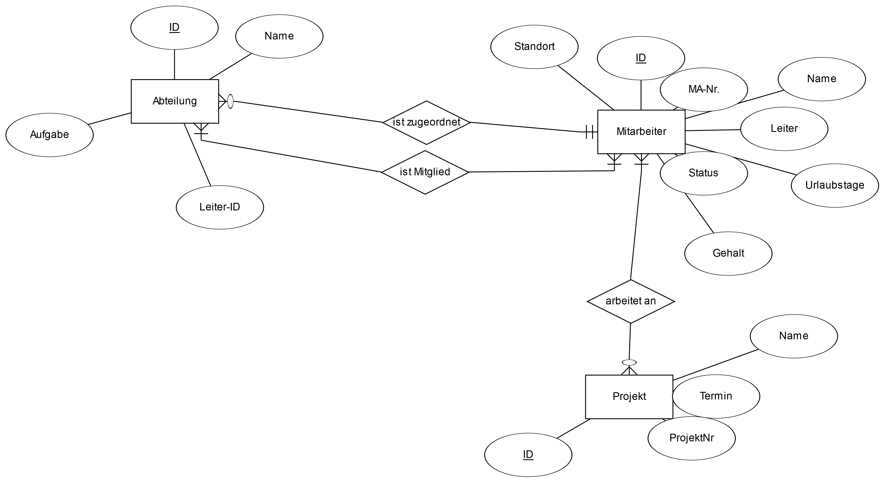
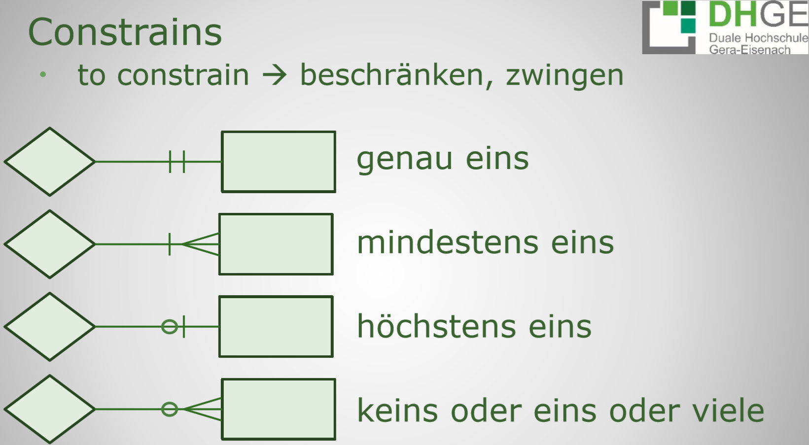
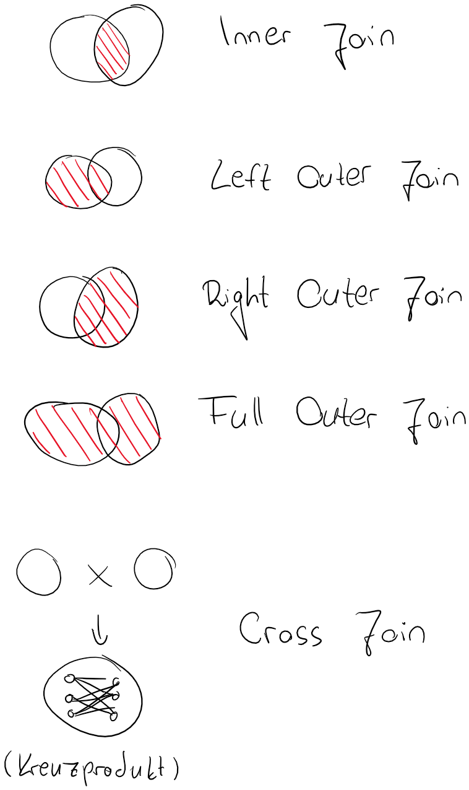

Datenbanken-Praktikum
=====================

<!-- START doctoc generated TOC please keep comment here to allow auto update -->
<!-- DON'T EDIT THIS SECTION, INSTEAD RE-RUN doctoc TO UPDATE -->
**Inhaltsverzeichnis**

- [Formen von Kundenanforderungen](#formen-von-kundenanforderungen)
- [Schematische Darstellung](#schematische-darstellung)
  - [Entity Relationship Diagramm (ERD)](#entity-relationship-diagramm-erd)
  - [Tabellenschema](#tabellenschema)
- [Constraints und Kardinalitäten](#constraints-und-kardinalit%C3%A4ten)
- [Vorgehensweise zur Modellierung einer Datenbank](#vorgehensweise-zur-modellierung-einer-datenbank)
- [Relationship-Matrix](#relationship-matrix)
- [SQL](#sql)
  - [Datenbanken](#datenbanken)
  - [Datentypen](#datentypen)
  - [Tabellen](#tabellen)
    - [Tabellen erstellen](#tabellen-erstellen)
    - [Eigenschaften für Tabellenspalten](#eigenschaften-f%C3%BCr-tabellenspalten)
    - [verändern von Tabellen](#ver%C3%A4ndern-von-tabellen)
    - [Constraints](#constraints)
  - [Daten einfügen](#daten-einf%C3%BCgen)
  - [Daten lesen](#daten-lesen)
  - [Aggregatsfunktionen](#aggregatsfunktionen)
  - [Unterabfragen](#unterabfragen)
  - [Unions](#unions)
  - [Gruppieren](#gruppieren)
  - [Joins](#joins)
  - [Daten verändern](#daten-ver%C3%A4ndern)

<!-- END doctoc generated TOC please keep comment here to allow auto update -->

<!--pagebreak-->

# Formen von Kundenanforderungen

- Kundenanforderung kann in folgenden Formen kommen:
  - ausformuliert schriftlich
    - hier ist das Datenbankmodell vorgegeben und man muss es nur noch bauen
  - in Stichpunkten
    - hier könnten Details fehlen, wodurch zusätzliche Kommunikation erforderlich sein kann
  - im Gespräch
    - Entwickler hat hier die Aufgabe, durch gezielte Fragen die wirklichen Anforderungen an das Datenbankmodell zu bestimmen
    - es kann sein, dass der Kunde selbst nicht wirklich weiß, was er haben will

# Schematische Darstellung

Folgende Darstellungen von Datenbankschemata sind am weitesten verbreitet:

Herr Grimm schlägt folgende Tools zur Modellierung vor, falls man noch eins sucht:

```txt
ERD-Tool online:
https://erdplus.com/standalone
https://app.creately.com/diagram/vHwWnnJJu2t/edit
https://cloud.smartdraw.com/ -> Google-Konto
https://app.diagrams.net/

Tabellenschema:
https://lucid.app

MS SQLServer Management Tool (SSMS):
direkter Download -> https://aka.ms/ssmsfullsetup
direkter Download deutsch -> https://go.microsoft.com/fwlink/?linkid=2146265&clcid=0x407
Info-Seite -> https://docs.microsoft.com/de-de/sql/ssms/download-sql-server-management-studio-ssms?view=sql-server-ver15
```

## Entity Relationship Diagramm (ERD)

Die Bestandteile:

<!-- width=400px -->

Beispiel-ERD:

<!-- width=400px -->

## Tabellenschema

- grafisch
  - ähnlich zum ERD sind Spalten, Beziehungen, etc. dargestellt
- ausformuliert
  - Modell im Fließtext beschrieben
  - Entwickler muss Modell also _herauslesen_

# Constraints und Kardinalitäten

- Constraints legen fest, ob eine Beziehung obligatorisch oder optional ist
- Kardinalitäten legen fest, ob eine Beziehung jeweils ein Attribut oder mehrere verbindet

| Formulierung               | Bedeutung                     |
| :------------------------- | :---------------------------- |
| genau eins                 | obligatorische Beziehung, ?:1 |
| mindestens eins            | obligatorische Beziehung, ?:n |
| höchstens eins             | optionale Beziehung, ?:1      |
| keins oder eins oder viele | optionale Beziehung, ?:n      |

<!-- width=400px -->

- im Zweifelsfall das flexiblere verwenden, für den Fall, dass sich in der Zukunft die Anforderungen ändern

# Vorgehensweise zur Modellierung einer Datenbank

Es wird folgende Reihenfolge vorgeschlagen:

- Entitäten und Attribute modellieren
- Primärschlüssel wählen
- Beziehungen modellieren
- Kardinalitäten festlegen
- Modell überprüfen

# Relationship-Matrix

- Eine Tabelle, in der Attribute und Beziehungen eingetragen werden
- hilft, einen Überblick über sein Modell zu behalten
- wird zeilenweise gelesen
- gegenüberliegende Relationen sollten sinnvoll gespiegelt werden

|                  | Abteilung | Abteilungsleiter | Mitarbeiter    | Projekt     |
| :--------------: | :-------: | :--------------: | :------------: | :---------: |
| Abteilung        | xxxxxxxxx | geführt von      | ist zugeordnet |             |
| Abteilungsleiter | leitet    | xxxxxxxxxxxxxxxx | ist            |             |
| Mitarbeiter      | gehört zu | ist              | xxxxxxxxxxxxxx | arbeitet an |
| Projekt          |           |                  | ist zugeordnet | xxxxxxxxxxx |

# SQL

## Datenbanken

**Datenbank erstellen**
```sql
CREATE DATABASE bibliothek
ON PRIMARY ( name = 'bibliothek' /*logischer Name*/, filename= N'c:\DB\bibliothek.mdf'  /*UTF-8 kodierter Pfad (N-Prefix)*/, size = 20MB, filegrowth= 5%)
LOG ON ( name = 'bibliothek_log', filename= N'c:\DB\bibliothek.ldf', size = 5MB, filegrowth= 1MB, maxsize= 50MB); /* Achtung: Keine Änderungen nach erreichen des Limits mehr möglich*/
```

**Datenbank auswählen**
```sql
USE bibliothek;
go
```

**Datenbank löschen**
```sql
DROP DATABASE bibliothek;
```

## Datentypen

| Datentyp                        | Beschreibung                                                             |
|---------------------------------|--------------------------------------------------------------------------|
| `smallint, integer, bigint`     | Ganze Zahlen                                                             |
| `numeric, decimal, number(n,m)` | Festkommazahlen                                                          |
| `real, float`                   | Gleitkommazahlen                                                         |
| `char(n)`                       | Zeichenkette der Länge n Bytes (`nchar` für Unicode)                     |
| `varchar(n)`                    | Zeichenkette mit variabler Speicherreservierung (`nvarchar` für Unicode) |
| `date, time, datetime`          | Datums- und Zeitangaben                                                  |
| `bit`                           | Einzelner Bit (Wahrheitswert)                                            |

## Tabellen

### Tabellen erstellen

```sql
CREATE TABLE Autor (
	id bigint PRIMARY KEY IDENTITY(0,1),
	name nvarchar(100) NOT NULL,
	vorname nvarchar(100) NOT NULL,
	geb_jahr smallint,
);

CREATE TABLE Buch (
	id bigint PRIMARY KEY IDENTITY(0,1),
	isbn varchar(30) UNIQUE NOT NULL,
	titel nvarchar(100) NOT NULL,
	preis numeric(6,2),
	leihbar bit DEFAULT 1,
	erschienen_am date,
);

create table Verlag (
	id bigint PRIMARY KEY,
	name nvarchar(50) NOT NULL,
	plz char(6),
	ort nvarchar(50) NOT NULL,
	strasse nvarchar(100),
	webseite nvarchar(200)
	);

create table nutzer(
	id bigint PRIMARY KEY IDENTITY(1,1),
	name nvarchar(50) NOT NULL,
	vorname nvarchar(50) NOT NULL,
	plz char(6),
	ort nvarchar(100) NOT NULL,
	strasse nvarchar(100)
);

create table ausleihe(
	id bigint PRIMARY KEY IDENTITY(1,1),
	exemplar_id bigint FOREIGN KEY REFERENCES exemplar(id) NOT NULL,
	nutzer_id bigint FOREIGN KEY REFERENCES nutzer(id) NOT NULL,
	leih_dat date DEFAULT(convert(date,getdate())) /*holt sich im Default die Systemzeit (als datetime) und wandelt es zu date um*/
);
```

- Einfügen von Fremdschlüsseln beim CREATEn ist Implementierungs-spezifisch. MSSQL: ``buch_id bigint FOREIGN KEY REFERENCES Buch(id) NOT NULL``
- Vorsicht: es gibt Syntax-Unterschiede zwischen CREATE und ALTER

```sql
create table Exemplar (
	id bigint PRIMARY KEY, /*Spalte ID vom Typ BigInt, Primärschlüssel*/
	buch_id bigint FOREIGN KEY REFERENCES Buch(id) NOT NULL,
	anschaffung date,
	standort nvarchar(40) NOT NULL, /*variabler Speicherplatz, aber maximal 100 Zeichen. Darf nicht leer sein*/
	leihbar bit
	);

create table Buch2Verlag (
	buch_id bigint FOREIGN KEY REFERENCES Buch(id) NOT NULL,
	verlag_id bigint FOREIGN KEY REFERENCES Verlag(id) NOT NULL,
	CONSTRAINT pk_buch2verlag PRIMARY KEY (buch_id, verlag_id)
	/*erstellt einen Constraint vom Primärschlüssel-Typ --> buch_id und verlag_id sind PKs*/
	);

CREATE TABLE Buch2Autor(
	autor_id bigint NOT NULL FOREIGN KEY REFERENCES Autor(id),
	buch_id bigint NOT NULL FOREIGN KEY REFERENCES Buch(id),
	CONSTRAINT pk_buch2autor PRIMARY KEY (buch_id, autor_id)
);
```

### Eigenschaften für Tabellenspalten

| Attribut        | Beschreibung                                                                                 |
|-----------------|----------------------------------------------------------------------------------------------|
| `PRIMARY KEY`   | Primärschlüssel                                                                              |
| `IDENTITY(n,m)` | Wert dieser Spalte wird automatisch gesetzt (aufsteigend beginnend bei n mit Schrittweite m) |
| `NOT NULL`      | Wert dieser Spalte darf nicht leer sein                                                      |
| `UNIQUE`        | Wert dieser Spalte muss innerhalb der Spalte einzigartig sein                                |
| `DEFAULT(n)`    | Standardwert für die Spalte                                                                  |
| `FOREIGN KEY`   | Fremdschlüssel                                                                               |
| `ON DELETE`     | Aktion beim Löschen der Zeile                                                                |
| `ON UPDATE`     | Aktion beim Aktualisieren der Zeile (verändern der Daten)                                    |

### verändern von Tabellen

[Microsoft Dokumentation](https://docs.microsoft.com/de-de/sql/t-sql/statements/alter-table-table-constraint-transact-sql?view=sql-server-ver15)

```sql
ALTER TABLE buch ALTER COLUMN preis numeric(6,2);
/*ändert in der Tabelle Buch die Spalte preis*/

ALTER TABLE buch ADD Auflage smallint DEFAULT 1;
/*fügt in der Tabelle buch die Spalte Auflage hinzu*/

ALTER TABLE tabellenName ADD
CONSTRAINT constraintName PRIMARY KEY (col1, col2);
/*fügt eine Constraint nachträglich hinzu*/

ALTER TABLE tabellenName DROP CONSTRAINT constraintName;
/*löscht Constraint*/

ALTER TABLE	Buch2Verlag  ADD
CONSTRAINT ck_buch2verlag_plz CHECK /*Check Constraint prüft, ob Daten in best. Form vorliegen*/
(plz LIKE '[a-z][0-9][0-9][0-9][0-9][0-9]');

ALTER TABLE buch ADD Constraint ck_buch_seiten CHECK (seiten BETWEEN 1 AND 5000);
```

Wenn eine Spalte gelöscht wird / aktualisiert wird, kann man über ein Constraint eine Aktion ausführen:

```sql
ALTER TABLE tabellenName ADD
CONSTRAINT constraintName PRIMARY KEY (col1, col2)
ON DELETE CASCADE
ON UPDATE CASCADE;
```

| Aktion          | Zweck                               |
| :-------------- | :---------------------------------- |
| ``CASCADE``     | kaskadierendes Löschen / Update     |
| ``SET NULL``    |              setze Zelle auf `NULL` |
| ``SET DEFAULT`` | setze Zelle auf den Default-Wert    |
| ``NO ACTION``   | ...                                 |

### Constraints

- FOREIGN KEY und CHECK Constraints erlauben eine vorl. Deaktivierung
  - Deaktivierung: ``ALTER TABLE Ausleihe NOCHECK CONSTRAINT FK_AusleihNutzer;``
  - Reaktivierung: ``ALTER TABLE Ausleihe   CHECK CONSTRAINT FK_AusleihNutzer;``

## Daten einfügen

- Syntax: ``INSERT INTO (zu,befüllende,spalten) VALUES (daten,hier,eintragen)``
  - die Spaltenliste und ``VALUES`` muss nicht angegeben werden, wenn alle Spalten in der richtigen Reihenfolge eingetragen werden

## Daten lesen

- Syntax: ``SELECT spalte1, spalte2 FROM tabelle``
- alle Spalten: ``SELECT * FROM tabelle``
- Angabe von Bedingungen: Schlüsselwort ``WHERE``: ``SELECT * FROM Buch WHERE Seiten = 128``
  - Vergleichsoperatoren: ``=``, ``<``, ``>``, ``<=``, ``>=``, ``!=``, ``<>``, ``!>``, ``!<``
  - Angabe von Bereichen mit ``BETWEEN``: ``SELECT * FROM buch WHERE Seiten BETWEEN 100 AND 500``
  - logische Verknüpfungen möglich: ``SELECT * FROM Buch WHERE Seiten = 128 AND verlag_id = 7``
  - logische Operatoren: ``NOT``, ``AND``, ``OR`` in genau dieser Rangreihenfolge
  - Klammerung möglich
- Select von Daten aus mehreren Tabellen: ``SELECT Titel, ISBN, Seiten FROM Buch, Verlag WHERE Verlag.id = Buch.Verlag_id AND Verlag.Name = 'Eichborn Verlag'``
  - wenn es zu Namenskonflikten kommt, kann man auch die Spalten mit dem ``tabelle.spalte``-Syntax angeben
  - Arbeit mit Wildcards mit ``like``: ``WHERE Verlag.Name like '%Eichborn'``
  - akzeptierte Wildcards:
    - ``%`` - beliebig viele Zeichen
    - ``_`` - genau ein Zeichen
    - ``[aeiou]%`` - beginnt mit Vokal
    - ``[^aeiou]%`` - beginnt mit Konsonant
    - ``[a-k]%`` - beginnt mit A bis K
- Sortieren mit ``ORDER BY``: ``SELECT * FROM abteilung ORDER BY abteilung.bezeichnung``
  - für umgekehrte Sortierung: anfügen des Schlüsselwortes ``DESC``
- Aliase:
  - ohne Sonderzeichen ``AS``: ``SELECT Mitarbeiter.vorname AS MA_Vorname``
  - bei Sonderzeichen in eckigen Klammern: ``SELECT Mitarbeiter.vorname [MA Vorname]``
  - Schlüsselwort ``AS`` optional
  - kann auch im ``FROM`` stehen
- Nach ``WHERE`` kann das Schlüsselwort ``IN`` folgen, um bspw. Auswahllisten abzufragen: ``SELECT * FROM Autor.Name IN ('Goethe', 'Schiller', 'Lessing')``
  - nicht kombinierbar mit ``LIKE``
- Limitieren von Ergebniszeilen mit Schlüsselwort ``TOP``: ``SELECT TOP (10) Titel, Seiten FROM buch ORDER BY Seiten``
- bei der Verwendung von ``ORDER BY`` und ``TOP`` in Kombination kann das Schlüsselwort ``WITH TIES`` verwendet werden, damit "Ties" mit angezeigt werden: ``SELECT TOP (5) WITH TIES Titel, Seiten FROM buch ORDER BY Seiten`` --> zeigt ggf. mehr als 5 an
- Beim Selektieren können Zeilen übersprungen werden:

```sql
-- diese Variante ist für kleinere Resultsets geeignet
SELECT * FROM autor ORDER BY name
OFFSET 6 ROWS
FETCH NEXT 5 ROWS ONLY;
```

- Schlüsselwort ``DISTINCT`` gibt nur einzigartige Zeilen aus, keine doppelten

## Aggregatsfunktionen

- [Microsoft Dokumentation](https://docs.microsoft.com/de-de/sql/t-sql/functions/aggregate-functions-transact-sql?view=sql-server-ver15)
- Funktionen, die auf Ergebnisse angewendet werden
- oft in Verbindung mit ``SELECT`` oder ``GROUP BY``
- Bsp.: Nutzer zählen mit count(): ``SELECT COUNT(*) FROM nutzer``

```sql
-- zeigt alle Nutzer ohne Email-Adresse an
SELECT COUNT(*) FROM nutzer
WHERE email IS NULL
OR email = '';

-- zeigt das Buch mit größter Seitenzahl an:
SELECT MAX(seiten) FROM buch
```

| Funktion                | Zweck                                                              |
| :---------------------- | :----------------------------------------------------------------- |
| MAX()                   | Maximum                                                            |
| MIN()                   | Minimum                                                            |
| SUM()                   | Summe                                                              |
| AVG()                   | Mittelwert                                                         |
| COUNT()                 | zählt Ergebniszeilen                                               |
| COUNT_BIG()             | wie Count, gibt bigint zurück                                      |
| GROUPING()              | wird Spaltenabfrage in ``GROUP BY`` aggregiert?                    |
| GROUPING_ID()           | berechnet Ebene der Gruppierung                                    |
| STRING_AGG()            | Concat. Strings mit Trennzeichen                                   |
| CHECKSUM_AGG()          | Prüfsumme                                                          |
| STDEV()                 | Standardabweichung                                                 |
| STDEVP()                | Standardabweichung für die Population                              |
| VAR()                   | stat. Varianz                                                      |
| VARP()                  | Varianz für die Population                                         |
| APPROX_COUNT_DISTINCT() | ungefähre Anzahl von eindeutigen Nicht-Null-Werten in einer Gruppe |

## Unterabfragen

- "Select im Select"
- Bsp.: alle Bücher selektieren, die überdurchschnittlich viele Seiten haben:

```sql
SELECT buch.titel, buch.seiten FROM buch
WHERE seiten > (SELECT AVG(seiten) FROM buch)
ORDER BY seiten;
```

## Unions

- ein Result Set aus mehreren Abfragen
- funktioniert nur für ähnliche - sprich zusammenführbare - Spalten

```sql
SELECT name, vorname FROM nutzer UNION
SELECT name, vorname FROM autor;
```

## Gruppieren

**sehr klausurrelevant, so der Hinweis von Herr Grimm**

- mit Schlüsselwort ``GROUP BY``
- Bsp.: wie oft kommen Namen vor?

```sql
SELECT name, COUNT(*) anzahl FROM nutzer GROUP BY name ORDER BY anzahl DESC;
```

- mit ``HAVING`` kann weiter eingeschränkt werden: nur Nutzer ausgeben, die mind. 2 Mal vorkommen

```sql
SELECT name, COUNT(*) anzahl FROM nutzer GROUP BY name HAVING COUNT(*) > 1 ORDER BY anzahl DESC;
```

```sql
-- alle Bücher, die mehr als 1 Autor haben
SELECT titel, COUNT(*) [Anzahl Autoren] FROM buch, autor, Buch2Autor
WHERE buch2autor.Autor_id = autor.id AND Buch2Autor.Buch_id = buch.id
GROUP BY titel HAVING COUNT(*) > 1;

-- alle Autoren, die mehr als 1 Buch geschrieben haben
SELECT name, vorname, COUNT(*) [Anzahl Bücher] FROM buch, autor, Buch2Autor
WHERE buch2autor.Autor_id = autor.id AND Buch2Autor.Buch_id = buch.id
GROUP BY autor.name, autor.Vorname HAVING COUNT(*) > 1;
```

## Joins

- Vereinigung von Abfragen

<!-- width=500px -->

```sql
SELECT titel, name FROM buch, verlag WHERE buch.verlag_id = verlag.id;

-- macht dasselbe wie

SELECT titel, name FROM buch
INNER JOIN verlag ON buch.Verlag_id = verlag.id;
```

```sql
-- alle Nutzer mit ggf. ausgeliehenen Büchern
SELECT name, vorname, titel FROM nutzer
LEFT JOIN ausleihe ON nutzer.id = ausleihe.nutzer_id
LEFT JOIN exemplar ON ausleihe.exemplar_id = exemplar.id
LEFT JOIN buch ON exemplar.buch_id = buch.id;

-- Verlage in der gleichen Stadt
SELECT DISTINCT v1.name, v1.ort, v1.plz FROM verlag v1
JOIN verlag v2 ON v1.ort = v2.ort
WHERE v1.id != v2.id
ORDER BY v1.ort;
```

## Daten verändern

- mit Schlüsselwort `UPDATE`
- angeben, welche Spalte welchen Wert erhält
- `UPDATE tabelle SET spalte = xyz WHERE bedingung`
  - WHERE optional, aber dann wird `UPDATE` für jede Zeile ausgeführt
- Rechnen ist mit folgenden Operatoren unterstützt: `| & ^ + - * / %`
  - alle Operatoren unterstützen auch die Form `+=` etc.
- Werte können aus anderen Spalten übernommen werden

```sql
-- André Grimm --> André Kaudelwerk
UPDATE nutzer SET name = 'Kaudelwerk' WHERE id =
(SELECT id FROM nutzer WHERE name = 'Grimm' AND vorname = 'André');

-- Rechnen ist erlaubt: alle Bücher +10 Seiten
UPDATE buch SET seiten = seiten + 10;

-- Werte aus anderen Tabellen übernehmen: Klappentext mit Name des Verlag ersetzen
UPDATE Buch SET Buch.Klappentext = Verlag.Name
FROM Buch JOIN Verlag ON Verlag.id = Buch.Verlag_id
```

## Daten löschen

- mit Schlüsselwort `DELETE`
- `DELETE FROM tabelle WHERE bedingung`
- Indices werden bei `DELETE` nicht zurückgesetzt (Fragmentierung)
- Alle Daten aus einer Tabelle löschen und Indices zurücksetzen: `TRUNCATE TABLE tabelle`
- Löschen der gesamten Struktur einer Tabelle `DROP TABLE tabelle`
- Löschen eines Constraints `ALTER TABLE tabelle DROP CONSTRAINT contraint`
- Löschen der gesamten Datenbank `DROP DATABASE datenbank`

```sql
-- Buch mit ID 27 löschen
DELETE FROM Buch WHERE id = 27;
-- Alle Bücher löschen, Indices zurücksetzen
TRUNCATE TABLE Buch;
-- Tabelle Buch mit allen Strukturen löschen
DROP TABLE Buch;
```

## Views

- vgl. "Alias für eine Abfrage"
- nach der Erstellung wie normale Tabellen verwendbar
- zusätzliche Attribute:
	- `ENCRYPTION` Unterliegende Datenbankstruktur der Basistabellen nicht preisgeben
	- `SCHEMABINDING` View fest an das Schema der Basistabelle binden
	- `VIEW_METADATA` Bei Abfrage des Views über die API werden die View-Metadaten statt den Basistabellen-Daten gesendet

```sql
-- Erleichterter Zugriff auf Buch und Exemplar Informationen
CREATE VIEW vBuchExemplar (ExemplarNr, Buchtitel, ISBN, RegalNr)
WITH ENCRYPTION, SCHEMABINDING, VIEW_METADATA
AS SELECT Exemplar.ExemplarNr, Buch.Titel, Buch.ISBN, Exemplar.RegalNr
FROM Exemplar
JOIN Buch ON Exemplar.Buch_id = Buch.id;
-- View wie normale Tabelle verwenden
SELECT * FROM vBuchExemplar;
-- View löschen
DROP VIEW vBuchExemplar;
```
