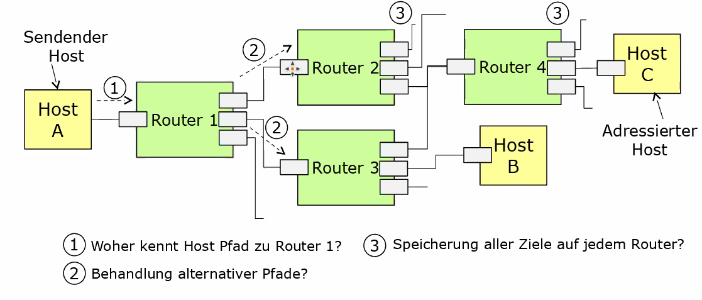
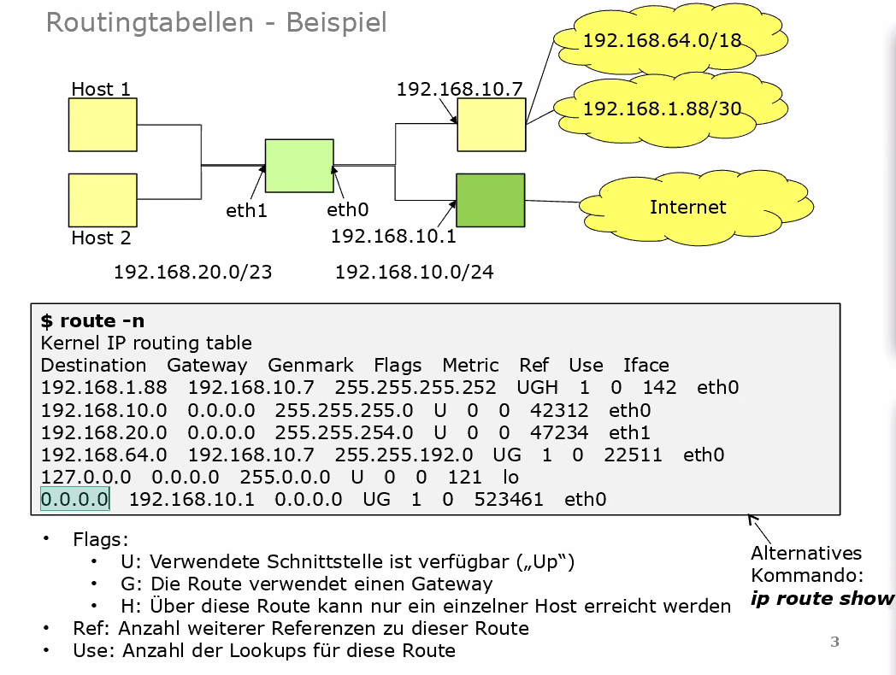

Rechnernetzkonzepte und -architekturen
======================================

<!-- START doctoc generated TOC please keep comment here to allow auto update -->
<!-- DON'T EDIT THIS SECTION, INSTEAD RE-RUN doctoc TO UPDATE -->
**Inhaltsverzeichnis**

- [Einleitung / Übersicht](#einleitung--%C3%BCbersicht)
  - [Veranstaltungsziele](#veranstaltungsziele)
  - [Inhaltlicher Teil](#inhaltlicher-teil)
    - [Kommunikationsszenario](#kommunikationsszenario)
    - [Standardisierung](#standardisierung)
    - [Internet Engineering Taskforce](#internet-engineering-taskforce)
      - [Arbeitsgruppen  / IETF-Areas](#arbeitsgruppen---ietf-areas)
    - [Begrifflichkeiten](#begrifflichkeiten)
      - [Übertragungsmodi](#%C3%BCbertragungsmodi)
      - [ISO/OSI Referenzmodell  <!-- hochgradig Prüfungsrelevant-->](#isoosi-referenzmodell-----hochgradig-pr%C3%BCfungsrelevant--)
    - [TCP/IP-Modell](#tcpip-modell)
    - [Kopplungselemente](#kopplungselemente)
    - [Topologien](#topologien)
    - [Medien/Verkabelung](#medienverkabelung)
    - [Tooling - Wireshark](#tooling---wireshark)
- [Netzzugangsschicht](#netzzugangsschicht)
  - [Übersicht zu Ethernet](#%C3%BCbersicht-zu-ethernet)
  - [Aufbau eines Ethernet Frames](#aufbau-eines-ethernet-frames)
  - [Namen von Netzwerkschnittstellen unter Linux](#namen-von-netzwerkschnittstellen-unter-linux)
  - [Switches](#switches)
    - [Architekturtypen](#architekturtypen)
    - [Kenngrößen](#kenngr%C3%B6%C3%9Fen)
    - [Spanning-Tree-Protocol <!--wahrscheinliche Prüfungsaufgabe-->](#spanning-tree-protocol---wahrscheinliche-pr%C3%BCfungsaufgabe--)
      - [STP - Port Fast/Fast Link](#stp---port-fastfast-link)
      - [Rapid Spanning Tree Protocol](#rapid-spanning-tree-protocol)
    - [Virtuelles LAN](#virtuelles-lan)
      - [Tag-basierte VLANs](#tag-basierte-vlans)
      - [Inter-VLAN-Routing](#inter-vlan-routing)
      - [STP und VLAN](#stp-und-vlan)
    - [Transparent Interconnection of lots of links (TRILL)](#transparent-interconnection-of-lots-of-links-trill)
    - [Stacking](#stacking)
- [3 Internetprotokoll und Hilfsprotokolle](#3-internetprotokoll-und-hilfsprotokolle)
  - [IPv4](#ipv4)
    - [IPv4-Header](#ipv4-header)
    - [Fragmentierung](#fragmentierung)
    - [IPv4-Adressierung](#ipv4-adressierung)
  - [Address Resolution Protocol (ARP)](#address-resolution-protocol-arp)
    - [Einordnung](#einordnung)
    - [Protokolldetails](#protokolldetails)
  - [ICMP](#icmp)
  - [Praxisübung](#praxis%C3%BCbung)
  - [Nachteile IPv4](#nachteile-ipv4)
  - [IPv6](#ipv6)
    - [Extension-Header](#extension-header)
    - [IPv6-Fragmentierung](#ipv6-fragmentierung)
    - [IPv6-Adressen](#ipv6-adressen)
      - [Adress-Notation](#adress-notation)
      - [Adress-Arten](#adress-arten)
      - [Generelle Adresstruktur](#generelle-adresstruktur)
    - [Erzeugung einer link-local Adresse](#erzeugung-einer-link-local-adresse)
    - [IPv6-Multicasts](#ipv6-multicasts)
    - [NDP](#ndp)
    - [Stateless Adress Autoconfiguration (SLAAC)](#stateless-adress-autoconfiguration-slaac)
    - [Migration IPv4 -> IPv6](#migration-ipv4---ipv6)
      - [Dual-Stack Lite (DS-Lite)](#dual-stack-lite-ds-lite)
    - [Exkurs: Raw Sockets](#exkurs-raw-sockets)
    - [Praxisbeispiel](#praxisbeispiel)
- [Trans`port`schicht](#transportschicht)
  - [User Datagram Protocol (UDP)](#user-datagram-protocol-udp)
  - [Transmission Control Protocol (TCP)](#transmission-control-protocol-tcp)
    - [Congestion / Receiving Window](#congestion--receiving-window)
    - [TCP-Optionen](#tcp-optionen)
    - [Verbindungsaufbau](#verbindungsaufbau)
      - [SYN-Cookies](#syn-cookies)
      - [TCP Fast-Open (TFO)](#tcp-fast-open-tfo)
    - [Multipath TCP (MTCP)](#multipath-tcp-mtcp)
    - [Transport Layer Security (TLS)](#transport-layer-security-tls)
  - [Quick UDP Internet Connections (QUIC)](#quick-udp-internet-connections-quic)
  - [Sockets](#sockets)
    - [SOCK_STREAM](#sock_stream)
    - [SOCK_DGRAM](#sock_dgram)
- [Exkurs: Routing](#exkurs-routing)
  - [Einleitung](#einleitung)
  - [Allgemeines zu Routing](#allgemeines-zu-routing)
    - [Beispiel Routingtabellen](#beispiel-routingtabellen)
    - [Schema für IP-Forwarding Algorithmus](#schema-f%C3%BCr-ip-forwarding-algorithmus)
  - [Hierarchische Struktur des Internets (Autonome Systeme)](#hierarchische-struktur-des-internets-autonome-systeme)
    - [Klassifizierung von AS](#klassifizierung-von-as)
    - [AS und Routing](#as-und-routing)
  - [Distanzvektor- und Link-State-Protokolle](#distanzvektor--und-link-state-protokolle)
    - [Bellman-Ford-Algorithmus](#bellman-ford-algorithmus)
    - [Dijkstra-Algorithmus](#dijkstra-algorithmus)
  - [Ausgewählte Routing-Protokolle](#ausgew%C3%A4hlte-routing-protokolle)
    - [Routing Information Protocol (RIP)](#routing-information-protocol-rip)
    - [Open Shortest Path First (OSPF)](#open-shortest-path-first-ospf)
      - [OSPF-Areas](#ospf-areas)
      - [OSPF - Hello-Pakete](#ospf---hello-pakete)
      - [OSPF- Designated Router](#ospf--designated-router)
      - [OSPF Link-State-Advertisements](#ospf-link-state-advertisements)
      - [Praxisbeispiel - Router-Daemonen-Implementierung (BIRD)](#praxisbeispiel---router-daemonen-implementierung-bird)
    - [Border Gateway Protocol (BGP)](#border-gateway-protocol-bgp)
      - [BGP-Peers /-Nachbarschaften](#bgp-peers--nachbarschaften)
      - [BGP-Pfadauswahl](#bgp-pfadauswahl)
      - [Anmerkung zur Sicherheit](#anmerkung-zur-sicherheit)

<!-- END doctoc generated TOC please keep comment here to allow auto update -->

<!--newpage-->

# Einleitung / Übersicht

## Veranstaltungsziele

**Wissensvermittlung zu:**

- Übersichtswissen über Rechnernetze
- Komponenten und Protokolle im Internet
- Planung von Netzwerken
- Konfiguration von Netzwerken

**Prüfungsleistung:**

- wenn möglich schriftliche Prüfung
- letzte Einheit ist für Prüfungsvorbereitung vorgesehen

**Hilfsmittel bei Prüfung:**

- wahrscheinlich 1 DIN A4 - Zettel handschriftlicher eigener Notizen

## Inhaltlicher Teil

### Kommunikationsszenario

<!-- width=500px -->

Bei Abruf einer Website durch `Host A` von `Server A` sind vielfältige Technologien zur Realisierung des Szenarios erforderlich.

- **Physische Verbindung:** Auf welchem Weg gelangen die Daten von Host zu Server und zurück?
- **Weiterleitung von Daten über das Internet:** Protokolle, Header,... (Wie müssen diese Daten gestaltet sein, damit sie verwendet werden können?)
- **Weiterleitung der Daten ans richtige Zielsystem:** Wie läuft das Routing ab?

### Standardisierung

- ISO
- ITU
- IEEE: Fokus auf den "unteren" Schichten, nah an Physik (Ethernet, Netzwerkkarten,...)
- IETF: Standardisierung der Protokolle (HTTP, UDP, TCP, Mailprotokolle); Freiwilligenorganisation

### Internet Engineering Taskforce

- Publikationsformat der IETF sind RfC's (Request for Comments) mit eindeutigen, fortlaufenden Nummern
- so ist UDP z.B. durch RFC 768 spezifiziert
- recht praxisnahe Beschreibung der Standards

#### Arbeitsgruppen  / IETF-Areas

IETF-Arbeitsgruppen sind einem von 7 Bereichen (Areas) zugeordnet:

- Applications and Real-Time
- Internet
- Security
- Operations and Management
- Routing
- General
- Transport

### Begrifflichkeiten

#### Übertragungsmodi

| verbindungsorientiert (z.B. TCP)                    | verbindunglos (z.B. UDP)                                      |
| --------------------------------------------------- | ------------------------------------------------------------- |
| Information über Existenz einer Beziehung liegt vor | Information über Existenz einer Beziehung liegt **nicht** vor |
| Beziehung zwischen Sender und Empfänger             | Kommunikation kann ohne Verbindungsaufbau begonnen werden     |


| leitungsvermittelt                                                                       | paketvermittelt                                                                                                             |
| ---------------------------------------------------------------------------------------- | --------------------------------------------------------------------------------------------------------------------------- |
| Feste Durchschaltung zwischen Sender und Empfänger                                       | Gemeinsame Nutzung von Leitungen                                                                                            |
| Ermöglicht Zusicherung von Eigenschaften (Quality of Service-Parameter)                  | Daten werden in Pakete aufgeteilt, die (direkt oder indirekt) Informationen für die Zuordnung zu einem Empfänger beinhalten |
| zu beachten: es müssen dann so viele Leitungen vorhanden sein, wie genutzt werden sollen | Überlastsituationen können auftreten                                                                                        |

> Im Großen und Ganzen ist "das Internet" paketvermittelt, Leitungsvermittlung kann in Spezialfällen vorhanden sein

#### ISO/OSI Referenzmodell  <!-- hochgradig Prüfungsrelevant-->

<!-- width=500px -->

- **Anwendungsschicht:** Durch anwendungsspezifische Protokolle verwendet
- **Darstellungsschicht:** Umwandlung von Daten in unabhängiges Format
- **Sitzungsschicht**
- **Transportschicht:** fügt Zusatzinformationen in die Pakete ein, um die Verwendung auf Empfängerseite zu definieren
- **Vermittlungsschicht:** Weiterleitung über lokale Netze hinaus / zwischen verschiedenen Netzen (unabhängig vom Typ der verwendeten Netze)
- **Sicherungsschicht:** Erfassung einzelner Bitfolgen als Frames, Hinzufügen von Redundanzinformationen (z.B. CRC - Cyclic Redundancy Check)
- **Bitübertragungsschicht:** einzelne Bits in physikalische Signale umwandeln und umgekehrt (Modulation und Demodulation)

### TCP/IP-Modell

Integriert das Referenzmodell unter Verwendung von vier Schichten:

<!-- width=500px -->

- **Anwendungsschicht:** Umfasst obere drei Schichten des OSI-Modells, weitere Unterteilung obliegt Anwendungsprotokoll
- **Transportschicht:** Ende-zu-Ende-Kommunikation zwischen Anwendungen
- **Internetschicht:** Ermöglicht Kommunikation zwischen Hosts in unterschiedlichen Netzwerken
- **Link Layer:** Kommunikation mit direkten Nachbarn

<!-- width=500px -->

### Kopplungselemente

<!-- width=500px -->

**Switches (auch: Bridge, L2-Switch)**

- Layer-2-Kopplungselement: verbinden Netzsegmente (Broadcast-Domains) und leiten Pakete zwischen diesen weiter
- Netzwerkkarten im gleichen Netzsegment können sich gegenseitig direkt adressieren (per MAC-Adresse)
- speichern intern eine Zuordnung zwischen Ausgangsports und MAC-Adressen

**Router (auch: Layer-3-Switch)**

- leiten Pakete zwischen unterschiedlichen Netzen weiter
- bei Weiterleitungsentscheidung wird IP-Adresse ausgewertet (Lookup in Routing-Tabelle)

**Weitere Kopplungselemente**

- Hub, Repeater, Application-Layer-Gateway, ...


### Topologien

Unterscheidung zwischen physikalischer und logischer Topologie:

- Physikalisch Topologie: tatsächlich vorhandenen Netzwerkkomponenten und ihrer Verbindungen
- Logisch Topologie: Kommunikationsbeziehungen und Struktur des Datenflusses

<!-- width=500px -->

> SPF (single point of failure) im Netz? Wenn ja: Ausfallsicherheit gering

### Medien/Verkabelung

heute typischerweise zwischen Kopplungselementen und Hosts eingesetzt:

**Twisted-Pair-Kabel**

- Kabel mit verdrillten Adernpaaren (= Schutz gegen Störeinflüsse durch gegenseitiges Aufheben)
- Unterscheidung in:
	- Unshielded Twisted Pair (UTP): Ungeschirmt
	- Shielded Twisted Pair (STP): Geflechtschirm
	- Foiled Twisted Pair (FTP): Gesamtschirmung
- Klassifizierung durch ISO-Kategorien (CAT 3, 5e, 6, 6A, 7,...)

**Lichtwellenleiter**

- Aus Glasfasern und Mantelung bestehende Lichtleiter
- Kern/Modenfeld besitzt einen höheren Brechungsindex als Mantel -> Führung des Lichts durch Totalreflexion
- Spezifikation durch Durchmesser([Kern$\oslash$]/[Mantel$\oslash$]); Weitere Kenngrößen: Wellenlänge, Dämpfung
- Unterscheidung in Multimode LWL und Single-/Monomode LWL

### Tooling - Wireshark

- nützliches Tool zur Darstellung von Kommunikationsvorgängen in Netzwerken
- Filterfunktionalität um gezielt nach IP-Adressen, Protokollen, Ports,... zu suchen
- verwendete Bibliothek: `LIBPCAP`
- weiteres Tool: `Scapy`

# Netzzugangsschicht

## Übersicht zu Ethernet

- Ursprünglich für LAN-Kommunikation vorgesehen
- Klassisch: Steuerung des Zugriffs auf den Kanal über CSMA/CD-Algorithmus (bei Punkt-zu-Punkt obsolet)
- Seit den 1980iger Jahren verschiedene Varianten etabliert, die sich bzgl.
Übertragungsraten, Kabeltypen und Leitungskodierung unterscheiden
	- Datenraten von 10 Mbit/s bis 400 Gbit/s, ...
	- Leitungskodierung u.a.: Manchester-Code, 4B5B-Code, 8b10b-Code, ...
	- Kabeltypen u.a.: Koaxialkabel, Twisted-Pair-Kabel, Multimode
Lichtwellenleiter, Singlemode Lichtwellenleiter, ...
- Alternative: z.B. Infiniband

## Aufbau eines Ethernet Frames

<!-- width=500px -->

- Präambel: Synchronisation zwischen Kommunikationspartnern
- SFD: Start of Frame Delimiter (fest Bitfolge zur Identifikation des Frame-Anfangs)
- Quell-/Zieladresse: global eindeutige 6-Byte-Adresse
- Nutzdaten: maximal 1500 Bytes Nutzdaten (Header höherer Schichten + Daten)
- Typ-Feld: Typ-Feld der nächsthöheren Netzwerkschicht (z.B. `0x0800` für IPv4) - alternativ Längenfeld
- Padding: Gewährleistet Minimalgröße von 64 Byte
- CRC-Checksum: 32-Bit-Prüfsumme über das Frame (von Zieladresse bis Padding-Feld)

## Namen von Netzwerkschnittstellen unter Linux

- Alt: `ethX` bzw. `wlanX` (an MAC gebunden -> Probleme bei Tausch)
- Neu: Consistent Network Device Naming (z.B. `enp0s25`)
	- Ethernetinterface (en), das an PCI-Bus (p) an Slot 25 hängt

## Switches

- Multiport Kopplungselemente, das Frames nur an den Port weiterleitet über den der Empfänger erreichbar ist
- Speicherung von Adressen in Source-Address-Table (SAT)
- **Cut-Through Switches:** Nach Analyse der MAC-Adresse sofortiges Durschalten zum entsprechenden Port (Weiterleitung ohne Zwischenspeicherung = geringe Latenz, kein Einfluss auf Datenrate)
- **Store-and-Forward Switches:** Frame wird am Eingangsport und Ausgangsport gepuffert (größere Latenz, Möglichkeit zur Zwischenverarbeitung der Daten)

### Architekturtypen

- **Shared Memory:** CPU kopiert Daten nach Extraktion der Zieladresse in den korrekten Ausgangspuffer
- **Bus-System:** Empfangener Port leitet Frame über gemeinsamen Bus an richtigen Ausgangsport
- **Switching-Matrix:** Physische Durchschaltung von Ein- und Ausgabeleitungen

### Kenngrößen

- Datenrate der verschiedenen Ports
- Datenrate des Backplanes (der internen Busse)
- Port-Typen
- Maximale Größe des SAT
- Managementinterface (CLI/WEB UI/ SNMP)
- Unterstützte RFCs und IEEE-Standards
- Bandbreitenmanagement
- Preis

### Spanning-Tree-Protocol <!--wahrscheinliche Prüfungsaufgabe-->

- STP etabliert sich innerhalb des Netzes einen Spannbaum durch das Blockieren von Ports, die Zyklen erzeugen würden
- Blockierter Port: Eingehender und ausgehender Traffic wird verworfen, Kanal ansonsten voll funktionsfähig
- STP reagiert automatisch auf Link-Fehler und berechnet einen neuen Spannbaum unter Berücksichtigung ausgefallener Verbindungen (-> Aktivierung blockierter Ports im neuen Spannbaum)

**Ablauf**

1. Root-Bridge bestimmen: alle Bridges senden Priorität und MAC an alle (höchste Priorität / geringste MAC wird Root)
2. Bestimmung zur kürzesten Pfade zur Root-Bridge (Pfadlänge wird an jedem Switch unter Berücksichtigung der Datenrate automatisch inkrementiert)
3. Deaktivieren aller Ports, die nicht Root sind

**Begriffe**

- Root-Port: Switch Port, der am nächsten zur Root-Bridge liegt
- Designated Port: Alle Ports, die kein Root-Port und nicht blockiert sind
- Non-Designated Port: Ports in blockiertem Zustand um Zyklen zu verhindern

#### STP - Port Fast/Fast Link

- STP weist Konvergenzprobleme auf: Netzwerk erst nach etwa 30 Sekunden funktionstüchtig (Probleme beispielsweise mit PXE Boot)
- Switches bieten Speziellen Modus für Ports an denen Endsysteme angeschlossen sind (Port geht sofort bei Aktivierung in Forwarding State)
- Herstellerspezifische Terminologie: PortFast (Cisco), Fast Link (NetGear)

#### Rapid Spanning Tree Protocol

- Proaktiver Ansatz bei dem effizient auf Alternativpfade gewechselt werden kann

### Virtuelles LAN

- Physisches Netzwerkdesign steht häufig mit logischem Netzwerkdesign in Konflikt
- logische Einteilung des Netzes auf Ebene der Switche (Aufteilung in Broadcast-Domänen; erhöhte Sicherheit)

**Varianten**

- Portbasierte VLANs: jeder Port kann Mitglied exakt eines VLANs sein
- Tag-basierte VLANs: Frames werden mit ID eines VLANs getaggt, wodurch über einen Port mehrere VLANs realisiert werden können
- dynamische/inhaltsbasierende VLANs: Zuordnung zu VLANs anhand verwendeter Protokolle (weniger verbreitet)

#### Tag-basierte VLANs

- Erweiterung der Ethernet-Frames um einen Tag zur Identifikation des VLANs zu dem das Frame gehört

**Aufbau** (4 Bytes)

<!-- width=500px -->

- **Tag Protocol Identifier:** fixer Hex-Wert
- **Priority Code Point:** Prioritätsinformationen
- **Drop Eligible Indicator:** Identifiziert Frames, die bei Überlast verworfen werden können
- **VLAN Identifier:** ID des zugehörigen VLANs ($2^{12}-2$ = max. 4096 VLANs)

#### Inter-VLAN-Routing

**Ansatz 1**

- Routing zwischen VLANs ohne zusätzliche Softwareunterstützung durch in unterschiedlichen VLANs befindliche Physikalische Schnittstellen eines Routers möglich
- Problem: hoher Aufwand für Hardware (für jedes VLAN physische Schnittstelle plus Verkabelung)


- **Ansatz 2:** Einsatz von virtuellen Interfaces zur Vermeidung des hohen Aufwandes für separate Schnittstellen
<!-- Gerne Prüfungsfrage: Voraussetzungen/Konfigurationsschritte -->

#### STP und VLAN

> STP weiß nix von VLANs

- klassischer Ansatz nutzt die verfügbaren physischen Verbindungen nicht optimal aus
- Lösung: Multiple Spanning Tree Protocol (jedes VLAN hat eigenen ST + ein Internal Spanning Tree für alle VLANs)

### Transparent Interconnection of lots of links (TRILL)

- Ethernet-Frames werden in einen TRILL-Header gekapselt
- Routing dieser Frames auf deren Basis auf L2 (nächster Hop wird durch umgebenen L2-Header angegeben)
- Nutzung von Intermediate System to System zur Ermittlung von Pfaden zwischen Rbridges
- TRILL-Header besitzt HOP-Count-Feld um Routing-Schleifen zu vermeiden
- Entfernung des THRILL-Headers vor Auslieferung an das Zielsystem

### Stacking

- Stackfähige Switsches können miteinander zu einer Gruppe verbunden werden (einzelnes logisches Gerät, ansprechen über einzelne IP)
- Vorteile: Skalierbarkeit (Anzahl der Ports einfach ), vereinfachte Netzwerkschnittstelle (Konfiguration von nur einem logischem Gerät), Vergrößerter Durchsatz (Stacking über Port mit hoher Datenrate)
- Nachteil: Platzbedarf, höherer Stromverbrauch mehrerer Geräte, Kopplung als neue Fehlerquelle

# 3 Internetprotokoll und Hilfsprotokolle

- Schicht 3; von Übertragungsmedium unabhängig
- Overlay über L2, bildet davon unabhängiges Netz
- Ermöglicht Adressierung von "Knoten"
- zwei Versionen verbreitet: IPv4 und IPv6
- IP-Paket wird trotz Hops nicht verändert (Ausnahme: NAT)
- Bezeichnung Hostadresse eigentlich falsch -> Schnittstellenadresse
- eine IP-Adresse ist nicht einem Host zugewiesen, sondern einem NIC
  - Workaround: Loopback-Interface, zur Adressierung von Localhost
- *casts:
  - Unicast: Senden an exakt einen NIC
  - Broadcast: Senden an alle NICs
  - Multicast: Senden an Teilmenge
  - Anycast: Senden an alle NICs, aber nur einer antwortet

## IPv4

### IPv4-Header

<!-- width=500px -->

- Version: 4 Bits, Protokollversion
- Internet Header Length (IHL): 4 Bits, Länge des Headers in 32 Bit Wörtern, Standardwert 5 -> 5 * 32 Bit = 20 Byte
- Differenciated Service Code Point (DSCP): 6 Bit, Prioritätsklassen
- Explicit Congestion Notification (ECN): 2 Bit, Meldung von Überlast, von Layer 4 gesteuert, wird damit rückläufig zu Sender kommuniziert "Bitte sende langsamer"
- Total Length: 16 Bit, Gesamtlänge des Datagramms / Fragments in Bytes
- Identification: 16 Bit, ID des Datagramms
- Flags: 3 Bit:
  - Bit 0: reserviert (RFC3514)
  - Bit 1: Don't Fragmen (DF)
  - Bit 2: More Fragments (MF)
- Fragment Offset: 13 Bit, Offset in 8 Byte Blöcken, die Daten innerhalb des urspr. Paket hatten
- Time to Live (TTL): 8 Bit, Lebenszeit des Pakets, in Praxis maximale Anzahl der Hops
- Protocol: 8 Bit, im Datenbereich verwendetes Protokoll, Bsp. in Linux: `/etc/protocols`
- Header Checksum: Prüfsumme für (nur) IP-Header
- Options: Zusatzdaten für bspw. Routing oder Zeitstempel
  - Bsp Source Routing: Sender gibt exakte Route an; ermöglicht Angriffsfläche für DoS-Attacken

### Fragmentierung

<!-- width=500px -->

- 1:1 Übersetzung von IP-Paket und ETH-Frame
- Maximum Transmission Unit (MTU): Maximalgröße des ETH-Payloads
  - ETH-Payload enthält auch IP-Header,... --> nicht tatsächliche Nutzdatengröße
  - größer: weniger Overhead, anfälliger für Fehler, höherer Speicherbedarf in Netzwerkkomponenten
  - kleiner: weniger Latenz, mehr Overhead
- wenn IP-Paket größer als MTU: muss fragmentiert werden
  - Ergebnis sind n vollwertige IP-Pakete inkl. Header
  - alle Pakete gleiche Identification Nummer  (zum Rekonstuieren des urspr. Paket)
  - Flags:
    - MF-Flag = 1 bei allen außer dem letzten Paket
    - Fragment Offset: zählt Byteposition hoch
- Wo wird fragmentiert?
  - bei IPv4 kann bei jedem Hop auf der Route fragmentiert werden, Performanceverlust
  - bei IPv6 wird beim Sender fragmentiert
- Pass-MTU: bezeichnet geringste MTU aller Hops auf der Route

```bash
# MTU anzeigen lassen
ip addr show
```

### IPv4-Adressierung

- Struktur: 0 bis n Bits Netzadresse, 32-n Bit Hostadresse (NIC-Adresse)
- Notation: ``adresse/n`` --> Classless Inter Domain Routing Notation (CIDR)
- Netzanteil ermöglicht Ausbildung einer hierarch. Struktur, skalierbar
- Einteilung von IPv4-Adressen in öff. Adressen (innerhalb des Intenets eindeutig, durch zentrale Instanz vergeben) und private Adressen (innerh. eines lokalen Netzes eindeutig)
- insbesondere durch IPv4-Adress-Knappheit werden öff. Adressen durch Network Address Translation (NAT) auf mehrere Hosts abgebildet
- Routing:

<!-- width=500px -->

## Address Resolution Protocol (ARP)

### Einordnung

<!-- width=500px -->

- ARP ermittelt zu IP-Adressen und weiteren Adressfamilien die zugehörigen Hardwareadressen
- Request-Reply-Protokoll
- ermittelte Zuordnung für best. Zeitraum in ARP-Tabelle gespeichert
- wenn Ziel-NIC außerhalb des eigenen Netzwerks: Ermittlung der MAC-Adresse des **Gateways**, nichts dahinter
  - siehe folgendes Bild:

<!-- width=500px -->

```
# Für Anzeige von ARP-Anfragen (Beispiel)
tcp dump -i any -p arp
```

### Protokolldetails

//TODO: Bild Folie 7

//TODO: ausfüllen

## ICMP

- Internet Control Message Protocol dient der Kommunikation von Fehlern und Abfrage von Statusinformation in (fast immer) IP-basierten Netzwerken
- ausgewählte Typen:
  - 0: Echo Reply: Antwort auf Echo Request
  - 3: Destination Unreachable: Ziel nicht erreichbar mit folgenden Codes:
    - 0: Net unreachable
    - 3: Port unreachable
    - 4: Fragmentation needed and Don't Fragmen (DF) was set
  - 5: Redirect: siehe unten
  - 9: Router Advertisement: dient automatischen Discovery von Routern
  - 11: Time Exceeded: TTL-Feld aus IP-Datagramms abgelaufen
  - 13: Timestamp: TODO
- Aufbau:
  - 8 Bit Typ (s.o.)
  - 8 Bit Code (s.o.)
  - 16 Bit Prüfsumme
  - weitere Inhalte abhängig von Typ / Code

Möglichkeiten:
- mehr Funktionen als "nur" Ping
- Fehlermeldungen können im Netzwerk propagiert werden
- Zeitstempel können zur Lastermittlung genutzt werden

Beispiel: ICMP-Redirect

- wird von einem Gateway versendet, wenn es feststellt, dass ein Router im gleichen Netz liegt, sodass direkt mit diesem kommuniziert werden kann
- bietet Angriffsfläche: kann verwendet werden, um kompromittierten Router in den Pfad zu zwingen
- per Default in vielen Systemen deaktiviert

## Praxisübung

Exkurs Namespaces:

- Namespaces bieten Möglichkeit, separate Netzwerk-Stacks lokal zu schaffen
- Zu Beginn leere und frei konfigurierbare Stacks
- es können komplette lokale Netzwerke innerhalb eines Kernels geschaffen werden
- wird zum Beispiel für [Docker](https://www.docker.com/) genutzt
	- dort aber auch noch separate Namespaces für PIDs, IP-Tables, Filesystem

Verknüpfung von 3 Network Namespaces:

<!-- width=500px -->

- 3 Namespaces erstellen:

```bash
sudo ip netns add ns1
sudo ip netns add ns2
sudo ip netns add ns3

sudo ip netns list # zur Überprüfung
```

- virtuelle Ethernet-Interfaces erstellen:

```bash
sudo ip link add veth1 netns ns1 type veth peer name veth2 netns ns2 # erstellt veth1 in ns1 und veth2 in ns2
sudo ip link add veth3 netns ns2 type veth peer name veth4 netns ns3
```

- Namespace betreten und Interface aktivieren:

```bash
sudo ip netns exec ns1 /bin/bash
ip link set veth1 up
```

- diesen Schritt für alle Interfaces wiederholen
- allen VEth-Interfaces die gewünschten Adressen vergeben: (für alle Interfaces wiederholen)

```bash
sudo ip netns exec ns1 /bin/bash
sudo ip addr add 192.168.42.5/24 dev veth1
```

- Routen zwischen den Namespaces anlegen:

```bash
sudo ip netns exec ns1 /bin/bash
ip route add 192.168.23.0/24 via 192.168.42.254
```

- diesen Schritt für alle Namespaces / gewünschten Routen wiederholen
- Kernel anweisen, für das Router-Namespace das Routing zu aktivieren:

```bash
sudo ip netns exec ns2 /bin/bash
echo 1 > /proc/sys/net/ipv4/ip_forward
```

- mit bspw. Ping überprüfen, ob Verbindung funktioniert

## Nachteile IPv4

- Ausgeschöpfter Adressraum: nur 4 Milliarden Adressen, ungünstige Vergabe, NAT als Lösung (aber: erschwert Nutzung einiger Dienste)
- Ineffizientes Routing: Header hat variable Länge
- Keine automatische Konfiguration: IP muss manuell oder über DHCP vergeben werden (zusätzliche Infrastruktur erforderlich)

## IPv6

- soll in nächsten Jahren schrittweise IPv4 ablösen
- Vereinfachung des Headers:

 <!-- width=500px -->

- Traffic-Class: Prioritätsangabe
- Flow Label: Klassifizierung von Datagrammen in verschiedenen Flows mit gleichem Label
- Next Header: Identifikation für Erweiterungsheader/Schicht-4-Header
- Payload-Length: Größe des gesamten Datagramms
- Hop-Limit: Ersetzt TTL Feld (Angabe maximaler Hops)

### Extension-Header

- in Zusammenhang mit Next-Header-Feld verwendet
- verweist auf Header eines Protokolls der nächsthöheren Schicht oder Extension-Header wird in das Datagramm eingebettet

<!-- width=500px -->

- Diverse Optionen: Hop-by-Hop Options, Fragment, Destination Options, Routing, Auth, ...

### IPv6-Fragmentierung

- Grundprinzip ähnlich zu IPv4:  wenn auf Pfad MTU nicht ausreicht wird fragmentiert
- Unterschied zu IPv4:
	- durch Sender fragmentiert, dadurch Effizienzsteigerung
	- Absender wird über Fragmentierungsbedarf informiert (per ICMPv6-Nachricht "Packet too big")
- Praxis: limitierende MTU meist an den Rändern, also beim Sender

### IPv6-Adressen

#### Adress-Notation

- `ffff:ffff:ffff:ffff:ffff:ffff:ffff:ffff` ($8*16=128 \text{Bit}$)
- Längere Folgen von Nullen können einmalig durch `::` abgekürzt werden: `ff01:0:0:0:0:0:2342:78fa` -> `ff01::2342:78fa``
- letzten 32 Bit einer Adresse kann die dezimale Notation (wie in IPv4)
verwenden: `::141.76.40.1`
- Portangabe: `[ff01:0:0:0:0:0:0:0:2342:78fa]:80` bzw. `[ff01::2342:78fa]:80`

**Empfehlungen aus RFC**

- führende Nullen des Blocks weglassen
- zwei Doppelpunkte sollen maximale Anzahl von 0-Blöcken repräsentieren (nicht zur Abkürzung eines einzelnen Blocks verwenden)
- bei mehreren möglichen Kürzungen: möglichst weit links kürzen

#### Adress-Arten

- **Unicast-Adressen:** Identifikator eines *einzelnen* Netzwerkinterfaces (link-local innerhalb geschlossener Netzsegmente oder global)
- **Anycast-Adressen:** Identifikator für *Menge von Interfaces* -> wird an **eines** der Interfaces gesendet, dass durch die Adresse identifiziert wird (z.B. bei DNS angewendet)
- **Multicast-Adressen:** Identifikator für *Menge von Interfaces* -> wird an **alle** Interfaces gesendet, die durch die Adresse identifiziert werden (kein Broadcast mehr erforderlich)

#### Generelle Adresstruktur

- Trennung zwischen Präfix und Interface Identifier
- Notation analog zu CIDR: `/64` am Ende gibt die Länge des Präfix an

Typ einer Adresse kann an den höchstwertigsten Bits erkannt werden:

- Unspecified-Adresse: `00...0` -> `::/128`
- Loopback-Adressen: `00..1` -> `::1/128`
- Multicast-Adressen: `11111111` -> `ff00::/8`
- Link-local Unicast: `111111101010` -> `fe80::/10`
- Solicited-Node-Adresse: `ff02:0:0:0:0:1:ff00::/104`
- Globale Unicast-Adressen: alle anderen (derzeit: `2000::/3`)
- Anycast-Adressen: Adressraum identisch zu Unicast-Adressen (syntaktisch nicht unterscheidbar)

### Erzeugung einer link-local Adresse

- wird aus der Link-Layer Adresse (MAC) berechnet
- Überprüfung auf Eindeutigkeit über `SLAAC`
- Problem: einfache Identifikation von Nutzern
- Lösung: Privacy Extension for Stateless Adress Autoconfiguration (regelmäßige zufällige Generierung des Interface-Identifiers)

### IPv6-Multicasts

<!-- width=500px -->

- es gibt mehrere Multicast-Gruppen an denen teilgenommen werden kann
- es existieren zudem festgelegte "well-known" Multicast-Adressen
	- `ff02::1` -> alle Knoten am Link (z.B. für ARP-äquivalente Anfragen)
	- `ff02:2` -> alle Router am Link
	- `ff02::16` -> alle MLDv2-fähigen Router

### NDP
<!-- NDP nicht so genau Prüfungsrelevant, mehr Infos in den Folien-->

**Aufgaben:**

- Ermitteln verfügbarer Router
- Bestimmung der Link-Layer-Adresse eines Knoten
- Verwaltung von Erreichbarkeitsinformationen
- Grundlage für Stateless Address Autoconfiguration

### Stateless Adress Autoconfiguration (SLAAC)
<!-- hochgradig Prüfungsrelevant-->

**Phase 1: Erzeugung und Überprüfung einer Link-lokalen Adresse:**

1. Host generiert Link-lokale Adresse aus MAC (oder Privacy Extension)
2. Host tritt der All-Nodes-Multicast-Adresse und der Solicited-Node-Multicast-Adresse der erzeugten Link-lokalen Adresse bei und sendet eine Neighbor-Solicitation-
Nachricht an diese Adresse
3. Host wartet bestimmte Zeitspanne; Ausbleiben einer Antwort = Indikator für die Eindeutigkeit der selbst zugewiesenen Adresse -> Adresse wird dem Interface zugewiesen
4. Host sendet Neighbor-Advertisement-Nachrichten an alle Hosts des Links (= Multicast-Adresse `ff02::1`)

**Phase 2: Erzeugen einer weltweit eindeutigen Global-Unicast-Adresse:**

1. Host fragt mittels einer Router-Solicitation-Nachricht nach einem Router Advertisement
2. Router versendet ein Router Advertisement mit allen
für die Konfiguration wichtigen Informationen (insbesondere Angabe des Präfixes) -> Erzeugung einer Global-Unicast-Adresse aus Präfix und Link-local-Adresse
3. Nach Betritt zur Solicited-Node-Multicast-Adresse für die Global Unicast-Adresse, werden mehrere Neighbor-Solicitation-Nachrichten an die Multicast-Adresse
versendet -> ist Adresse bereits verwendet sendet entsprechender Host Neighbor-Advertisement-Nachricht
4. Ist die Adresse frei, wird sie lokal zugewiesen

### Migration IPv4 -> IPv6

- Übergang zu IPv6 wird seit zwanzig Jahren propagiert
- Aktuell: Koexistenz von IPv4 und IPv6 -> Mechanismen zur Interoperabilität
	- Dual-Stack: Interface erhalt sowohl IPv4 und IPv6-Adressen
	- Tunnel-Mechanismen: Kapselung Header der beider Versionen (z.B. `4in6`, `6in4`, `6over4`, ...)
	- Translations-Mechanismen: Transformation der Header in unterschiedliche Versionen (z.B. NAT64 = Übersetzung von IPv4-Adressen in IPv6)

#### Dual-Stack Lite (DS-Lite)

- Kombination aus Tunnelmechanismen und Translation
- Vorteile:
	- Providerinfrastruktur kann auf IPv6 umgestellt werden
	- IPv4-Adressen beim Provider werden eingespart

<!-- width=500px -->

### Exkurs: Raw Sockets

- Ermöglichen die Instanziierung von IP-Headern und Implementierung von Protokollen im User-Space
- IP-Headerelemente wie auch gekapselte Datagramme können im Programm befüllt werden
- durch Raw Sockets können z.B. implementiert werden:
	- Netzwerksicherheitswerkzeuge wie Portscanner
	- ICMP-basierte Anwendungen
	- Routing-Protokolle
- Tooling: `Scapy` und `nmap`
- Frage: Wie kann unter Verwendung von Raw-Sockets ein einfaches TRACEROUTE gebaut werden?

- Antwort: Mit Hilfe des TTL kann dies ermöglicht werden
	- erst TTL 1 (ICMP des ersten Routers)
	- dann TTL 2 (ICMP des zweiten Routers)
	- wiedrholen bis zum Erreichen des gewünschten Ziels
- Problem: nicht alle Router haben diese ICMP-Antworten aktiviert, weitere Anpassung nötig

### Praxisbeispiel

- Namespaces erstellen:

```bash
sudo ip netns add ns1
sudo ip netns add ns2

sudo ip netns list # zur Prüfung
```

- virtuelle Ethernet-Interfaces erstellen:

```bash
sudo ip link add veth1 netns ns1 type veth peer name veth2 netns ns2 # erstellt veth1 in ns1 und veth2 in ns2
```

- radvd installieren und ggf. Konfigurationsdatei anlegen, falls nicht schon vorhanden:

```bash
apt-get install radvd # bei anderen Distributionen analog
touch /etc/radvd.conf
```

- Konfigurationsdatei bearbeiten:

```conf
interface veth1{
  AdvSendAdvert on;
	prefix 2001:db8:1:0::/64{
		AdvOnLink on;
		AdvAutonomous on;
		AdvRouterAddr off;
	};
};
```
[größere Beispiel-Config](https://github.com/reubenhwk/radvd/blob/master/radvd.conf.example)

- Namespace betreten und Interface aktivieren:

```bash
sudo ip netns exec ns1 /bin/bash
ip link set veth1 up
ip a # wird nur Link-Local Adresse besitzen
```

- diesen Schritt für zweites Interface wiederholen
- Unit-Datei für den ``radvd``-Dienst sichern: ``cp /lib/systemd/system/radvd.service /home/username/radvd.service.bak``
- Unit-Datei für den ``radvd``-Dienst zum Schreiben öffnen
- dort die ``ExecStart``-Zeile auf Folgendes ändern:

```conf
ExecStart=/bin/sh -c 'exec /sbin/ip netns exec ns1 /usr/bin/radvd --nodaemon'
```

- **Achtung:** der Pfad von ``radvd`` kann sich je nach Distribution ändern. Auf Ubuntu ist sie in ``/usr/sbin``. Im Zweifelsfall kann der Ort mit ``which radvd`` herausgefunden werden.
- Unit-Datei neu einlesen: ``sudo systemctl daemon-reload``
- radvd starten: ``sudo systemctl start radvd``
- Status des Dienstes prüfen: ``sudo systemctl status radvd``
- Den Network Namespace betreten prüfen, ob ``ip a`` nun zusätzlich eine ``scope global`` IPv6-Adresse mit dem ``2001:[...]``-Präfix anzeigt
**tbc: Anfang nächster Einheit**

# Trans`port`schicht

- Transportschicht dient der Ende-zu-Ende Kommunikation (Prozess zu Prozess)
- Adressierungsmöglichkeit = **Ports** (`bind()` bindet Kommunikation an Port)
- Beispiel: zielgerichtete Adressierung von `http`-Server über Port 80 (alle Ports<1024 = *well-known* Ports -> benötigen `root`)

<!-- width=500px -->

## User Datagram Protocol (UDP)

- verbindungsloses unzuverlässiges Transportprotokoll zur ausschließlichen Addresierung von Ports (16-Bit Adresskomponente)
- *unzuverlässiges* = keine Reaktion auf Paketverluste (z.B. durch überlastete Router)
- *verbindungslos* = Kommunikationszustand wird in keinem lokalen Zustand verwaltet -> erneut übermittelt von IP+Port bei jeder Verbindung
- keine Reihenfolgegarantie: Pakete werden nicht zwingend in der richtige Reihenfolge an den Zielprozess weitergegeben
	- Reihenfolge ankommender Pakete kann von keinem Protokoll garantiert werden -> aber: Pufferung vor Weitergabe möglich
- geringer Protokolloverhead -> sehr effizient (besonders für Video-/Audiodaten)
- eingesetzt von DNS, DHCP, NTP, SNMP, ...

<!-- width=500px -->

## Transmission Control Protocol (TCP)

- dominierendes Schicht-4-Protokoll im Internet
- verbindungsorientierte Kommunikation mit wohldefiniertem Verbindungsaufbau
- zuverlässige Kommunikation durch Bestätigungen
- Reihenfolgegarantie
    - Reihenfolge eines Datenstreams bei Sender und Empfänger gleich
    - Bei Reihenfolgeänderung der Bytes bei der Übertragung erfolgt Umsortierung auf Empfängerseite
- Flow Control (Flusskontrolle)
- Congestion Control (Überlaststeuerung) -> bei verlorenen Pakten dynamische Reduktion der Paketgröße
- Segmentierung von Anwendungsdaten in übertragbare Einheiten (auf Grundlage der Maximum Segment Size - MSS)

<!-- width=500px -->

Sequenznummer: bezieht sich auf das erstes Byte eines Paketes
Acknowledgement Number: Bestätigung der Sequenznummer der erhaltenen Bytes (ohne Ack -> wiederholtes Senden des Pakets)
Options: hier eigentlich alle später hinzugekommenen Erweiterungen verwirklicht
Window Size:
  - Empfänger teilt hier maximale Größe des Receiving-Window mit
  - kann sich im Verlauf ändern
Urgent Pointer: verweist auf Daten im Bytebereich (Priorisierung von Daten)
Flags: Bitflags zur Steuerung der Kommunikation (z.B. Aufbau, Trennung, der Verbindung oder ACK)

### Congestion / Receiving Window


- **Receiving Window:** Puffert Daten vor Weiterleitung an den Prozess (verhindert, das Daten für die Verarbeitung verworfen werden müssen)
- **Congestion Window:** soll, bei maximalem Durchsatz, Überlast auf einem Pfad verhindern (insbesondere durch überlastete Router) -> Größe wird dynamisch angepasst (<= Receiving Window)
- beide Windows können auf Konfigurationsebene angepasst werden (z.B. bei lokalen `CEPH`-Clustern, die durch Routing-Flaschenhälse nicht begrenzt sind)
- TCP-Verbindungen sind **bidirektional** -> Sender und Empfänger nehmen ebenso die umgekehrte Rolle ein
- Abbau der bidirektional Verbidnungen separat (`FIN`-Flag) -> können auch unidirektional abgebaut werden

<!-- width=500px -->

- `ECN`-Feld im IP-Header: wird von Router bei Überlast gesetzt
- Rückmeldung an den Sender durch das Setzen des Feldes bei ausgehenden IP-Paketen
- Sender reduziert nach Rückmeldung die Paketgröße und informiert Empfänger über TCP-Header
- = Zusammenspiel zwischen Layern (IP und TCP)

### TCP-Optionen

- Feld, das Zusatzinformationen beinhalten kann, die nicht in den anderen Header-Felder repräsentiert werden
- Mögliche Optionstypen `kind` [durch IANA zugewiesen](https://www.iana.org/assignments/tcp-parameters/tcp-parameters.xhtml)
- Beispiele:
	- 2 = Maximum Segment Size Option: maximale Segmentgröße des Empfängers
	- 3 = Window Scale Option: ermöglicht Window-Größen über 65535 Bytes
	- 4 = TCP Selective Acknowledgment Options
	- 30 = Multipath TCP (MPTCP)

### Verbindungsaufbau

<!-- width=500px -->

<!--Handshake (+ besonders sync-flag) = prüfungsrelevant-->

- zu Beginn beide Seiten CLOSED -> Client sendet Paket mit `SYN`-Flag
- Server antwortet mit `SYN-ACK` -> Client bestätigt mit `ACK`
- neuer Zustand: Established (zum Schließen: `FIN`-Paket)

<!-- width=500px -->

- `SYN`: Synchronisation von Sequenznummern (zufällig gewählt im Angriffsvektoren zuverringern)
	- ist `SYN`-Flag gesetzt wird mitgesendete Sequenznummer als Startsequenznummer festgelegt
- Port-Scanner (wie `nmap`) senden `SYN`-Pakete an alle Ports warten auf `ACK` Antwort (Ports mit aktivem Dienst)
- `SYN`-Paket bieten DOS-Angriffspunkt (`SYN-Flooding`) -> Fluten des Servers mit `SYN`-Paketen -> sendet `ACK` und wartet vergeblich auf `ACK` des Empfängers -> viele halboffene Verbindungen
	- halboffene Verbindungen pro Socket limitiert -> keine neuen Verbindungen möglich
	- Firewall als Schutz: Blacklisten von IPs die mehrere SYN-Pakete kurz hintereinander senden

#### SYN-Cookies

- Idee: Server hält nach initialem TCP-Fragment (mit gesetztem `SYN`-flag) noch keinen Zustand -> kodiert Zustandsbehaftete Informationen als Cookie (Zeitstempel, Endpunkte (IPs+Ports), MSS)
- Cookie wird als Sequenznummer an den Client zurückgesendet -> Server erhält Informationen im dritten Schritt des Verbindungsaufbaus vom Client zurück
- Zusatzschritt für Angreifer -> höherer Aufwand
- bei vielen Systemen umgesetzt, allerdings _kein_ RFC dazu vorhanden

#### TCP Fast-Open (TFO)

<!--gern gewählte Prüfungsfrage-->

- Ziel: Netzwerklatenz von Anwendungen um eine volle RTT reduzieren (3-Wege-Handshake vor Übermittlung von Anwendungsdaten)
- Grundprinzip: Client fragt beim ersten Verbindungsaufbau eine spezifisches `TFO`-Cookie an
- Bei erneutem Verbindungsaufbau werden direkt mit dem ersten Segment Anwendungsdaten und der gespeicherte `TFO`-Cookie übermittelt (kein regulärer Drei-Wege-Handshake erforderlich)
- Senkung der Latenz und Page Load Time (`PLT`) besonders für Webcrawler bedeutend
- Spezifikation ist als [Experimental RFC der IETF](https://tools.ietf.org/html/rfc7413) verfügbar

<!-- width=200px -->

### Multipath TCP (MTCP)

- klassische TCP-Verbindung an eine Netzwerkschnittstelle gebunden -> bei mehreren Netzwerkschnittstellen ineffiziente Nutzung der Resourcen
- Ziel von `MTCP`: parallele Nutzung mehrerer Netzwerkschnittstellen
- keine Änderung auf Anwendungsschicht -> Implementation von TCP-Subflows innerhalb der Transportschicht
- TCP-Subflows verhalten sich wie normale TCP-Verbindungen auf separaten Pfaden
- Realisierung der Protokolloperationen durch TCP-Optionen
- jede TCP-Verbindung besitzt eigene Sequenznummer + zusätzlich globale Sequenznummer -> Paketverluste werden auf Subflow-Ebene erkannt und behandelt
- bei Ausfall eines Subflows -> erneute Übertragung über verfügbare Subflows

<!--Motivation und Grundprinzip sind hier wichtig-->

### Transport Layer Security (TLS)

- setzt auf TCP-verbindungen auf, [durch RFC standardisiert](https://tools.ietf.org/html/rfc5246)
- Protokoll bietet: Authentisierung und Schlüsseltausch, Verschlüsselungsalgorithmen und Kryptografische Hash-Funktionen
- sichert z.B. HTTP-Kommunikation oder Schlüsselaustausche bei OpenVPN ab

## Quick UDP Internet Connections (QUIC)

<!-- width=500px -->

- Implementation wichtiger Protokollmechanismen (u.a. Übertragungswiederholung bei Verlusten, Congestion Control, Flow Control) oberhalb von UDP
- bietet Möglichkeit, ab dem ersten Paket Anwendungsdaten zu übermitteln
- Verbindungsaufbau und Tausch kryptografischer Parameter in einem Schritt -> geringerer Overhead als TCP+TLS
- Verbindungen besitzen eindeutigen Identifier -> unabhängig von IP+Port

## Sockets

- Software-Schnittstelle über die Netzwerk- und Interprozess-Kommunikation durchgeführt werden kann
- Anlegen durch Systemaufruf `socket()`: `int socket(int domain, int type, int protocol)`


### SOCK_STREAM

- Serverseite muss einen Socket in einen Zustand überführen, in dem Verbindungen nach einer Verbindungsanfrage (mittels Aufruf `connect()`) durch einen Client etabliert werden können
- Überführung und Etablierung einer Verbindung erfolgt in drei Schritten
  - 1. `bind()` Binden des Sockets an einen Port
  - 2. `listen()` Markierung des Sockets als passiv
  - 3. `accept()` Akzeptieren von eingehenden Verbindungen (Reguläres Verhalten: blockierender Aufruf)
- -> erst ab `accept()` kann der 3W-Handshake erfolgen (bis dahin ist der Prozess blockiert)

<!--Abbildung höchstgradig prüfungsrelevant-->

<!-- width=500px -->

### SOCK_DGRAM

- versandt von Datagrammen über UDP unter Angabe von IP und Port
- keine Überführung des Sockets in einen verbindungbereiten Zustand erforderlich
- `bind()` bindet den Socket an einen Port
- kein Verbidungsaufbau (UDP) -> `sendto()` erfordert stets alle Informationen des Kommunikationsendpunktes
- `recvfrom()` blockiert den Prozess

<!--Abbildung höchstgradig prüfungsrelevant-->

<!-- width=500px -->

<!--Vergleich von TCP und UDP gerne Prüfungsfrage-->


# Exkurs: Routing

## Einleitung 

<!-- width=500px -->

- Wie werden Informationen bezüglich der Topologie ausgetauscht?
- Wie werden Pfade auf Grundlage der topologischen Informationen berechnet?
- Welche Ansätze zur Verkleinerung der Routingtabellen existieren?
- Wie kann Routing in einem mehrere hunderttausend Router umfassenden Netz realisiert werden?

## Allgemeines zu Routing
### Beispiel Routingtabellen 
<!-- width=500px -->

Benachbarte Subnetze können beim Routing zusammengefasst werden, wie im folgenden Beispiel zu sehen: 
<!--Mögliche Prüfungsaufgabe-->

Aufteilen eines Netzes in Subnetze: 
- Beispiel: 
  - 192.168.42.0/24 ist uns zugewiesen 
  - soll in mind. 5 aufgeteilt werden
- Anwendung: 
  - Aufteilung in 5 nicht möglich, daher in 8 Subnetze aufteilen (nächsthöhere 2er Potenz)
  - Fixieren der n-Bit -> Subnetzmaske aktualisieren (hier von /24 auf /27)
  - `192.168.42` ist gesetzt, nur letztes Oktett kann verteilt werden 
    - 000 -> 0    -> 192.168.42.0/27
    - 001 -> 32   -> 192.168.42.32/27
    - 010 -> 64   -> 192.168.42.64/27
    - 011 -> 96   -> 192.168.42.96/27
    - 100 -> 128  -> 192.168.42.128/27
    - 101
    - 110
    - 111

<!-- width=500px -->

Begriffsunterscheidung: 
- Forwarding Information Base (FIB) und Routingtabellen unterscheiden sich eigentlich, sind jedoch in Theorie und Praxis nicht einheitlich bezeichnet 


### Schema für IP-Forwarding Algorithmus

```
Ziel: D 
N = Präfix nzw. Netz von D 

if (N ist direkt am lokalen Link angeschlossen) 
{
  ermittle MAC-Adresse von D
  sende Paket an MAC-Adresse von D
}

else if (es existiert ein Routingtabelleneintrag für N) 
{
  ermittle ausgehende Schnittstelle
  ermittle MAC-Adresse des nächsten Hops H
  sende Paket an H 
}

else if (es existiert ein Default-Gateway von G)
{
  ermittle MAC-Adresse von G
  sende Paket an G 
}
else 
{
  sende ICMP-Fehlermeldung an Quelle des Pakets
}
```


## Hierarchische Struktur des Internets (Autonome Systeme)

- zur Ausbildung eines hierarchischen Netzwerkes und damit eines skalierbareren Routings wird das Internet unterteilt in Autonome Systeme 
- "An AS is a connected group of on or more IP prefixes run by one or more network operators which has a SINGLE and CLEARLY DEFINED routing policy"
- Unterscheidung in: 
  - Registrierte AS:
    - Erhalten eine weltweit eindeutige 16-Bit bzw. 32-Bit AS-Nummer
    - werden von den Regional Internet Registries verwaltet
    - Aktuelle Liste registrierter AS kann eingesehen werden via http://www.iana.org/assignments/as-numbers/as-numbers.xhtml
  - Private AS:
    - 16-Bit-ASN: 64512 - 65534
    - 32-Bit-ASN: 4200000000 - 4294967294

Wie kann ich ein AS beantragen?
  - Beantragung bei der RIPE
    - dazu muss RIPE-Mitgliedschaft vorhanden sein 

  - Voraussetzungen:
    - einheitliche Routing-Policy vorweisen
    - Bedarf begründen 
    - AS muss (physische) Verbindungen in mindestens 2 andere AS haben

**"Das Internet" ist also eine Menge aus autonomen Systemen, die jeweils von den Grenzroutern wissen. Über deren jeweilige Funktionsweise müssen keine Informationen vorhanden sein.**


<!-- width=500px -->

### Klassifizierung von AS

- Relation zu AS: 
  - Transit:
    - Betreiber eines AS zahlt für die Weiterleitung von Daten durch das zweite AS 
  - Peering: 
    - Aufgrund von Abkommen werden Daten zwischen den AS kostenfrei ausgetauscht
  - Kunde:
    - Kostenpflichtige Nutzung eines AS als Zugang zum Internet

<!-- width=500px -->

### AS und Routing

- Routing-Protokolle für die Wegewahl **zwischen** AS: 
  - Inter-AS-Protokolle / Exterior Gateway Protocols (EGP)
    - Müssen bei Routing betriebswirtschaftliche Aspekte berücksichtigen (Policy- / Regelbasiert)
    - Geben einen Pfad von AS vor, durch den ein Paket zu leiten ist
    - Beispiel (und gleichzeitig einziges praktisch bedeutsames EGP):
      - Border Gateway Protocol (BGP)
- Routing-Protokolle für die Wegewahl **innerhalb** eines AS 
  - Intra-AS-Protokolle / Interior Gateway Protocols (IGP)
    - Beispiele:
      - Routing Information Protocol (RIP Version 1 und 2)
      - Open Shortest Path First (OSPF)
      - Enhanced Interior Gateway Routing Protocol (EIGRP)
      - Babel 
      - Intermediate System to Intermediate System Protocol (IS-IS)

<!-- width=500px -->

## Distanzvektor- und Link-State-Protokolle

- Distanzvektorroutingprotokolle
  - Router haben keine Informationen über die gesamte Topologie des Netzes, sondern speichern nur, welcher Knoten mit welcher Distanz über welchen Nachbarn zu erreichen ist
  - Distanzinformationen für Ziele werden an Nachbarrouter in regelmäßigen Abständen propagiert
  - Vorteile: 
    - geringe Komplexität 
    - geringes Nachrichtenaufkommen 
  - Nachteile: 
    - Mangelnde Topologieinformation kann zu schlechten Routingentscheidungen führen (z.B. `Count-to-Infinity-Problem`)
  - Beispiele: 
    - RIP
    - Babel
    - EIGRP

- Link-State-Routing-Protokolle
  - regelmäßiger Versand von Informationen (`Link-State-Advertisements (LSA)`) über alle bekannten Nachbarn eines Knotens samt Distanzangabe 
  - Distanzinformation wird an Nachbarrouter propagiert und von dort weiter in das Netz geflutet 
  - Aus den Informationen wird ein Graph konstruiert für den z.B. mittels `Dijkstra-Algorithmus` kürzeste Wege zu allen Zielen berechnet werden können 
  - Vorteile: 
    - jeder Router kennt die Topologie des Netzes
  - Nachteile: 
    - hohe Komplexität 
    - hohes Nachrichtenaufkommen 
  - Beispiele: 
    - OSPF
    - IS-IS

<!-- Abbildungen fehlen noch -->   

### Bellman-Ford-Algorithmus

- Verfahren, welches in Distanzvektorverfahren eingesetzt wird
- Zeitkomplexität `O(n * m)` (n= Anzahl Knoten, m= Anzahl Kanten)
- Grundlegender Ablauf: 
  - Grundgedanke: 
    - Es wird für alle Kanten aller Knoten geprüft, ob Kosten zur Erreichung des Anfangsknotens der Kante plus Kosten für die Verwendung der Kante niedriger sind, als aktuell gespeicherte Kosten des Zielknotens der Kante sind

  <!-- TODO: von Folien übernehmen  -->   
### Dijkstra-Algorithmus  

  <!-- TODO: von Folien übernehmen  -->

## Ausgewählte Routing-Protokolle

### Routing Information Protocol (RIP)

- sehr schlichtes und einfach zu implementierendes Protokoll
- Drei Versionen verfügbar: 
  - RIPv1 (praktisch irrelevant)
    - im Gegensatz zu v2 noch keine CIDR-Unterstützung
  - RIPv2
    - einziges mit praktischer Relevanz
  - RIPng (mit IPv6 Unterstützung)

<!-- TODO: Rest von Folien übernehmen  -->

Schwächen: 
- Hop-Limit von 15
  - Falls ein Knoten über mehr als 15 Hops erreichbar ist, gilt er für RIP als unerreichbar
- keine Separation in Broadcast-Domänen 
  - Netz wird durch Broadcasts geflutet
  - keine Möglichkeit, große Netze in RIP:Bereiche einzuteilen, die nur innerhlab des Bereichs Informationen austauschen
- Hops als einzige Metrik
  - keine Möglichkeit, unterschiedliche Kosten in Routingentscheidungen einzubeziehen

<!-- TODO: Rest von Folien übernehmen  -->

### Open Shortest Path First (OSPF)

- eines der am häufigsten innerhalb von AS eingesetzten Protokolle im Internet 
- für IPv4 und IPv6 verfügbar, nur kleine Unterschiede
- Ablauf: 
  - Nachbarn propagieren in regelmäßigen Abständen `Hello-Pakete`
  - Nach der Ausbildung der Nachbarschaftsbeziehungen werden LSA an Nachbarn gesendet, die diese wiederum an ihre Nachbarn verteilen 
    - Erzeugung von transitiven Beziehungen

<!-- TODO: Rest von Folien übernehmen  -->

#### OSPF-Areas
- `hello-pakete` wie auch LS-Informationen werden geflutet 
- Zur Reduktion der Paketzahl wurden `Areas` eingeführt 
- Nur die Router, die in einer Area lokalisierte Schnittstellen aufweisen, nehmen an der gleichen Instanz des Routing-Algorithmus teil 
- Minimal liegt Area 0 (0.0.0.0) vor, zu der alle anderen Areas direkt oder via virtuellem Links verbunden sein müssen 
- Routen zwischen Areas führen immer über Area 0 
- Areas führen zu einer Klassifikation von Routern 

<!-- width=500px -->

#### OSPF - Hello-Pakete

- Dienen dem Detektieren von benachbarten Routern 
- Nach Prüfung von in Paketen enthaltenen Informationen wird für jeden benachbarten Knoten ein Eintrag in einer dem empfangenden Interface zugeordneten Datenstruktur vermerkt 
- zu ausgewählten Nachbarn wird eine "Adjazenz" ausgebildet 

<!-- width=500px -->

#### OSPF- Designated Router

- Bei n Routern in einem Netz bestehen `(n*(n-1))/2` mögliche Nachbarschaftbeziehungen 
- Führt zu extensivem Fluten mit LSAs bereits bei wenigen Routern in Broadcastnetzen 
- zur Vermeidung nimmt ein Router die Rolle des **Designated Routers** ein

<!-- TODO: Rest von Folien übernehmen  -->
#### OSPF Link-State-Advertisements

- nach der Ausbildung der Adjazenz werden Link-State-Advertisement-Nachrichten ausgetauscht 
- Unterscheidung von fünf LSA-Typen: 
  - Router-LSA (Typ 1)
    - Versendet von allen Routern innerhalb einer einzelnen Area
    - Beschreibt die Zustände aller Interfaces des Routers innerhalb einer Area
  - Network-LSA
    - Von Designated-R

<!-- TODO: Rest von Folien übernehmen  -->
<!-- Nicht prüfungsrelevant - muss nicht auswendig gelernt werden  -->
<!-- width=500px -->

#### Praxisbeispiel - Router-Daemonen-Implementierung (BIRD)

<!-- TODO: Einpflegen der Doku, wenn es denn mal funktioniert  -->

### Border Gateway Protocol (BGP)

- Zielsetzung: Routing von IP durch AS 
- Aktuelle Version 4 beschrieben in RFC 4271

- BGP ermöglicht keine Einflussnahme jenseits des eigenen AS
- Zentrales Prinzip für BGP-Routing: 
  <!-- TODO: Zitat aus Folie 21 übernehmen  -->

<!-- width=500px -->

- zum Beispiel: 
  - sobald eine Entscheidungsmöglichkeit mehrerer Routen (über mehrere ISP) vorliegt, lohnt sich der Einsatz von BGP 

#### BGP-Peers /-Nachbarschaften

- BGP- Router etabliert Verbindung mit ausgewählten Peers und tauscht mit diesen Pfadinformationen aus 
- Konfiguration von Verbindungen zu Peers erfolgt manuell 
- BGP definiert vier wichtige Nachrichten für Kommunikation zwischen Peers: 
  - `OPEN`: Teilt Peer initial BGP-Version, AS-Nr., Hold-Timer, BGP Identifier mit 
  - `NOTIFICATION`
<!-- TODO: Rest von Folie 22 übernehmen  -->

- Konfiguration von Nachbarschaftsbeziehungen erfolgt manuell 
- zur Konfiguration wird IP-Adresse des Nachbarn samt AS-Nummer angegeben 
- Unterscheidung zwischen Nachbarschaftsbeziehungen: 
  - innerhalb eines AS: internal BGP (iBGP)
  - außerhalb eines AS: external BGP (eBGP)
- Beispiel: Konfiguration von BGP-Nachbarschaften via CLI auf Cisco-Router: 

<!-- width=500px -->

- Standardmäßig wird zum Nachbar nächstliegendes Interfaces als Quell-Interface für BGP-Kommunikation verwendet

- Nach dem Etablieren einer Verbindung zu einem Nachbarn werden in regelmäßigen Abständen `UPDATE`-Nachrichten ausgetauscht
- `UPDATE`-Nachrichten dienen dem Bewerben neuer und dem Verwerfen invalid gewordenener Ziele

<!-- TODO: Rest von Folie 24 übernehmen  -->

<!-- width=500px -->

- Mandatory Attributes: 
  - `ORIGIN`: Definiert die allgemeine Herkunft der Pfadinformationen (drei Werte möglich: `IGP`, `EGP`, `INCOMPLETE`)
  - `AS_PATH`: Beschreibt den bisherigen Pfad von AS (Angabe der AS-Nummer), den das Update durchlaufen hat
  - `NEXT_HOP`: Verweist auf die IP-Adresse des Routers, der als nächster Router auf dem im Update enthaltenen Pfad verwendet werden sollte


#### BGP-Pfadauswahl 

- RFC 4271 macht keine Vorgaben zur Selektion eines Pfades 
- Informationen zur Selektion sind sehr allgemein: 
  - 
  - 
- Möglicher Ansatz im folgenden Beispiel: Wahl der Route mit dem kürzesten AS-Pfad (via AS 500)


Beispiel Cisco: Selektion eines Pfads über Auswahlprozess mit etwa einem Dutzend Regeln, die bis zu einem Match schrittweise durchlaufen werden, z.B: 
  - Der Pfad mit dem höchsten `Weight`-Wert (proprietäres Attribut) wird bevorzugt
  - Bei gleicher `AS_PATH`-Länge 

  <!-- TODO: Rest von Folie 25 übernehmen  -->


  #### Anmerkung zur Sicherheit

  - Fehlkonfigurationen der AS können schwerwiegende Folgen haben 
  - Beispiel malaysischer Provider mit AS-Beziehungen zu Nachbarn 
    - Fehlkonfiguration: 
      - Ziel-IP-Adressen im gesamten Bereich wurden mit Kosten von 0 definiert
      - Information wurde von vielen AS verteilt
      - daher wurden massiver Traffic über diesen einen Provider geschleust 
      - -> große Teile des Internet zusammengebrochen 
    - Problem hier: 
      - keine Validation der propagierten Informationen 
  - Beispiel Hyjack eines BGP-Routers
    - mit gezielter Verteilung von (Fehl-)Informationen kann dann Traffic gezielt umgeleitet und abgegriffen werden 
  
  ## Zusammenfassung Routing 

    Themen: 
      - AS-Beantragung
      - OSPF und BGP
      - Routingverfahren innerhalb und zwischen AS

    <!-- TODO: Von Folie 29 übernehmen und nochmal schön machen hier  -->


  