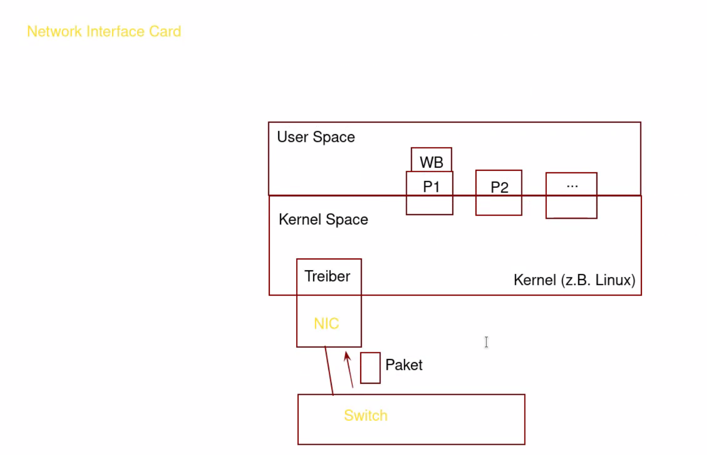
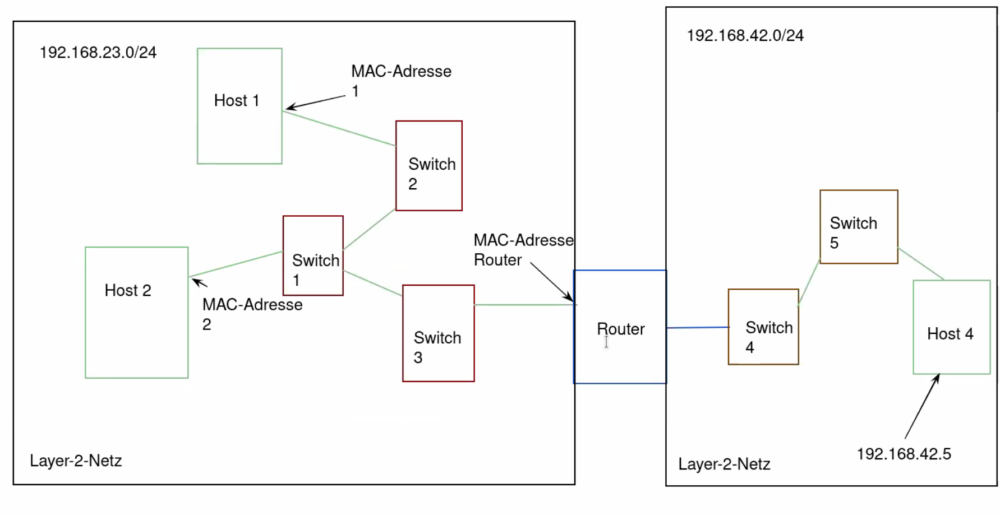

<!-- START doctoc generated TOC please keep comment here to allow auto update -->
<!-- DON'T EDIT THIS SECTION, INSTEAD RE-RUN doctoc TO UPDATE -->
**Inhaltsverzeichnis**

- [Rechnernetzkonzepte und -architekturen](#rechnernetzkonzepte-und--architekturen)
- [1. Einleitung / Übersicht](#1-einleitung--%C3%BCbersicht)
  - [1.1 Veranstaltungsziele](#11-veranstaltungsziele)
  - [1.2 Inhaltlicher Teil](#12-inhaltlicher-teil)
    - [1.2.1 Kommunikationsszenario](#121-kommunikationsszenario)
    - [1.2.2 Standardisierung](#122-standardisierung)
    - [Internet Engineering Taskforce](#internet-engineering-taskforce)
      - [Arbeitsgruppen  / IETF-Areas](#arbeitsgruppen---ietf-areas)
    - [1.2.3 Begrifflichkeiten](#123-begrifflichkeiten)
    - [1.2.4 ISO / OSI Referenzmodell  - Prüfungsrelevant](#124-iso--osi-referenzmodell----pr%C3%BCfungsrelevant)
      - [7 Anwendungsschicht](#7-anwendungsschicht)
      - [6 Darstellungsschicht](#6-darstellungsschicht)
      - [5 Sitzungsschicht](#5-sitzungsschicht)
      - [4 Transportschicht](#4-transportschicht)
      - [3 Vermittlungsschicht](#3-vermittlungsschicht)
      - [2 Sicherungsschicht](#2-sicherungsschicht)
      - [1 Bitübertragungsschicht](#1-bit%C3%BCbertragungsschicht)
    - [1.2.5 TCP / IP-Modell](#125-tcp--ip-modell)
    - [1.2.6 Protokoll-Header](#126-protokoll-header)
    - [1.2.7. Kopplungselemente](#127-kopplungselemente)
      - [**Switches**](#switches)
      - [**Router**](#router)
      - [**Weitere Kopplungselemente**](#weitere-kopplungselemente)
    - [1.2.8 Topologien](#128-topologien)
    - [Tooling - Wireshark](#tooling---wireshark)
- [2. Netzzugangsschicht: Ethernet / Switching](#2-netzzugangsschicht-ethernet--switching)
- [3. Vermittlungsschicht: Internet Protocol](#3-vermittlungsschicht-internet-protocol)
- [4. Transportschicht: User Datagram Protocol und Transmission Control Protocol](#4-transportschicht-user-datagram-protocol-und-transmission-control-protocol)
- [5. Routing](#5-routing)
- [6. Anwendungsschicht](#6-anwendungsschicht)
- [7. Software-defined Networking](#7-software-defined-networking)
- [8. Netztechnologien](#8-netztechnologien)

<!-- END doctoc generated TOC please keep comment here to allow auto update -->

# Rechnernetzkonzepte und -architekturen 

*16.11.2020*

# 1. Einleitung / Übersicht
## 1.1 Veranstaltungsziele 
Wissensvermittlung zu: 
- Übersichtswissen über Rechnernetze 
- Komponenten und Protokolle im Internet 
- Planung von Netzwerken 
- Konfiguration von Netzwerken

Prüfungsleistung: 
- wenn möglich schriftliche Prüfung 
- letzte Einheit ist für Prüfungsvorbereitung vorgesehen 

Hilfsmittel bei Prüfung: 
- wahrscheinlich 1 DIN A4 - Zettel handschriftlicher eigener Notizen 

    
## 1.2 Inhaltlicher Teil 
### 1.2.1 Kommunikationsszenario 



Bei Abruf einer Website durch Host A von Server A sind vielfältige Technologien zur Realisierung des Szenarios erforderlich. 

**Physische Verbindung**
Auf welchem Weg gelangen die Daten von Host zu Server und zurück?

**Weiterleitung von Daten über das Internet**
- Protokolle, Header, ...

Wie müssen diese Daten gestaltet sein, damit sie verwendet werden können? 

**Weiterleitung der Daten ans richtige Zielsystem**
Wie läuft das Routing ab? 


### 1.2.2 Standardisierung

- ISO 
- ITU
- IEEE
    - Fokus auf den "unteren" Schichten, nah an Physik 
    - Ethernet, Netzwerkkarten, ...
- IETF
    - Standardisierung der Protokolle
    - HTTP, UDP, TCP, Mailprotokolle 
    - ist kein Berufsverband, sondern Freiwilligenorganisation

### Internet Engineering Taskforce 

- Publikationsformat der IETF sind RfC's (Request for Comments)
- RFC haben eindeutige, fortlaufend vergebene Nummern 
- so ist UDP z.B. durch RFC 768 spezifiziert
- recht praxisnahe Beschreibung der Standards

#### Arbeitsgruppen  / IETF-Areas

- IETF-Arbeitsgruppen sind einem von 7 Bereichen (Areas) zugeordnet
    - Applications and Real-Time
    - Internet
    - Security 
    - Operations and Management
    - Routing 
    - General 
    - Transport 
    

### 1.2.3 Begrifflichkeiten 

**Übertragungsmodi** 

|verbindungsorientiert| verbindunglos|
|----|-----|
|Information über Existenz einer Beziehung liegt vor|Information über Existenz einer Beziehung liegt **nicht** vor|
|Beziehung zwischen Sender und Empfänger| Kommunikation kann ohne Verbindungsaufbau begonnen werden|
|z.B. TCP| z.B. UDP|


|leitungsvermittelt| paketvermittelt|
|----|----|
|Feste Durchschaltung zwischen Sender und Empfänger| Gemeinsame Nutzung von Leitungen|
|Ermöglicht Zusicherung von Eigenschaften (Quality of Service- Parameter)|Daten werden in Pakete aufgeteilt, die (direkt oder indirekt) Informationen für die Zuordnung zu einem Empfänger beinhalten|
|zu beachten: es müssen dann soviele Leitungen vorhanden sein, wie genutzt werden sollen|zu beachten: Überlastsituationen können auftreten|


Im Großen und Ganzen ist "das Internet" paketvermittelt, Leitungsvermittlung kann in Spezialfällen vorhanden sein 


### 1.2.4 ISO / OSI Referenzmodell  - Prüfungsrelevant


#### 7 Anwendungsschicht
- Durch anwendungsspezifische Protokolle verwendet 

#### 6 Darstellungsschicht
- Umwandlung von Daten in unabhängiges Format 

#### 5 Sitzungsschicht
- 
#### 4 Transportschicht
- fügt Zusatzinformationen in die Pakete ein, um die Verwendung auf Empfängerseite zu definieren


#### 3 Vermittlungsschicht
- Weiterleitung über lokale Netze hinaus / zwischen verschiedenen Netzen
- unabhängig vom Typ der verwendeten Netze

#### 2 Sicherungsschicht
- einzelne Bitfolgen werden als Frames erfasst 
- Redundanzinformationen werden hinzugefügt um Fehlererkennung und -korrekturen (auch auf Empfängerseite) zu ermöglichen (z.B. Paritätsbits)
-  Beispielverfahren: CRC (Cyclic Redundancy Check)


#### 1 Bitübertragungsschicht
- einzelne Bits in physikalische Signale umwandeln und umgekehrt 
- Modulation und Demodulation

### 1.2.5 TCP / IP-Modell 
 
 Integriert das Referenzmodell, verwendet dazu 4 Schichten.
 Siehe dazu Folie 14. 

### 1.2.6 Protokoll-Header

Siehe Folie 15 

### 1.2.7. Kopplungselemente


#### **Switches**
- verbinden Netzsegmente (Broadcast-Domains) und leiten Pakete zwischen diesen weiter
- sind Layer 2 - Kopplungselemente 
- Netzwerkkarten im gleichen Netzsegment können sich gegenseitig direkt addressieren (per MAC-Adresse)
- speichern intern eine Zuordnung zwischen Ausgangsports und MAC-Adressen 
- Alternative Namen: Bridge, L2-Switch

#### **Router**

- leiten Pakete zwischen unterschiedlichen Netzen weiter
- bei Weiterleitungsentscheidung wird IP-Adresse ausgewertet (Lookup in Routing-Tabelle)
- Alternativ auch: Layer-3-Switch 

#### **Weitere Kopplungselemente**
- Hub, Repeater, Application-Layer-Gateway

<br>

**Kleiner Einschub, nicht komplett:**
```sh
ip addr show

ip neigh 
# zeigt Nachbarn in ARP-Tabelle an 
# IPv4, IPv6 und MAC-Adresse

ip r

ip route
```

### 1.2.8 Topologien

Unterscheidung zwischen physikalischer und logischer Topologie.
Physikalisch dabei die tatsächlich vorhandenen (physischen) Netzwerkkomponenten und ihrer Verbindungen. 
Logisch dabei die Kommunkationsbeziehungen und der Struktur des Datenflusses. 

Grafische Aufarbeitung versch. Topologien auf Folie 17 

Zu beachten: Gibt es SPF (single point of failure) im Netz? Wenn ja: Ausfallsicherheit gering 

**hier fehlen noch Dinge**


### Tooling - Wireshark 

- nützliches Tool zur Darstellung von Kommunikationsvorgängen in Netzwerken 
- es ist eine Filterfunktionalität vorhanden um gezielt nach IP-Adressen, Protokollen, Ports, ... zu suchen 
- dabei verwendete Bibliothek: **LIBPCAP**

Auch verwendetes Tool: Scapy 
 


# 2. Netzzugangsschicht: Ethernet / Switching
# 3. Vermittlungsschicht: Internet Protocol 
# 4. Transportschicht: User Datagram Protocol und Transmission Control Protocol 
# 5. Routing
# 6. Anwendungsschicht
# 7. Software-defined Networking
# 8. Netztechnologien

