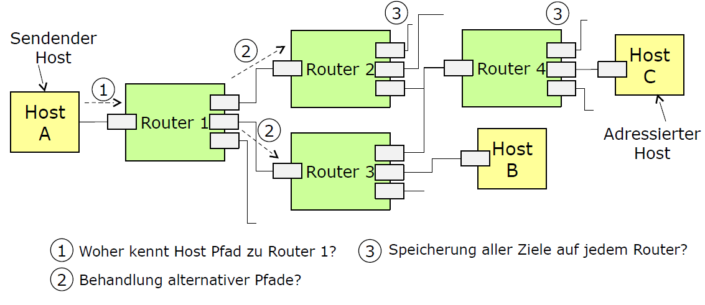
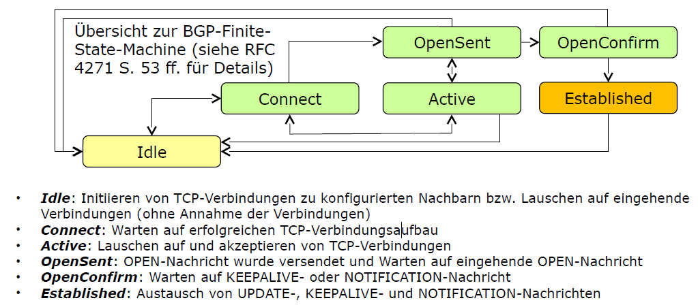

<!----------
title: "Rechnernetze - Grundlagen"
date: "Semester 3"
keywords: [Rechnernetze, DHGE, Semester 3]
---------->

Rechnernetze - Grundlagen
=========================

<!-- START doctoc generated TOC please keep comment here to allow auto update -->
<!-- DON'T EDIT THIS SECTION, INSTEAD RE-RUN doctoc TO UPDATE -->
**Inhaltsverzeichnis**

- [Einleitung / Übersicht](#einleitung--%C3%BCbersicht)
  - [Veranstaltungsziele](#veranstaltungsziele)
  - [Inhaltlicher Teil](#inhaltlicher-teil)
    - [Kommunikationsszenario](#kommunikationsszenario)
    - [Standardisierung](#standardisierung)
    - [Internet Engineering Taskforce](#internet-engineering-taskforce)
      - [Arbeitsgruppen  / IETF-Areas](#arbeitsgruppen---ietf-areas)
    - [Begrifflichkeiten](#begrifflichkeiten)
      - [Übertragungsmodi](#%C3%BCbertragungsmodi)
      - [ISO/OSI Referenzmodell  <!-- hochgradig Prüfungsrelevant-->](#isoosi-referenzmodell-----hochgradig-pr%C3%BCfungsrelevant--)
    - [TCP/IP-Modell](#tcpip-modell)
    - [Kopplungselemente](#kopplungselemente)
    - [Topologien](#topologien)
    - [Medien/Verkabelung](#medienverkabelung)
    - [Tooling - Wireshark](#tooling---wireshark)
- [Netzzugangsschicht](#netzzugangsschicht)
  - [Übersicht zu Ethernet](#%C3%BCbersicht-zu-ethernet)
  - [Aufbau eines Ethernet Frames](#aufbau-eines-ethernet-frames)
  - [Namen von Netzwerkschnittstellen unter Linux](#namen-von-netzwerkschnittstellen-unter-linux)
  - [Switches](#switches)
    - [Architekturtypen](#architekturtypen)
    - [Kenngrößen](#kenngr%C3%B6%C3%9Fen)
    - [Spanning-Tree-Protocol <!--wahrscheinliche Prüfungsaufgabe-->](#spanning-tree-protocol---wahrscheinliche-pr%C3%BCfungsaufgabe--)
      - [STP - Port Fast/Fast Link](#stp---port-fastfast-link)
      - [Rapid Spanning Tree Protocol](#rapid-spanning-tree-protocol)
    - [Virtuelles LAN](#virtuelles-lan)
      - [Tag-basierte VLANs](#tag-basierte-vlans)
      - [Inter-VLAN-Routing](#inter-vlan-routing)
      - [STP und VLAN](#stp-und-vlan)
    - [Transparent Interconnection of lots of links (TRILL)](#transparent-interconnection-of-lots-of-links-trill)
    - [Stacking](#stacking)
- [3 Internetprotokoll und Hilfsprotokolle](#3-internetprotokoll-und-hilfsprotokolle)
  - [IPv4](#ipv4)
    - [IPv4-Header](#ipv4-header)
    - [Fragmentierung](#fragmentierung)
    - [IPv4-Adressierung](#ipv4-adressierung)
  - [Address Resolution Protocol (ARP)](#address-resolution-protocol-arp)
    - [Einordnung](#einordnung)
    - [Protokolldetails](#protokolldetails)
  - [ICMP](#icmp)
  - [Praxisübung](#praxis%C3%BCbung)
  - [Nachteile IPv4](#nachteile-ipv4)
  - [IPv6](#ipv6)
    - [Extension-Header](#extension-header)
    - [IPv6-Fragmentierung](#ipv6-fragmentierung)
    - [IPv6-Adressen](#ipv6-adressen)
      - [Adress-Notation](#adress-notation)
      - [Adress-Arten](#adress-arten)
      - [Generelle Adresstruktur](#generelle-adresstruktur)
    - [Erzeugung einer link-local Adresse](#erzeugung-einer-link-local-adresse)
    - [IPv6-Multicasts](#ipv6-multicasts)
    - [NDP](#ndp)
    - [Stateless Adress Autoconfiguration (SLAAC)](#stateless-adress-autoconfiguration-slaac)
    - [Migration IPv4 -> IPv6](#migration-ipv4---ipv6)
      - [Dual-Stack Lite (DS-Lite)](#dual-stack-lite-ds-lite)
    - [Exkurs: Raw Sockets](#exkurs-raw-sockets)
    - [Praxisbeispiel](#praxisbeispiel)
- [Trans`port`schicht](#transportschicht)
  - [User Datagram Protocol (UDP)](#user-datagram-protocol-udp)
  - [Transmission Control Protocol (TCP)](#transmission-control-protocol-tcp)
    - [Congestion / Receiving Window](#congestion--receiving-window)
    - [TCP-Optionen](#tcp-optionen)
    - [Verbindungsaufbau](#verbindungsaufbau)
      - [SYN-Cookies](#syn-cookies)
      - [TCP Fast-Open (TFO)](#tcp-fast-open-tfo)
    - [Multipath TCP (MTCP)](#multipath-tcp-mtcp)
    - [Transport Layer Security (TLS)](#transport-layer-security-tls)
  - [Quick UDP Internet Connections (QUIC)](#quick-udp-internet-connections-quic)
  - [Sockets](#sockets)
    - [SOCK_STREAM](#sock_stream)
    - [SOCK_DGRAM](#sock_dgram)
- [Exkurs: Routing](#exkurs-routing)
  - [Einleitung](#einleitung)
  - [Allgemeines zu Routing](#allgemeines-zu-routing)
    - [Beispiel Routingtabellen](#beispiel-routingtabellen)
    - [Zusammenfassung von Subnetzen](#zusammenfassung-von-subnetzen)
    - [Aufteilen von Subnetzen](#aufteilen-von-subnetzen)
    - [Schema für IP-Forwarding Algorithmus](#schema-f%C3%BCr-ip-forwarding-algorithmus)
  - [Hierarchische Struktur des Internets (Autonome Systeme)](#hierarchische-struktur-des-internets-autonome-systeme)
    - [Klassifizierung von AS](#klassifizierung-von-as)
    - [AS und Routing](#as-und-routing)
  - [Distanzvektor- und Link-State-Protokolle](#distanzvektor--und-link-state-protokolle)
    - [Bellman-Ford-Algorithmus](#bellman-ford-algorithmus)
    - [Dijkstra-Algorithmus](#dijkstra-algorithmus)
  - [Ausgewählte Routing-Protokolle](#ausgew%C3%A4hlte-routing-protokolle)
    - [Routing Information Protocol (RIP)](#routing-information-protocol-rip)
      - [(ausgewählte) Schwächen von RIP](#ausgew%C3%A4hlte-schw%C3%A4chen-von-rip)
    - [Open Shortest Path First (OSPF)](#open-shortest-path-first-ospf)
      - [OSPF-Areas](#ospf-areas)
      - [OSPF - Hello-Pakete](#ospf---hello-pakete)
      - [OSPF- Designated Router](#ospf--designated-router)
      - [OSPF Link-State-Advertisements](#ospf-link-state-advertisements)
      - [Praxisbeispiel - Router-Daemonen-Implementierung (BIRD)](#praxisbeispiel---router-daemonen-implementierung-bird)
    - [Border Gateway Protocol (BGP)](#border-gateway-protocol-bgp)
      - [BGP-Peers /-Nachbarschaften](#bgp-peers--nachbarschaften)
      - [BGP-Pfadauswahl](#bgp-pfadauswahl)
      - [Anmerkung zur Sicherheit](#anmerkung-zur-sicherheit)
- [Anwendungsschicht / Application-Layer](#anwendungsschicht--application-layer)
  - [Einleitung](#einleitung-1)
  - [Anwendungsschicht: Bezug zum OSI-Referenzmodell](#anwendungsschicht-bezug-zum-osi-referenzmodell)
  - [Ausführung von Systemdiensten](#ausf%C3%BChrung-von-systemdiensten)
  - [Domain Name System (DNS)](#domain-name-system-dns)
    - [1. Perspektive: Domainregistrierung](#1-perspektive-domainregistrierung)
    - [Load-Balancing durch DNS](#load-balancing-durch-dns)
    - [DNS-Überblick](#dns-%C3%BCberblick)
    - [Resource Records](#resource-records)
    - [Protokoll / Anfragedetails](#protokoll--anfragedetails)
    - [Zonendefinition / Zonentransfer](#zonendefinition--zonentransfer)
    - [DNS over TLS / HTTPS](#dns-over-tls--https)
    - [Dynamic DNS / Reverse DNS](#dynamic-dns--reverse-dns)
    - [DNS - manuelle Abfragen](#dns---manuelle-abfragen)
  - [Zeitsynchronisation - NTP](#zeitsynchronisation---ntp)
    - [Motivation](#motivation)
    - [Network Time Protocol - Architektur](#network-time-protocol---architektur)
    - [NTP On-Wire Protocol](#ntp-on-wire-protocol)
    - [SNTP - Simple Network Time Protocol](#sntp---simple-network-time-protocol)
    - [NTP - Implementierungsbeispiele](#ntp---implementierungsbeispiele)
  - [DHCP](#dhcp)
    - [DHCPv6](#dhcpv6)
  - [SOCKS-Protokoll](#socks-protokoll)
- [Prüfungsvorbereitung](#pr%C3%BCfungsvorbereitung)
  - [Formalien](#formalien)
  - [Beispielklausur](#beispielklausur)
    - [Internet Engineering Taskforce (2 Punkte)](#internet-engineering-taskforce-2-punkte)
    - [ISO/OSI-Referenzmodell (7 Punkte)](#isoosi-referenzmodell-7-punkte)
    - [Virtuelle LANs (6 Punkte)](#virtuelle-lans-6-punkte)
    - [Internet Protocol (4 Punkte)](#internet-protocol-4-punkte)
    - [IP-Subnetze (6 Punkte)](#ip-subnetze-6-punkte)
    - [Routing (6 Punkte)](#routing-6-punkte)
    - [Transportschicht (9 Punkte)](#transportschicht-9-punkte)
    - [Autonome Systeme / BGP (4 Punkte)](#autonome-systeme--bgp-4-punkte)
    - [Domain Name System (4 Punkte)](#domain-name-system-4-punkte)
    - [VXLAN (2 Punkte)](#vxlan-2-punkte)
  - [Praxisübung: Aufsetzen eines DNS-Servers](#praxis%C3%BCbung-aufsetzen-eines-dns-servers)

<!-- END doctoc generated TOC please keep comment here to allow auto update -->

<!--newpage-->

# Einleitung / Übersicht

## Veranstaltungsziele

**Wissensvermittlung zu:**

- Übersichtswissen über Rechnernetze
- Komponenten und Protokolle im Internet
- Planung von Netzwerken
- Konfiguration von Netzwerken

**Prüfungsleistung:**

- wenn möglich schriftliche Prüfung
- letzte Einheit ist für Prüfungsvorbereitung vorgesehen

**Hilfsmittel bei Prüfung:**

- wahrscheinlich 1 DIN A4 - Zettel handschriftlicher eigener Notizen

## Inhaltlicher Teil

### Kommunikationsszenario

<!-- width=500px -->

Bei Abruf einer Website durch `Host A` von `Server A` sind vielfältige Technologien zur Realisierung des Szenarios erforderlich.

- **Physische Verbindung:** Auf welchem Weg gelangen die Daten von Host zu Server und zurück?
- **Weiterleitung von Daten über das Internet:** Protokolle, Header,... (Wie müssen diese Daten gestaltet sein, damit sie verwendet werden können?)
- **Weiterleitung der Daten ans richtige Zielsystem:** Wie läuft das Routing ab?

### Standardisierung

- ISO
- ITU
- IEEE: Fokus auf den "unteren" Schichten, nah an Physik (Ethernet, Netzwerkkarten,...)
- IETF: Standardisierung der Protokolle (HTTP, UDP, TCP, Mailprotokolle); Freiwilligenorganisation

### Internet Engineering Taskforce

- Publikationsformat der IETF sind RfC's (Request for Comments) mit eindeutigen, fortlaufenden Nummern
- so ist UDP z.B. durch RFC 768 spezifiziert
- recht praxisnahe Beschreibung der Standards

#### Arbeitsgruppen  / IETF-Areas

IETF-Arbeitsgruppen sind einem von 7 Bereichen (Areas) zugeordnet:

- Applications and Real-Time
- Internet
- Security
- Operations and Management
- Routing
- General
- Transport

### Begrifflichkeiten

#### Übertragungsmodi

| verbindungsorientiert (z.B. TCP)                    | verbindunglos (z.B. UDP)                                      |
| --------------------------------------------------- | ------------------------------------------------------------- |
| Information über Existenz einer Beziehung liegt vor | Information über Existenz einer Beziehung liegt **nicht** vor |
| Beziehung zwischen Sender und Empfänger             | Kommunikation kann ohne Verbindungsaufbau begonnen werden     |


| leitungsvermittelt                                                                       | paketvermittelt                                                                                                             |
| ---------------------------------------------------------------------------------------- | --------------------------------------------------------------------------------------------------------------------------- |
| Feste Durchschaltung zwischen Sender und Empfänger                                       | Gemeinsame Nutzung von Leitungen                                                                                            |
| Ermöglicht Zusicherung von Eigenschaften (Quality of Service-Parameter)                  | Daten werden in Pakete aufgeteilt, die (direkt oder indirekt) Informationen für die Zuordnung zu einem Empfänger beinhalten |
| zu beachten: es müssen dann so viele Leitungen vorhanden sein, wie genutzt werden sollen | Überlastsituationen können auftreten                                                                                        |

> Im Großen und Ganzen ist "das Internet" paketvermittelt, Leitungsvermittlung kann in Spezialfällen vorhanden sein

#### ISO/OSI Referenzmodell  <!-- hochgradig Prüfungsrelevant-->

<!-- width=500px -->

- **Anwendungsschicht:** Durch anwendungsspezifische Protokolle verwendet
- **Darstellungsschicht:** Umwandlung von Daten in unabhängiges Format
- **Sitzungsschicht**
- **Transportschicht:** fügt Zusatzinformationen in die Pakete ein, um die Verwendung auf Empfängerseite zu definieren
- **Vermittlungsschicht:** Weiterleitung über lokale Netze hinaus / zwischen verschiedenen Netzen (unabhängig vom Typ der verwendeten Netze)
- **Sicherungsschicht:** Erfassung einzelner Bitfolgen als Frames, Hinzufügen von Redundanzinformationen (z.B. CRC - Cyclic Redundancy Check)
- **Bitübertragungsschicht:** einzelne Bits in physikalische Signale umwandeln und umgekehrt (Modulation und Demodulation)

### TCP/IP-Modell

Integriert das Referenzmodell unter Verwendung von vier Schichten:

<!-- width=500px -->

- **Anwendungsschicht:** Umfasst obere drei Schichten des OSI-Modells, weitere Unterteilung obliegt Anwendungsprotokoll
- **Transportschicht:** Ende-zu-Ende-Kommunikation zwischen Anwendungen
- **Internetschicht:** Ermöglicht Kommunikation zwischen Hosts in unterschiedlichen Netzwerken
- **Link Layer:** Kommunikation mit direkten Nachbarn

<!-- width=500px -->

### Kopplungselemente

<!-- width=500px -->

**Switches (auch: Bridge, L2-Switch)**

- Layer-2-Kopplungselement: verbinden Netzsegmente (Broadcast-Domains) und leiten Pakete zwischen diesen weiter
- Netzwerkkarten im gleichen Netzsegment können sich gegenseitig direkt adressieren (per MAC-Adresse)
- speichern intern eine Zuordnung zwischen Ausgangsports und MAC-Adressen

**Router (auch: Layer-3-Switch)**

- leiten Pakete zwischen unterschiedlichen Netzen weiter
- bei Weiterleitungsentscheidung wird IP-Adresse ausgewertet (Lookup in Routing-Tabelle)

**Weitere Kopplungselemente**

- Hub, Repeater, Application-Layer-Gateway, ...


### Topologien

Unterscheidung zwischen physikalischer und logischer Topologie:

- Physikalisch Topologie: tatsächlich vorhandenen Netzwerkkomponenten und ihrer Verbindungen
- Logisch Topologie: Kommunikationsbeziehungen und Struktur des Datenflusses

<!-- width=500px -->

> SPF (single point of failure) im Netz? Wenn ja: Ausfallsicherheit gering

### Medien/Verkabelung

heute typischerweise zwischen Kopplungselementen und Hosts eingesetzt:

**Twisted-Pair-Kabel**

- Kabel mit verdrillten Adernpaaren (= Schutz gegen Störeinflüsse durch gegenseitiges Aufheben)
- Unterscheidung in:
	- Unshielded Twisted Pair (UTP): Ungeschirmt
	- Shielded Twisted Pair (STP): Geflechtschirm
	- Foiled Twisted Pair (FTP): Gesamtschirmung
- Klassifizierung durch ISO-Kategorien (CAT 3, 5e, 6, 6A, 7,...)

**Lichtwellenleiter**

- Aus Glasfasern und Mantelung bestehende Lichtleiter
- Kern/Modenfeld besitzt einen höheren Brechungsindex als Mantel -> Führung des Lichts durch Totalreflexion
- Spezifikation durch Durchmesser([Kern$\oslash$]/[Mantel$\oslash$]); Weitere Kenngrößen: Wellenlänge, Dämpfung
- Unterscheidung in Multimode LWL und Single-/Monomode LWL

### Tooling - Wireshark

- nützliches Tool zur Darstellung von Kommunikationsvorgängen in Netzwerken
- Filterfunktionalität um gezielt nach IP-Adressen, Protokollen, Ports,... zu suchen
- verwendete Bibliothek: `LIBPCAP`
- weiteres Tool: `Scapy`

# Netzzugangsschicht

## Übersicht zu Ethernet

- Ursprünglich für LAN-Kommunikation vorgesehen
- Klassisch: Steuerung des Zugriffs auf den Kanal über CSMA/CD-Algorithmus (bei Punkt-zu-Punkt obsolet)
- Seit den 1980iger Jahren verschiedene Varianten etabliert, die sich bzgl.
Übertragungsraten, Kabeltypen und Leitungskodierung unterscheiden
	- Datenraten von 10 Mbit/s bis 400 Gbit/s, ...
	- Leitungskodierung u.a.: Manchester-Code, 4B5B-Code, 8b10b-Code, ...
	- Kabeltypen u.a.: Koaxialkabel, Twisted-Pair-Kabel, Multimode
Lichtwellenleiter, Singlemode Lichtwellenleiter, ...
- Alternative: z.B. Infiniband

## Aufbau eines Ethernet Frames

<!-- width=500px -->

- Präambel: Synchronisation zwischen Kommunikationspartnern
- SFD: Start of Frame Delimiter (fest Bitfolge zur Identifikation des Frame-Anfangs)
- Quell-/Zieladresse: global eindeutige 6-Byte-Adresse
- Nutzdaten: maximal 1500 Bytes Nutzdaten (Header höherer Schichten + Daten)
- Typ-Feld: Typ-Feld der nächsthöheren Netzwerkschicht (z.B. `0x0800` für IPv4) - alternativ Längenfeld
- Padding: Gewährleistet Minimalgröße von 64 Byte
- CRC-Checksum: 32-Bit-Prüfsumme über das Frame (von Zieladresse bis Padding-Feld)

## Namen von Netzwerkschnittstellen unter Linux

- Alt: `ethX` bzw. `wlanX` (an MAC gebunden -> Probleme bei Tausch)
- Neu: Consistent Network Device Naming (z.B. `enp0s25`)
	- Ethernetinterface (en), das an PCI-Bus (p) an Slot 25 hängt

## Switches

- Multiport Kopplungselemente, das Frames nur an den Port weiterleitet über den der Empfänger erreichbar ist
- Speicherung von Adressen in Source-Address-Table (SAT)
- **Cut-Through Switches:** Nach Analyse der MAC-Adresse sofortiges Durschalten zum entsprechenden Port (Weiterleitung ohne Zwischenspeicherung = geringe Latenz, kein Einfluss auf Datenrate)
- **Store-and-Forward Switches:** Frame wird am Eingangsport und Ausgangsport gepuffert (größere Latenz, Möglichkeit zur Zwischenverarbeitung der Daten)

### Architekturtypen

- **Shared Memory:** CPU kopiert Daten nach Extraktion der Zieladresse in den korrekten Ausgangspuffer
- **Bus-System:** Empfangener Port leitet Frame über gemeinsamen Bus an richtigen Ausgangsport
- **Switching-Matrix:** Physische Durchschaltung von Ein- und Ausgabeleitungen

### Kenngrößen

- Datenrate der verschiedenen Ports
- Datenrate des Backplanes (der internen Busse)
- Port-Typen
- Maximale Größe des SAT
- Managementinterface (CLI/WEB UI/ SNMP)
- Unterstützte RFCs und IEEE-Standards
- Bandbreitenmanagement
- Preis

### Spanning-Tree-Protocol <!--wahrscheinliche Prüfungsaufgabe-->

- STP etabliert sich innerhalb des Netzes einen Spannbaum durch das Blockieren von Ports, die Zyklen erzeugen würden
- Blockierter Port: Eingehender und ausgehender Traffic wird verworfen, Kanal ansonsten voll funktionsfähig
- STP reagiert automatisch auf Link-Fehler und berechnet einen neuen Spannbaum unter Berücksichtigung ausgefallener Verbindungen (-> Aktivierung blockierter Ports im neuen Spannbaum)

**Ablauf**

1. Root-Bridge bestimmen: alle Bridges senden Priorität und MAC an alle (höchste Priorität / geringste MAC wird Root)
2. Bestimmung zur kürzesten Pfade zur Root-Bridge (Pfadlänge wird an jedem Switch unter Berücksichtigung der Datenrate automatisch inkrementiert)
3. Deaktivieren aller Ports, die nicht Root sind

**Begriffe**

- Root-Port: Switch Port, der am nächsten zur Root-Bridge liegt
- Designated Port: Alle Ports, die kein Root-Port und nicht blockiert sind
- Non-Designated Port: Ports in blockiertem Zustand um Zyklen zu verhindern

#### STP - Port Fast/Fast Link

- STP weist Konvergenzprobleme auf: Netzwerk erst nach etwa 30 Sekunden funktionstüchtig (Probleme beispielsweise mit PXE Boot)
- Switches bieten Speziellen Modus für Ports an denen Endsysteme angeschlossen sind (Port geht sofort bei Aktivierung in Forwarding State)
- Herstellerspezifische Terminologie: PortFast (Cisco), Fast Link (NetGear)

#### Rapid Spanning Tree Protocol

- Proaktiver Ansatz bei dem effizient auf Alternativpfade gewechselt werden kann

### Virtuelles LAN

- Physisches Netzwerkdesign steht häufig mit logischem Netzwerkdesign in Konflikt
- logische Einteilung des Netzes auf Ebene der Switche (Aufteilung in Broadcast-Domänen; erhöhte Sicherheit)

**Varianten**

- Portbasierte VLANs: jeder Port kann Mitglied exakt eines VLANs sein
- Tag-basierte VLANs: Frames werden mit ID eines VLANs getaggt, wodurch über einen Port mehrere VLANs realisiert werden können
- dynamische/inhaltsbasierende VLANs: Zuordnung zu VLANs anhand verwendeter Protokolle (weniger verbreitet)

#### Tag-basierte VLANs

- Erweiterung der Ethernet-Frames um einen Tag zur Identifikation des VLANs zu dem das Frame gehört

**Aufbau** (4 Bytes)

<!-- width=500px -->

- **Tag Protocol Identifier:** fixer Hex-Wert
- **Priority Code Point:** Prioritätsinformationen
- **Drop Eligible Indicator:** Identifiziert Frames, die bei Überlast verworfen werden können
- **VLAN Identifier:** ID des zugehörigen VLANs ($2^{12}-2$ = max. 4096 VLANs)

#### Inter-VLAN-Routing

**Ansatz 1**

- Routing zwischen VLANs ohne zusätzliche Softwareunterstützung durch in unterschiedlichen VLANs befindliche Physikalische Schnittstellen eines Routers möglich
- Problem: hoher Aufwand für Hardware (für jedes VLAN physische Schnittstelle plus Verkabelung)


- **Ansatz 2:** Einsatz von virtuellen Interfaces zur Vermeidung des hohen Aufwandes für separate Schnittstellen
<!-- Gerne Prüfungsfrage: Voraussetzungen/Konfigurationsschritte -->

#### STP und VLAN

> STP weiß nix von VLANs

- klassischer Ansatz nutzt die verfügbaren physischen Verbindungen nicht optimal aus
- Lösung: Multiple Spanning Tree Protocol (jedes VLAN hat eigenen ST + ein Internal Spanning Tree für alle VLANs)

### Transparent Interconnection of lots of links (TRILL)

- Ethernet-Frames werden in einen TRILL-Header gekapselt
- Routing dieser Frames auf deren Basis auf L2 (nächster Hop wird durch umgebenen L2-Header angegeben)
- Nutzung von Intermediate System to System zur Ermittlung von Pfaden zwischen Rbridges
- TRILL-Header besitzt HOP-Count-Feld um Routing-Schleifen zu vermeiden
- Entfernung des THRILL-Headers vor Auslieferung an das Zielsystem

### Stacking

- Stackfähige Switsches können miteinander zu einer Gruppe verbunden werden (einzelnes logisches Gerät, ansprechen über einzelne IP)
- Vorteile: Skalierbarkeit (Anzahl der Ports einfach ), vereinfachte Netzwerkschnittstelle (Konfiguration von nur einem logischem Gerät), Vergrößerter Durchsatz (Stacking über Port mit hoher Datenrate)
- Nachteil: Platzbedarf, höherer Stromverbrauch mehrerer Geräte, Kopplung als neue Fehlerquelle

# 3 Internetprotokoll und Hilfsprotokolle

- Schicht 3; von Übertragungsmedium unabhängig
- Overlay über L2, bildet davon unabhängiges Netz
- Ermöglicht Adressierung von "Knoten"
- zwei Versionen verbreitet: IPv4 und IPv6
- IP-Paket wird trotz Hops nicht verändert (Ausnahme: NAT)
- Bezeichnung Hostadresse eigentlich falsch -> Schnittstellenadresse
- eine IP-Adresse ist nicht einem Host zugewiesen, sondern einem NIC
  - Workaround: Loopback-Interface, zur Adressierung von Localhost
- *casts:
  - Unicast: Senden an exakt einen NIC
  - Broadcast: Senden an alle NICs
  - Multicast: Senden an Teilmenge
  - Anycast: Senden an alle NICs, aber nur einer antwortet

## IPv4

### IPv4-Header

<!-- width=500px -->

- Version: 4 Bits, Protokollversion
- Internet Header Length (IHL): 4 Bits, Länge des Headers in 32 Bit Wörtern, Standardwert 5 -> 5 * 32 Bit = 20 Byte
- Differenciated Service Code Point (DSCP): 6 Bit, Prioritätsklassen
- Explicit Congestion Notification (ECN): 2 Bit, Meldung von Überlast, von Layer 4 gesteuert, wird damit rückläufig zu Sender kommuniziert "Bitte sende langsamer"
- Total Length: 16 Bit, Gesamtlänge des Datagramms / Fragments in Bytes
- Identification: 16 Bit, ID des Datagramms
- Flags: 3 Bit:
  - Bit 0: reserviert (RFC3514)
  - Bit 1: Don't Fragmen (DF)
  - Bit 2: More Fragments (MF)
- Fragment Offset: 13 Bit, Offset in 8 Byte Blöcken, die Daten innerhalb des urspr. Paket hatten
- Time to Live (TTL): 8 Bit, Lebenszeit des Pakets, in Praxis maximale Anzahl der Hops
- Protocol: 8 Bit, im Datenbereich verwendetes Protokoll, Bsp. in Linux: `/etc/protocols`
- Header Checksum: Prüfsumme für (nur) IP-Header
- Options: Zusatzdaten für bspw. Routing oder Zeitstempel
  - Bsp Source Routing: Sender gibt exakte Route an; ermöglicht Angriffsfläche für DoS-Attacken

### Fragmentierung

<!-- width=500px -->

- 1:1 Übersetzung von IP-Paket und ETH-Frame
- Maximum Transmission Unit (MTU): Maximalgröße des ETH-Payloads
  - ETH-Payload enthält auch IP-Header,... --> nicht tatsächliche Nutzdatengröße
  - größer: weniger Overhead, anfälliger für Fehler, höherer Speicherbedarf in Netzwerkkomponenten
  - kleiner: weniger Latenz, mehr Overhead
- wenn IP-Paket größer als MTU: muss fragmentiert werden
  - Ergebnis sind n vollwertige IP-Pakete inkl. Header
  - alle Pakete gleiche Identification Nummer  (zum Rekonstuieren des urspr. Paket)
  - Flags:
    - MF-Flag = 1 bei allen außer dem letzten Paket
    - Fragment Offset: zählt Byteposition hoch
- Wo wird fragmentiert?
  - bei IPv4 kann bei jedem Hop auf der Route fragmentiert werden, Performanceverlust
  - bei IPv6 wird beim Sender fragmentiert
- Pass-MTU: bezeichnet geringste MTU aller Hops auf der Route

```bash
# MTU anzeigen lassen
ip addr show
```

### IPv4-Adressierung

- Struktur: 0 bis n Bits Netzadresse, 32-n Bit Hostadresse (NIC-Adresse)
- Notation: ``adresse/n`` --> Classless Inter Domain Routing Notation (CIDR)
- Netzanteil ermöglicht Ausbildung einer hierarch. Struktur, skalierbar
- Einteilung von IPv4-Adressen in öff. Adressen (innerhalb des Intenets eindeutig, durch zentrale Instanz vergeben) und private Adressen (innerh. eines lokalen Netzes eindeutig)
- insbesondere durch IPv4-Adress-Knappheit werden öff. Adressen durch Network Address Translation (NAT) auf mehrere Hosts abgebildet
- Routing:

<!-- width=500px -->

## Address Resolution Protocol (ARP)

### Einordnung

<!-- width=500px -->

- ARP ermittelt zu IP-Adressen und weiteren Adressfamilien die zugehörigen Hardwareadressen
- Request-Reply-Protokoll
- ermittelte Zuordnung für best. Zeitraum in ARP-Tabelle gespeichert
- wenn Ziel-NIC außerhalb des eigenen Netzwerks: Ermittlung der MAC-Adresse des **Gateways**, nichts dahinter
  - siehe folgendes Bild:

<!-- width=500px -->

```
# Für Anzeige von ARP-Anfragen (Beispiel)
tcp dump -i any -p arp
```

### Protokolldetails

//TODO: Bild Folie 7

//TODO: ausfüllen

## ICMP

- Internet Control Message Protocol dient der Kommunikation von Fehlern und Abfrage von Statusinformation in (fast immer) IP-basierten Netzwerken
- ausgewählte Typen:
  - 0: Echo Reply: Antwort auf Echo Request
  - 3: Destination Unreachable: Ziel nicht erreichbar mit folgenden Codes:
    - 0: Net unreachable
    - 3: Port unreachable
    - 4: Fragmentation needed and Don't Fragmen (DF) was set
  - 5: Redirect: siehe unten
  - 9: Router Advertisement: dient automatischen Discovery von Routern
  - 11: Time Exceeded: TTL-Feld aus IP-Datagramms abgelaufen
  - 13: Timestamp: TODO
- Aufbau:
  - 8 Bit Typ (s.o.)
  - 8 Bit Code (s.o.)
  - 16 Bit Prüfsumme
  - weitere Inhalte abhängig von Typ / Code

Möglichkeiten:
- mehr Funktionen als "nur" Ping
- Fehlermeldungen können im Netzwerk propagiert werden
- Zeitstempel können zur Lastermittlung genutzt werden

Beispiel: ICMP-Redirect

- wird von einem Gateway versendet, wenn es feststellt, dass ein Router im gleichen Netz liegt, sodass direkt mit diesem kommuniziert werden kann
- bietet Angriffsfläche: kann verwendet werden, um kompromittierten Router in den Pfad zu zwingen
- per Default in vielen Systemen deaktiviert

## Praxisübung

Exkurs Namespaces:

- Namespaces bieten Möglichkeit, separate Netzwerk-Stacks lokal zu schaffen
- Zu Beginn leere und frei konfigurierbare Stacks
- es können komplette lokale Netzwerke innerhalb eines Kernels geschaffen werden
- wird zum Beispiel für [Docker](https://www.docker.com/) genutzt
	- dort aber auch noch separate Namespaces für PIDs, IP-Tables, Filesystem

Verknüpfung von 3 Network Namespaces:

<!-- width=500px -->

- 3 Namespaces erstellen:

```bash
sudo ip netns add ns1
sudo ip netns add ns2
sudo ip netns add ns3

sudo ip netns list # zur Überprüfung
```

- virtuelle Ethernet-Interfaces erstellen:

```bash
sudo ip link add veth1 netns ns1 type veth peer name veth2 netns ns2 # erstellt veth1 in ns1 und veth2 in ns2
sudo ip link add veth3 netns ns2 type veth peer name veth4 netns ns3
```

- Namespace betreten und Interface aktivieren:

```bash
sudo ip netns exec ns1 /bin/bash
ip link set veth1 up
```

- diesen Schritt für alle Interfaces wiederholen
- allen VEth-Interfaces die gewünschten Adressen vergeben: (für alle Interfaces wiederholen)

```bash
sudo ip netns exec ns1 /bin/bash
sudo ip addr add 192.168.42.5/24 dev veth1
```

- Routen zwischen den Namespaces anlegen:

```bash
sudo ip netns exec ns1 /bin/bash
ip route add 192.168.23.0/24 via 192.168.42.254
```

- diesen Schritt für alle Namespaces / gewünschten Routen wiederholen
- Kernel anweisen, für das Router-Namespace das Routing zu aktivieren:

```bash
sudo ip netns exec ns2 /bin/bash
echo 1 > /proc/sys/net/ipv4/ip_forward
```

- mit bspw. Ping überprüfen, ob Verbindung funktioniert

## Nachteile IPv4

- Ausgeschöpfter Adressraum: nur 4 Milliarden Adressen, ungünstige Vergabe, NAT als Lösung (aber: erschwert Nutzung einiger Dienste)
- Ineffizientes Routing: Header hat variable Länge
- Keine automatische Konfiguration: IP muss manuell oder über DHCP vergeben werden (zusätzliche Infrastruktur erforderlich)

## IPv6

- soll in nächsten Jahren schrittweise IPv4 ablösen
- Vereinfachung des Headers:

 <!-- width=500px -->

- Traffic-Class: Prioritätsangabe
- Flow Label: Klassifizierung von Datagrammen in verschiedenen Flows mit gleichem Label
- Next Header: Identifikation für Erweiterungsheader/Schicht-4-Header
- Payload-Length: Größe des gesamten Datagramms
- Hop-Limit: Ersetzt TTL Feld (Angabe maximaler Hops)

### Extension-Header

- in Zusammenhang mit Next-Header-Feld verwendet
- verweist auf Header eines Protokolls der nächsthöheren Schicht oder Extension-Header wird in das Datagramm eingebettet

<!-- width=500px -->

- Diverse Optionen: Hop-by-Hop Options, Fragment, Destination Options, Routing, Auth, ...

### IPv6-Fragmentierung

- Grundprinzip ähnlich zu IPv4:  wenn auf Pfad MTU nicht ausreicht wird fragmentiert
- Unterschied zu IPv4:
	- durch Sender fragmentiert, dadurch Effizienzsteigerung
	- Absender wird über Fragmentierungsbedarf informiert (per ICMPv6-Nachricht "Packet too big")
- Praxis: limitierende MTU meist an den Rändern, also beim Sender

### IPv6-Adressen

#### Adress-Notation

- `ffff:ffff:ffff:ffff:ffff:ffff:ffff:ffff` ($8*16=128 \text{Bit}$)
- Längere Folgen von Nullen können einmalig durch `::` abgekürzt werden: `ff01:0:0:0:0:0:2342:78fa` -> `ff01::2342:78fa``
- letzten 32 Bit einer Adresse kann die dezimale Notation (wie in IPv4)
verwenden: `::141.76.40.1`
- Portangabe: `[ff01:0:0:0:0:0:0:0:2342:78fa]:80` bzw. `[ff01::2342:78fa]:80`

**Empfehlungen aus RFC**

- führende Nullen des Blocks weglassen
- zwei Doppelpunkte sollen maximale Anzahl von 0-Blöcken repräsentieren (nicht zur Abkürzung eines einzelnen Blocks verwenden)
- bei mehreren möglichen Kürzungen: möglichst weit links kürzen

#### Adress-Arten

- **Unicast-Adressen:** Identifikator eines *einzelnen* Netzwerkinterfaces (link-local innerhalb geschlossener Netzsegmente oder global)
- **Anycast-Adressen:** Identifikator für *Menge von Interfaces* -> wird an **eines** der Interfaces gesendet, dass durch die Adresse identifiziert wird (z.B. bei DNS angewendet)
- **Multicast-Adressen:** Identifikator für *Menge von Interfaces* -> wird an **alle** Interfaces gesendet, die durch die Adresse identifiziert werden (kein Broadcast mehr erforderlich)

#### Generelle Adresstruktur

- Trennung zwischen Präfix und Interface Identifier
- Notation analog zu CIDR: `/64` am Ende gibt die Länge des Präfix an

Typ einer Adresse kann an den höchstwertigsten Bits erkannt werden:

- Unspecified-Adresse: `00...0` -> `::/128`
- Loopback-Adressen: `00..1` -> `::1/128`
- Multicast-Adressen: `11111111` -> `ff00::/8`
- Link-local Unicast: `111111101010` -> `fe80::/10`
- Solicited-Node-Adresse: `ff02:0:0:0:0:1:ff00::/104`
- Globale Unicast-Adressen: alle anderen (derzeit: `2000::/3`)
- Anycast-Adressen: Adressraum identisch zu Unicast-Adressen (syntaktisch nicht unterscheidbar)

### Erzeugung einer link-local Adresse

- wird aus der Link-Layer Adresse (MAC) berechnet
- Überprüfung auf Eindeutigkeit über `SLAAC`
- Problem: einfache Identifikation von Nutzern
- Lösung: Privacy Extension for Stateless Adress Autoconfiguration (regelmäßige zufällige Generierung des Interface-Identifiers)

### IPv6-Multicasts

<!-- width=500px -->

- es gibt mehrere Multicast-Gruppen an denen teilgenommen werden kann
- es existieren zudem festgelegte "well-known" Multicast-Adressen
	- `ff02::1` -> alle Knoten am Link (z.B. für ARP-äquivalente Anfragen)
	- `ff02::2` -> alle Router am Link
	- `ff02::16` -> alle MLDv2-fähigen Router

### NDP
<!-- NDP nicht so genau Prüfungsrelevant, mehr Infos in den Folien-->

**Aufgaben:**

- Ermitteln verfügbarer Router
- Bestimmung der Link-Layer-Adresse eines Knoten
- Verwaltung von Erreichbarkeitsinformationen
- Grundlage für Stateless Address Autoconfiguration

### Stateless Adress Autoconfiguration (SLAAC)
<!-- hochgradig Prüfungsrelevant-->

**Phase 1: Erzeugung und Überprüfung einer Link-lokalen Adresse:**

1. Host generiert Link-lokale Adresse aus MAC (oder Privacy Extension)
2. Host tritt der All-Nodes-Multicast-Adresse und der Solicited-Node-Multicast-Adresse der erzeugten Link-lokalen Adresse bei und sendet eine Neighbor-Solicitation-
Nachricht an diese Adresse
3. Host wartet bestimmte Zeitspanne; Ausbleiben einer Antwort = Indikator für die Eindeutigkeit der selbst zugewiesenen Adresse -> Adresse wird dem Interface zugewiesen
4. Host sendet Neighbor-Advertisement-Nachrichten an alle Hosts des Links (= Multicast-Adresse `ff02::1`)

**Phase 2: Erzeugen einer weltweit eindeutigen Global-Unicast-Adresse:**

1. Host fragt mittels einer Router-Solicitation-Nachricht nach einem Router Advertisement
2. Router versendet ein Router Advertisement mit allen
für die Konfiguration wichtigen Informationen (insbesondere Angabe des Präfixes) -> Erzeugung einer Global-Unicast-Adresse aus Präfix und Link-local-Adresse
3. Nach Betritt zur Solicited-Node-Multicast-Adresse für die Global Unicast-Adresse, werden mehrere Neighbor-Solicitation-Nachrichten an die Multicast-Adresse
versendet -> ist Adresse bereits verwendet sendet entsprechender Host Neighbor-Advertisement-Nachricht
4. Ist die Adresse frei, wird sie lokal zugewiesen

### Migration IPv4 -> IPv6

- Übergang zu IPv6 wird seit zwanzig Jahren propagiert
- Aktuell: Koexistenz von IPv4 und IPv6 -> Mechanismen zur Interoperabilität
	- Dual-Stack: Interface erhalt sowohl IPv4 und IPv6-Adressen
	- Tunnel-Mechanismen: Kapselung Header der beider Versionen (z.B. `4in6`, `6in4`, `6over4`, ...)
	- Translations-Mechanismen: Transformation der Header in unterschiedliche Versionen (z.B. NAT64 = Übersetzung von IPv4-Adressen in IPv6)

#### Dual-Stack Lite (DS-Lite)

- Kombination aus Tunnelmechanismen und Translation
- Vorteile:
	- Providerinfrastruktur kann auf IPv6 umgestellt werden
	- IPv4-Adressen beim Provider werden eingespart

<!-- width=500px -->

### Exkurs: Raw Sockets

- Ermöglichen die Instanziierung von IP-Headern und Implementierung von Protokollen im User-Space
- IP-Headerelemente wie auch gekapselte Datagramme können im Programm befüllt werden
- durch Raw Sockets können z.B. implementiert werden:
	- Netzwerksicherheitswerkzeuge wie Portscanner
	- ICMP-basierte Anwendungen
	- Routing-Protokolle
- Tooling: `Scapy` und `nmap`
- Frage: Wie kann unter Verwendung von Raw-Sockets ein einfaches TRACEROUTE gebaut werden?

- Antwort: Mit Hilfe des TTL kann dies ermöglicht werden
	- erst TTL 1 (ICMP des ersten Routers)
	- dann TTL 2 (ICMP des zweiten Routers)
	- wiedrholen bis zum Erreichen des gewünschten Ziels
- Problem: nicht alle Router haben diese ICMP-Antworten aktiviert, weitere Anpassung nötig

### Praxisbeispiel

- Namespaces erstellen:

```bash
sudo ip netns add ns1
sudo ip netns add ns2

sudo ip netns list # zur Prüfung
```

- virtuelle Ethernet-Interfaces erstellen:

```bash
sudo ip link add veth1 netns ns1 type veth peer name veth2 netns ns2 # erstellt veth1 in ns1 und veth2 in ns2
```

- radvd installieren und ggf. Konfigurationsdatei anlegen, falls nicht schon vorhanden:

```bash
apt-get install radvd # bei anderen Distributionen analog
touch /etc/radvd.conf
```

- Konfigurationsdatei bearbeiten:

```conf
interface veth1{
  AdvSendAdvert on;
	prefix 2001:db8:1:0::/64{
		AdvOnLink on;
		AdvAutonomous on;
		AdvRouterAddr off;
	};
};
```
[größere Beispiel-Config](https://github.com/reubenhwk/radvd/blob/master/radvd.conf.example)

- Namespace betreten und Interface aktivieren:

```bash
sudo ip netns exec ns1 /bin/bash
ip link set veth1 up
ip a # wird nur Link-Local Adresse besitzen
```

- diesen Schritt für zweites Interface wiederholen
- Unit-Datei für den ``radvd``-Dienst sichern: ``cp /lib/systemd/system/radvd.service /home/username/radvd.service.bak``
- Unit-Datei für den ``radvd``-Dienst zum Schreiben öffnen
- dort die ``ExecStart``-Zeile auf Folgendes ändern:

```conf
ExecStart=/bin/sh -c 'exec /sbin/ip netns exec ns1 /usr/bin/radvd --nodaemon'
```

- **Achtung:** der Pfad von ``radvd`` kann sich je nach Distribution ändern. Auf Ubuntu ist sie in ``/usr/sbin``. Im Zweifelsfall kann der Ort mit ``which radvd`` herausgefunden werden.
- Unit-Datei neu einlesen: ``sudo systemctl daemon-reload``
- radvd starten: ``sudo systemctl start radvd``
- Status des Dienstes prüfen: ``sudo systemctl status radvd``
- Den Network Namespace betreten prüfen, ob ``ip a`` nun zusätzlich eine ``scope global`` IPv6-Adresse mit dem ``2001:[...]``-Präfix anzeigt
**tbc: Anfang nächster Einheit**

# Trans`port`schicht

- Transportschicht dient der Ende-zu-Ende Kommunikation (Prozess zu Prozess)
- Adressierungsmöglichkeit = **Ports** (`bind()` bindet Kommunikation an Port)
- Beispiel: zielgerichtete Adressierung von `http`-Server über Port 80 (alle Ports<1024 = *well-known* Ports -> benötigen `root`)

<!-- width=500px -->

## User Datagram Protocol (UDP)

- verbindungsloses unzuverlässiges Transportprotokoll zur ausschließlichen Addresierung von Ports (16-Bit Adresskomponente)
- *unzuverlässiges* = keine Reaktion auf Paketverluste (z.B. durch überlastete Router)
- *verbindungslos* = Kommunikationszustand wird in keinem lokalen Zustand verwaltet -> erneut übermittelt von IP+Port bei jeder Verbindung
- keine Reihenfolgegarantie: Pakete werden nicht zwingend in der richtige Reihenfolge an den Zielprozess weitergegeben
	- Reihenfolge ankommender Pakete kann von keinem Protokoll garantiert werden -> aber: Pufferung vor Weitergabe möglich
- geringer Protokolloverhead -> sehr effizient (besonders für Video-/Audiodaten)
- eingesetzt von DNS, DHCP, NTP, SNMP, ...

<!-- width=500px -->

## Transmission Control Protocol (TCP)

- dominierendes Schicht-4-Protokoll im Internet
- verbindungsorientierte Kommunikation mit wohldefiniertem Verbindungsaufbau
- zuverlässige Kommunikation durch Bestätigungen
- Reihenfolgegarantie
    - Reihenfolge eines Datenstreams bei Sender und Empfänger gleich
    - Bei Reihenfolgeänderung der Bytes bei der Übertragung erfolgt Umsortierung auf Empfängerseite
- Flow Control (Flusskontrolle)
- Congestion Control (Überlaststeuerung) -> bei verlorenen Pakten dynamische Reduktion der Paketgröße
- Segmentierung von Anwendungsdaten in übertragbare Einheiten (auf Grundlage der Maximum Segment Size - MSS)

<!-- width=500px -->

Sequenznummer: bezieht sich auf das erstes Byte eines Paketes
Acknowledgement Number: Bestätigung der Sequenznummer der erhaltenen Bytes (ohne Ack -> wiederholtes Senden des Pakets)
Options: hier eigentlich alle später hinzugekommenen Erweiterungen verwirklicht
Window Size:
  - Empfänger teilt hier maximale Größe des Receiving-Window mit
  - kann sich im Verlauf ändern
Urgent Pointer: verweist auf Daten im Bytebereich (Priorisierung von Daten)
Flags: Bitflags zur Steuerung der Kommunikation (z.B. Aufbau, Trennung, der Verbindung oder ACK)

### Congestion / Receiving Window


- **Receiving Window:** Puffert Daten vor Weiterleitung an den Prozess (verhindert, das Daten für die Verarbeitung verworfen werden müssen)
- **Congestion Window:** soll, bei maximalem Durchsatz, Überlast auf einem Pfad verhindern (insbesondere durch überlastete Router) -> Größe wird dynamisch angepasst (<= Receiving Window)
- beide Windows können auf Konfigurationsebene angepasst werden (z.B. bei lokalen `CEPH`-Clustern, die durch Routing-Flaschenhälse nicht begrenzt sind)
- TCP-Verbindungen sind **bidirektional** -> Sender und Empfänger nehmen ebenso die umgekehrte Rolle ein
- Abbau der bidirektional Verbidnungen separat (`FIN`-Flag) -> können auch unidirektional abgebaut werden

<!-- width=500px -->

- `ECN`-Feld im IP-Header: wird von Router bei Überlast gesetzt
- Rückmeldung an den Sender durch das Setzen des Feldes bei ausgehenden IP-Paketen
- Sender reduziert nach Rückmeldung die Paketgröße und informiert Empfänger über TCP-Header
- = Zusammenspiel zwischen Layern (IP und TCP)

### TCP-Optionen

- Feld, das Zusatzinformationen beinhalten kann, die nicht in den anderen Header-Felder repräsentiert werden
- Mögliche Optionstypen `kind` [durch IANA zugewiesen](https://www.iana.org/assignments/tcp-parameters/tcp-parameters.xhtml)
- Beispiele:
	- 2 = Maximum Segment Size Option: maximale Segmentgröße des Empfängers
	- 3 = Window Scale Option: ermöglicht Window-Größen über 65535 Bytes
	- 4 = TCP Selective Acknowledgment Options
	- 30 = Multipath TCP (MPTCP)

### Verbindungsaufbau

<!-- width=500px -->

<!--Handshake (+ besonders sync-flag) = prüfungsrelevant-->

- zu Beginn beide Seiten CLOSED -> Client sendet Paket mit `SYN`-Flag
- Server antwortet mit `SYN-ACK` -> Client bestätigt mit `ACK`
- neuer Zustand: Established (zum Schließen: `FIN`-Paket)

<!-- width=500px -->

- `SYN`: Synchronisation von Sequenznummern (zufällig gewählt im Angriffsvektoren zuverringern)
	- ist `SYN`-Flag gesetzt wird mitgesendete Sequenznummer als Startsequenznummer festgelegt
- Port-Scanner (wie `nmap`) senden `SYN`-Pakete an alle Ports warten auf `ACK` Antwort (Ports mit aktivem Dienst)
- `SYN`-Paket bieten DOS-Angriffspunkt (`SYN-Flooding`) -> Fluten des Servers mit `SYN`-Paketen -> sendet `ACK` und wartet vergeblich auf `ACK` des Empfängers -> viele halboffene Verbindungen
	- halboffene Verbindungen pro Socket limitiert -> keine neuen Verbindungen möglich
	- Firewall als Schutz: Blacklisten von IPs die mehrere SYN-Pakete kurz hintereinander senden

#### SYN-Cookies

- Idee: Server hält nach initialem TCP-Fragment (mit gesetztem `SYN`-flag) noch keinen Zustand -> kodiert Zustandsbehaftete Informationen als Cookie (Zeitstempel, Endpunkte (IPs+Ports), MSS)
- Cookie wird als Sequenznummer an den Client zurückgesendet -> Server erhält Informationen im dritten Schritt des Verbindungsaufbaus vom Client zurück
- Zusatzschritt für Angreifer -> höherer Aufwand
- bei vielen Systemen umgesetzt, allerdings _kein_ RFC dazu vorhanden

#### TCP Fast-Open (TFO)

<!--gern gewählte Prüfungsfrage-->

- Ziel: Netzwerklatenz von Anwendungen um eine volle RTT reduzieren (3-Wege-Handshake vor Übermittlung von Anwendungsdaten)
- Grundprinzip: Client fragt beim ersten Verbindungsaufbau eine spezifisches `TFO`-Cookie an
- Bei erneutem Verbindungsaufbau werden direkt mit dem ersten Segment Anwendungsdaten und der gespeicherte `TFO`-Cookie übermittelt (kein regulärer Drei-Wege-Handshake erforderlich)
- Senkung der Latenz und Page Load Time (`PLT`) besonders für Webcrawler bedeutend
- Spezifikation ist als [Experimental RFC der IETF](https://tools.ietf.org/html/rfc7413) verfügbar

<!-- width=200px -->

### Multipath TCP (MTCP)

- klassische TCP-Verbindung an eine Netzwerkschnittstelle gebunden -> bei mehreren Netzwerkschnittstellen ineffiziente Nutzung der Resourcen
- Ziel von `MTCP`: parallele Nutzung mehrerer Netzwerkschnittstellen
- keine Änderung auf Anwendungsschicht -> Implementation von TCP-Subflows innerhalb der Transportschicht
- TCP-Subflows verhalten sich wie normale TCP-Verbindungen auf separaten Pfaden
- Realisierung der Protokolloperationen durch TCP-Optionen
- jede TCP-Verbindung besitzt eigene Sequenznummer + zusätzlich globale Sequenznummer -> Paketverluste werden auf Subflow-Ebene erkannt und behandelt
- bei Ausfall eines Subflows -> erneute Übertragung über verfügbare Subflows

<!--Motivation und Grundprinzip sind hier wichtig-->

### Transport Layer Security (TLS)

- setzt auf TCP-verbindungen auf, [durch RFC standardisiert](https://tools.ietf.org/html/rfc5246)
- Protokoll bietet: Authentisierung und Schlüsseltausch, Verschlüsselungsalgorithmen und Kryptografische Hash-Funktionen
- sichert z.B. HTTP-Kommunikation oder Schlüsselaustausche bei OpenVPN ab

## Quick UDP Internet Connections (QUIC)

<!-- width=500px -->

- Implementation wichtiger Protokollmechanismen (u.a. Übertragungswiederholung bei Verlusten, Congestion Control, Flow Control) oberhalb von UDP
- bietet Möglichkeit, ab dem ersten Paket Anwendungsdaten zu übermitteln
- Verbindungsaufbau und Tausch kryptografischer Parameter in einem Schritt -> geringerer Overhead als TCP+TLS
- Verbindungen besitzen eindeutigen Identifier -> unabhängig von IP+Port

## Sockets

- Software-Schnittstelle über die Netzwerk- und Interprozess-Kommunikation durchgeführt werden kann
- Anlegen durch Systemaufruf `socket()`: `int socket(int domain, int type, int protocol)`


### SOCK_STREAM

- Serverseite muss einen Socket in einen Zustand überführen, in dem Verbindungen nach einer Verbindungsanfrage (mittels Aufruf `connect()`) durch einen Client etabliert werden können
- Überführung und Etablierung einer Verbindung erfolgt in drei Schritten
  - 1. `bind()` Binden des Sockets an einen Port
  - 2. `listen()` Markierung des Sockets als passiv
  - 3. `accept()` Akzeptieren von eingehenden Verbindungen (Reguläres Verhalten: blockierender Aufruf)
- -> erst ab `accept()` kann der 3W-Handshake erfolgen (bis dahin ist der Prozess blockiert)

<!--Abbildung höchstgradig prüfungsrelevant-->

<!-- width=500px -->

### SOCK_DGRAM

- versandt von Datagrammen über UDP unter Angabe von IP und Port
- keine Überführung des Sockets in einen verbindungbereiten Zustand erforderlich
- `bind()` bindet den Socket an einen Port
- kein Verbidungsaufbau (UDP) -> `sendto()` erfordert stets alle Informationen des Kommunikationsendpunktes
- `recvfrom()` blockiert den Prozess

<!--Abbildung höchstgradig prüfungsrelevant-->

<!-- width=500px -->

<!--Vergleich von TCP und UDP gerne Prüfungsfrage-->


# Exkurs: Routing

## Einleitung 

<!-- width=500px -->

- Wie werden Informationen bezüglich der Topologie ausgetauscht?
- Wie werden Pfade auf Grundlage der topologischen Informationen berechnet?
- Welche Ansätze zur Verkleinerung der Routingtabellen existieren?
- Wie kann Routing in einem mehrere hunderttausend Router umfassenden Netz realisiert werden?

## Allgemeines zu Routing
### Beispiel Routingtabellen 
<!-- width=500px -->

- alternatives Kommando `ip route show`
- Flags: 
  - `U`: Verwendete Schnittstelle ist verfügbar 
  - `G`: Die Route verwendet eien Gateway
  - `H`: Über diese Route kann nur ein einzelner Host erreicht werden
- `Ref`: Anzahl weiterer Referenzen zu dieser Route
- `Use`: Anzahl der Lookups für diese Route 

### Zusammenfassung von Subnetzen
<!--Mögliche Prüfungsaufgabe-->

Benachbarte Subnetze können beim Routing zusammengefasst werden, wie im folgenden Beispiel zu sehen: 
<!-- width=500px -->

### Aufteilen von Subnetzen 
<!--Mögliche Prüfungsaufgabe-->

Beispiel: 
- 192.168.42.0/24 ist uns zugewiesen 
- soll in 5 gleichgroße Netze aufgeteilt werden

Anwendung:

1. Aufteilung immer nur in Zweierpotenzen möglich
- in diesem Fall ist die nächstgrößere Zweierpotenz 8 ($2^3$)
   - daher Aufteilung in 8 Netze vornehmen 
2. Aktualisieren der Subnetzmaske 
- bisher:
  - `11111111.11111111.11111111.00000000` bzw. `255.255.255.0`
  - `/24` in CIDR bedeutet, dass die ersten 24 Bits (von links) auf 1 gesetzt sind 
  - da in 8 Netze aufgeteilt wird (**3.** Potenz von 2), werden entsprechend 3 Bits in der neuen Subnetzmaske auf 1 gesetzt
- neue Maske: 
  - `11111111.11111111.11111111.11100000` bzw `255.255.255.224`
  - `/27` in CIDR
3. Ensprechend der uns zugewiesenen Adresse mit SN-Maske sind die ersten drei Oktette, also `192.168.42.x` gesetzt und nur das letzte Oktett kann verteilt werden 
  - die ersten drei Bits des letzten Oktetts werden nach folgendem Muster zur Aufteilung genutzt: 
  ```bash
    - 000(00000) -> 0    -> 192.168.42.0/27
    - 001(00000) -> 32   -> 192.168.42.32/27
    - 010(00000) -> 64   -> 192.168.42.64/27
    - 011(00000) -> 96   -> 192.168.42.96/27
    - 100(00000) -> 128  -> 192.168.42.128/27

    # Zusätzlich verfügbar: 
    - 101(00000) -> 160
    - 110(00000) -> 192
    - 111(00000) -> 224
  ```


### Schema für IP-Forwarding Algorithmus

Begriffsunterscheidung: 
- Forwarding Information Base (FIB) und Routingtabellen unterscheiden sich eigentlich, sind jedoch in Theorie und Praxis nicht einheitlich bezeichnet 

```
Ziel: D 
N = Präfix bzw. Netz von D 

if (N ist direkt am lokalen Link angeschlossen) 
{
  ermittle MAC-Adresse von D
  sende Paket an MAC-Adresse von D
}

else if (es existiert ein Routingtabelleneintrag für N) 
{
  ermittle ausgehende Schnittstelle
  ermittle MAC-Adresse des nächsten Hops H
  sende Paket an H 
}

else if (es existiert ein Default-Gateway von G)
{
  ermittle MAC-Adresse von G
  sende Paket an G 
}
else 
{
  sende ICMP-Fehlermeldung an Quelle des Pakets
}
```

- Forwarding nutzt im Falle von IPv6 die durch das NDP gefüllten Datenstrukturen (z.B. Prefix-List); siehe für einen allgemeinen IPv6-Forwardingalgorithmus RFC 4861


## Hierarchische Struktur des Internets (Autonome Systeme)

- zur Ausbildung eines hierarchischen Netzwerkes und damit eines skalierbareren Routings wird das Internet unterteilt in Autonome Systeme 
- *"An AS is a connected group of on or more IP prefixes run by one or more network operators which has a SINGLE and CLEARLY DEFINED routing policy"*
- Unterscheidung in: 
  - Registrierte AS:
    - Erhalten eine weltweit eindeutige 16-Bit bzw. 32-Bit AS-Nummer
    - werden von den Regional Internet Registries verwaltet
    - Aktuelle Liste registrierter AS kann eingesehen werden via http://www.iana.org/assignments/as-numbers/as-numbers.xhtml
  - Private AS:
    - 16-Bit-ASN: 64512 - 65534
    - 32-Bit-ASN: 4200000000 - 4294967294

Wie kann ich ein AS beantragen?
  - Beantragung bei der RIPE
    - dazu muss RIPE-Mitgliedschaft vorhanden sein 

  - Voraussetzungen:
    - einheitliche Routing-Policy vorweisen
    - Bedarf begründen 
    - AS muss (physische) Verbindungen in mindestens 2 andere AS haben

**"Das Internet" ist also eine Menge aus autonomen Systemen, die jeweils von den Grenzroutern wissen. Über deren jeweilige Funktionsweise müssen keine Informationen vorhanden sein.**


<!-- width=500px -->

### Klassifizierung von AS

- Relation zu AS: 
  - Transit:
    - Betreiber eines AS zahlt für die Weiterleitung von Daten durch das zweite AS 
  - Peering: 
    - Aufgrund von Abkommen werden Daten zwischen den AS kostenfrei ausgetauscht
  - Kunde:
    - Kostenpflichtige Nutzung eines AS als Zugang zum Internet

<!-- width=500px -->

### AS und Routing

- Routing-Protokolle für die Wegewahl **zwischen** AS: 
  - Inter-AS-Protokolle / Exterior Gateway Protocols (EGP)
    - Müssen bei Routing betriebswirtschaftliche Aspekte berücksichtigen (Policy- / Regelbasiert)
    - Geben einen Pfad von AS vor, durch den ein Paket zu leiten ist
    - Beispiel (und gleichzeitig einziges praktisch bedeutsames EGP):
      - Border Gateway Protocol (BGP)
- Routing-Protokolle für die Wegewahl **innerhalb** eines AS 
  - Intra-AS-Protokolle / Interior Gateway Protocols (IGP)
    - Beispiele:
      - Routing Information Protocol (RIP Version 1 und 2)
      - Open Shortest Path First (OSPF)
      - Enhanced Interior Gateway Routing Protocol (EIGRP)
      - Babel 
      - Intermediate System to Intermediate System Protocol (IS-IS)

<!-- width=500px -->

## Distanzvektor- und Link-State-Protokolle

- Distanzvektorroutingprotokolle
  - Router haben keine Informationen über die gesamte Topologie des Netzes, sondern speichern nur, welcher Knoten mit welcher Distanz über welchen Nachbarn zu erreichen ist
  - Distanzinformationen für Ziele werden an Nachbarrouter in regelmäßigen Abständen propagiert
  - Vorteile: 
    - geringe Komplexität 
    - geringes Nachrichtenaufkommen 
  - Nachteile: 
    - Mangelnde Topologieinformation kann zu schlechten Routingentscheidungen führen (z.B. `Count-to-Infinity-Problem`)
  - Beispiele: 
    - RIP
    - Babel
    - EIGRP

<!-- width=200px -->

- Link-State-Routing-Protokolle
  - regelmäßiger Versand von Informationen (`Link-State-Advertisements (LSA)`) über alle bekannten Nachbarn eines Knotens samt Distanzangabe 
  - Distanzinformation wird an Nachbarrouter propagiert und von dort weiter in das Netz geflutet 
  - Aus den Informationen wird ein Graph konstruiert für den z.B. mittels `Dijkstra-Algorithmus` kürzeste Wege zu allen Zielen berechnet werden können 
  - Vorteile: 
    - jeder Router kennt die Topologie des Netzes
  - Nachteile: 
    - hohe Komplexität 
    - hohes Nachrichtenaufkommen 
  - Beispiele: 
    - OSPF
    - IS-IS

<!-- width=200px -->

### Bellman-Ford-Algorithmus

- Verfahren, welches in Distanzvektorverfahren eingesetzt wird
- Zeitkomplexität `O(n * m)` (n= Anzahl Knoten, m= Anzahl Kanten)
- Grundlegender Ablauf: 
  - Grundgedanke: 
    - Es wird für alle Kanten aller Knoten geprüft, ob Kosten zur Erreichung des Anfangsknotens der Kante plus Kosten für die Verwendung der Kante niedriger sind, als aktuell gespeicherte Kosten des Zielknotens der Kante sind
  - Initialisierung:
    - Setze Distanz zu lokalen Knoten auf 0 und zu allen anderen auf unendlich 

    ```
    für j von 1 bis (n-1)
      für jede Kante (a,b) mit Gewicht w aus der Menge der Kanten:
        falls distanz[a] + w < distanz[b]:
          distanz[b] := distanz[a] + w
          vorgaenger[b] := a
    ``` 
  - Abschließend wird geprüft, ob ein Zyklus mit negativem Gewicht existiert
  - Nachteile für Routing-Algorithmen: 
    - keine gute Skalierbarkeit 
    - `Count-to-infinity-Problem`

$\rightarrow$ Zahlreiche Erweiterungen bzw. Alternativen (insb. Dijkstra verfügbar)

### Dijkstra-Algorithmus  

- Berechnung von kürzesten Pfaden in einem kantengewichteten Graphen
- Zeitkomplexität stark von Implementierung abhängig:
  - z.B. mit Fibonacci-Heap wird Zeitkomplexität `O(n * log n + m)` erreicht (n = Anzahl Knoten, m = Anzahl Kanten)
- Grundlegender Ablauf: 
  - Für jeden Zielknoten ungleich dem lokalen Knoten führe aus:
    1. Setze Distanz zu lokalem Knoten auf 0 und zu allen anderen auf unendlich
    2. Falls es noch unbesuchte Knoten gibt: 
        1. Selektiere Knoten mit geringster Distanz zum lokalen Knoten
        2. Speichere selektierten Knoten als besucht
        3. Berechne für alle unbesuchten Nachbarn des selektierten Knoten die Distanz zum lokalen Knoten
        4. Falls berechnete Distanz kleiner als die bisher für Nachbarn berechnete Distanz, ersetze bisher gespeicherte Distanz und vermerke selektierten Knoten als Vorgänger für unbesuchten Nachbarn

<!-- width=500px -->

## Ausgewählte Routing-Protokolle

### Routing Information Protocol (RIP)

- sehr schlichtes und einfach zu implementierendes Protokoll
- Drei Versionen verfügbar: 
  - RIPv1 (praktisch irrelevant)
    - im Gegensatz zu v2 noch keine CIDR-Unterstützung
  - RIPv2
    - einziges mit praktischer Relevanz
  - RIPng (mit IPv6 Unterstützung)
- Router versenden Response-Nachrichten 
  - in regelmäßigen Intervallen (Broadcast)
  - falls es eine Änderung in den Routing-Tabellen gab (Broadcast)
  - auf Anfrage (mittels RIP-Request-Nachricht)
- jede Nachricht kann bis zu 25 RIP-Einträge beinhalten

<!-- width=500px -->

#### (ausgewählte) Schwächen von RIP

- Hop-Limit von 15
  - Falls ein Knoten über mehr als 15 Hops erreichbar ist, gilt er für RIP als unerreichbar
- keine Separation in Broadcast-Domänen 
  - Netz wird durch Broadcasts geflutet
  - keine Möglichkeit, große Netze in RIP-Bereiche einzuteilen, die nur innerhalb des Bereichs Informationen austauschen
- Hops als einzige Metrik
  - keine Möglichkeit, unterschiedliche Kosten in Routingentscheidungen einzubeziehen
- nur nächster Hop ist benannt
  - Topologische Informationen jenseits des ersten Hops können für Routingentscheidungen nicht verwendet werden 
- Langsame Konvergenz im Fall von topologischen Änderungen
  - Topologische Änderungen propagieren sich langsam durch das Netz, da jeder Knoten zunächst lokale Tabellen aktualisiert und dann Änderungen propagiert

$\rightarrow$ RIP eignet sich nur für kleine Netze

$\rightarrow$ Schwächen werden u.a. durch Open Shortest Path First adressiert

### Open Shortest Path First (OSPF)

- eines der am häufigsten innerhalb von AS eingesetzten Protokolle im Internet 
- für IPv4 und IPv6 verfügbar, nur kleine Unterschiede
- Ablauf: 
  - Nachbarn propagieren in regelmäßigen Abständen `Hello-Pakete`
  - Nach der Ausbildung der Nachbarschaftsbeziehungen werden LSA an Nachbarn gesendet, die diese wiederum an ihre Nachbarn verteilen 
    - dadurch Erzeugung von transitiven Beziehungen

<!-- width=500px -->

#### OSPF-Areas
- `hello-pakete` wie auch LS-Informationen werden geflutet 
- Zur Reduktion der Paketzahl wurden `Areas` eingeführt 
- Nur die Router, die in einer Area lokalisierte Schnittstellen aufweisen, nehmen an der gleichen Instanz des Routing-Algorithmus teil 
- Minimal liegt Area 0 (alternativ: 0.0.0.0) vor, zu der alle anderen Areas direkt oder via virtuellem Links verbunden sein müssen 
- Routen zwischen Areas führen immer über Area 0 
- Areas führen zu einer Klassifikation von Routern 

<!-- width=500px -->

#### OSPF - Hello-Pakete

- Dienen dem Detektieren von benachbarten Routern 
- Nach Prüfung von in Paketen enthaltenen Informationen wird für jeden benachbarten Knoten ein Eintrag in einer dem empfangenden Interface zugeordneten Datenstruktur vermerkt 
- zu ausgewählten Nachbarn wird eine "Adjazenz" ausgebildet 

<!-- width=500px -->

#### OSPF- Designated Router

- Bei n Routern in einem Netz bestehen $(n*(n-1))/2$ mögliche Nachbarschaftbeziehungen 
- Führt zu extensivem Fluten mit LSAs bereits bei wenigen Routern in Broadcastnetzen 
- zur Vermeidung nimmt ein Router die Rolle des `Designated Routers` ein
- DR nimmt LSAs von adjazenten Routern entgegen und verteilt sie an alle anderen Router im Netz 
- Bei Ausfall des DR übernimmt ein zweites Router-Interface unmittelbar dessen Rolle (`Backup-Designated-Router (BDR)`)
- DR und BDR werden im Rahmen des Hello-Protokolls bestimmt: 
  - Im Hello-Paket enthaltene Router-Priorität wird zur Bestimmung verwendet (Höchste Priorität = DR)
  - Bei gleichen Prioritätswerten, wird Router mit höchster Rouer-ID (meist IP) verwendet 

<!-- width=500px -->

#### OSPF Link-State-Advertisements
<!-- Nicht prüfungsrelevant - muss nicht auswendig gelernt werden  -->

- nach der Ausbildung der Adjazenz werden Link-State-Advertisement-Nachrichten ausgetauscht 
- Unterscheidung von fünf LSA-Typen: 
  - Router-LSA (Typ 1)
    - Versendet von allen Routern innerhalb einer einzelnen Area
    - Beschreibt die Zustände aller Interfaces des Routers innerhalb einer Area
  - Network-LSA
    - Von Designated-Router innerhalb einer einzelnen Area versendet 
    - LSA beinhaltet Liste von Routern, die mit einem spezilellen Netzwerk verbunden sind
  - Summary LSAs (Typ 3 und 4)
    - Versendet von Area Border Routers
    - Jedes LSA beschreibt eine Route zu einem Ziel außerhalb der OSPF-Area, aber noch innerhalb des AS
    - Typ 3: Network Summary, beschreiben Pfade zu Netzwerken 
    - Typ 4: ASBR Summary, beschreiben Pfade zu AS Boundary Routers 
  - AS-external-LSA (Typ 5)
    - Von AS-Boundary Router in das Netzwerk geflutet 
    - jedes LSA beschreibt einen Pfad zu einem Ziel in einem anderen AS 
. Auf Grundlage der LSAs kann jeder Router eine spezifische Topologie des Netzes erstellen und über Dijkstra kürzeste Pfade berechnen 

<!-- width=500px -->

#### Praxisbeispiel - Router-Daemonen-Implementierung (BIRD)

<!-- TODO: Einpflegen der Doku, wenn es denn mal funktioniert  -->


### Border Gateway Protocol (BGP)

- Zielsetzung: Routing von IP durch AS 
- Aktuelle Version 4 beschrieben in RFC 4271

- BGP ermöglicht keine Einflussnahme jenseits des eigenen AS
- Zentrales Prinzip für BGP-Routing: 

  *"BGP does not enable one AS to send traffic to a neighboring AS for
  forwarding to some destination (reachable through but) beyond that
  neighboring AS, intending that the traffic take a different route to that
  taken by the traffic originating in the neighboring AS”*
  (aus RFC 4271, S. 6 f.)

  $\rightarrow$ BGP ermöglicht keine Einflussnahme jenseits des eigenen AS


<!-- width=500px -->

- zum Beispiel: 
  - sobald eine Entscheidungsmöglichkeit mehrerer Routen (über mehrere ISP) vorliegt, lohnt sich der Einsatz von BGP 

#### BGP-Peers /-Nachbarschaften

- BGP-Router etabliert Verbindung mit ausgewählten Peers und tauscht mit diesen Pfadinformationen aus 
- Konfiguration von Verbindungen zu Peers erfolgt manuell 
- BGP definiert vier wichtige Nachrichten für Kommunikation zwischen Peers: 
  - `OPEN`: Teilt Peer initial BGP-Version, AS-Nr., Hold-Timer, BGP Identifier mit 
  - `NOTIFICATION`: Dient zur Beendigung einer Verbindung mit Fehlermeldung
  - `KEEPALIVE`: Wird für Verbidnungserhaltung regelmäßig gesendet 
    - Hold Timer bestimmt max. Zeitraum zwischen KEEPALIVE-Nachrichten
  - `UPDATE`: Informiert Peers über Routen 

<!-- width=500px -->  

- Konfiguration von Nachbarschaftsbeziehungen erfolgt manuell 
- zur Konfiguration wird IP-Adresse des Nachbarn samt AS-Nummer angegeben 
- Unterscheidung zwischen Nachbarschaftsbeziehungen: 
  - innerhalb eines AS: internal BGP (iBGP)
  - außerhalb eines AS: external BGP (eBGP)
- Beispiel: Konfiguration von BGP-Nachbarschaften via CLI auf Cisco-Router: 

<!-- width=500px -->

- Standardmäßig wird zum Nachbar nächstliegendes Interfaces als Quell-Interface für BGP-Kommunikation verwendet

- Nach dem Etablieren einer Verbindung zu einem Nachbarn werden in regelmäßigen Abständen `UPDATE`-Nachrichten ausgetauscht
- `UPDATE`-Nachrichten dienen dem Bewerben neuer und dem Verwerfen invalid gewordenener Ziele

<!-- width=500px -->

- Felder: 
  - Withdrawn Routes: 
    - Beinhaltet eine Liste von IP-Adress-Präfixen, deren Routing-Informationen nicht mehr valide sind
  - Path Attributes
    - Eigenschaften / Attribute für die mit der UPDATE-Nachricht beworbenen Ziele (für alle in der Nachricht aufgeführten Routen identisch)
  - Network Layer Reachability Information: 
    - Liste von Zielen, die die gleichen Eigenschaften teilen 
    - Durtch IP-Adress-Präfix spezifiziert   

<!-- width=500px -->

- Mandatory Attributes: 
  - `ORIGIN`: Definiert die allgemeine Herkunft der Pfadinformationen (drei Werte möglich: `IGP`, `EGP`, `INCOMPLETE`)
  - `AS_PATH`: Beschreibt den bisherigen Pfad von AS (Angabe der AS-Nummer), den das Update durchlaufen hat
  - `NEXT_HOP`: Verweist auf die IP-Adresse des Routers, der als nächster Router auf dem im Update enthaltenen Pfad verwendet werden sollte


#### BGP-Pfadauswahl 

- RFC 4271 macht keine Vorgaben zur Selektion eines Pfades (vgl. Sektion 9.3)
- Informationen zur Selektion sind sehr allgemein: 
  - *"If the local AS appears in the AS path of the new route being considered, then that new route cannot be viewed as better than any other route..."*
  - *"In order to achieve a successful distributed operation, only routes with a likelihood of stability can be chosen."*

- Möglicher Ansatz im folgenden Beispiel: Wahl der Route mit dem kürzesten AS-Pfad (via AS 500)

<!-- width=500px -->

Beispiel Cisco: Selektion eines Pfads über Auswahlprozess mit etwa einem Dutzend Regeln, die bis zu einem Match schrittweise durchlaufen werden, z.B: 
  - Der Pfad mit dem höchsten `Weight`-Wert (proprietäres Attribut) wird bevorzugt
  - Bei gleicher `AS_PATH`-Länge selektiere Pfad mit niedrigstem Origin-Typ (IGP < EGP < Incomplete)
  - Fallback: Bevorzuge Pfad mit niedrigster Router-ID des BGP-Nachbarn 

#### Anmerkung zur Sicherheit

- Fehlkonfigurationen der AS können schwerwiegende Folgen haben 
- Beispiel malaysischer Provider mit AS-Beziehungen zu Nachbarn 
  - Fehlkonfiguration: 
    - Ziel-IP-Adressen im gesamten Bereich wurden mit Kosten von 0 definiert
    - Information wurde von vielen AS verteilt
    - daher wurden massiver Traffic über diesen einen Provider geschleust 
    - -> große Teile des Internet zusammengebrochen 
  - Problem hier: 
    - keine Validation der propagierten Informationen 
- Beispiel Hijack eines BGP-Routers
  - mit gezielter Verteilung von (Fehl-)Informationen kann dann Traffic gezielt umgeleitet und abgegriffen werden 

# Anwendungsschicht / Application-Layer

## Einleitung 

- auf der Anwendungsschicht existiert eine Vielzahl verschiedener Protokolle -> zu viel um alle zu kennen und zu behandeln 
- daher Klassifizierung von Protokollen nötig

## Anwendungsschicht: Bezug zum OSI-Referenzmodell


- Anwendungsschicht übernimmt Aufgaben der obersten drei Schichten des OSI-Modells: 
  - Sitzungsschicht
  - Darstellungsschicht
  - Anwendungsschicht

- die Anwendungsschicht setzt dabei auf der Transportschicht auf und greift auf diese beispielsweise über die Socket-Schnittstelle zu

<!-- width=500px -->

- Unterscheidung von zwei Formen von Anwendungsprotokollen gemäß RFC 1122
  - Anwenderprotokolle ("User Protocols"):
    - verwendet von Clients, User steht dahinter und triggert bestimmte Schritte 
    - HTTP, SMTP, SSH 
  - Unterstützungsprotokolle ("Support Protocols")
    - NTP, DNS, DHCP, SOCKS 

## Ausführung von Systemdiensten 

- Unterstützungsprotokolle finden meist in kontinuierlich auf einen Betriebssystem laufenden Diensten / Daemon-Programmen Einsatz 
- Zur Kontrolle der Dienste / Daemonen wird ein Initialisierungssystem eingesetz -> init-System in unixoiden OS 
- Init-System startet bei Systemstart die gewünschten Dienste
  - zum Abschluss des Startvorgangs ist das System dann im gewünschten Zustand 

- Tool `pstree` zeigt die Hierarchie der laufenden Prozesse an 

<!-- width=500px -->

## Domain Name System (DNS)

### 1. Perspektive: Domainregistrierung

- Anfrage bei Providern, wie z.B. strato
  - dort Registrierung auf den dortigen Nameservern und Verknüpfung mit der IP-Adresse des eigenen Webservers
  - diese Verbindung wird in einem `resource-record` auf dem Nameserver hinterlegt 
    - zusätzlich Typinformation hinterlegt (z.B. `A-Record`)
  - Problem zu dem Zeitpunkt: 
    - Nutzer, die mit diesem Server kommunizieren wollen, wissen noch nicht, welchen Nameserver sie abfragen müssen um an die IP zu gelangen 
  - daher: `DNS`
    - Nutzer verwendet einen `Resolver` (in Linux: `/etc/resolv.conf`)
    - in der config stehen die Nameserver z.B. des ISP 
  - bisher hat der Nameserver des ISP aber die Information über die neue Domain noch gar nicht
    - Trennung der Domain in die TLD und den TLD-spezifischen Namen
    - ISP-Nameserver steuert daraufhin einen der 13 Root-NS an 
    - dort wird angefragt, wer für die TLD verantwortlich ist 
    - Root-Server gibt `resource-record` für den TLD-Nameserver zurück 
  - für .de -> DENIC (eingetragener Verein)
    - diese betreiben eine ganze Reihe von NS
  - daraufhin Anfrage an NS von DENIC
    - Wer ist für den Namen der Domain verantwortlich? (im Beispiel: br1it -> Strato)
    - DNS gibt `resource-record` für Strato-NS zurück 
    - Eintrag von Strato auf dem DENIC-NS erfolgte bei Registrierung der Domain
  - daraufhin Anfrage bei Strato-NS 
    - dieser gibt dann `resource-record` für die Domain zurück 
  - NS des ISP leitet diesen an Resolver des Nutzers weiter 
    - Dieser hat dann die IP des Webservers und kann auf diesen zugreifen 
  - Informationen werden auf allen Ebenen teilweise gecached: 
    - in Windows Resolvercache anzeigen: `ipconfig /displaydns`

  <!-- width=500px -->

### Load-Balancing durch DNS
- spielt auch wichtige Aufgaben im Load-Balancing
  - Mit einem Namen können mehrere IP-Adressen verbunden sein 
  - Reihenfolge der Auslieferung entscheidet über die anzusteuernde IP-Adresse
  - Auf DNS-Ebene kann somit also Load-Balancing erfolgen, wenn die Reihenfolge geändert wird

### DNS-Überblick 
<!-- Prüfungsfrage: Warum wird zwischen iterativen und rekursiven Anfragen unterschieden: Mit rekursiven Anfragen könnte kein Caching vorgenommen werden-->

- DNS ist ein hierarchisch organisierter Verzeichnisdienst zur Verwaltung von Informationen über Domänen (vor allem IP-Adressinformationen)
- der Domänen-Namensraum ist in **Zonen** untergliedert, die verschiedenen Nameservern innerhalb der Serverhierarchie zugeteilt werden 
- Namensauflösung erfolgt durch Delegation oder Weiterleitung; als Fallback werden Root-Server in die Auflösung einbezogen 
- Server nehmen intensives Caching vor, um Anfragen möglichst lokal beantworten zu können 

<!-- width=500px -->

### Resource Records

- Resource Records sind Informationsentitäten, die in Zonendateien, in DNS-Caches und bei der Kommunikation zwischen DNS-Teilnehmern verwendet werden
- wurden zunächst mit der ursprünglichen DNS-Spezifikation eingeführt und durch zusätzliche RFCs deutlich erweitert 
- Informationen werden meist einem Domainnamen zugeordnet und weisen eine Protokollklasse (meist `IN`-Internet), eine Typangabe und eine Gültigkeitsdauer auf
- Ausgewählte Typen: 
  - `A`: Ordnen Domainnamen eine IP-Adresse zu, beispielsweise 
    ```
    www.tu-dresden.de.  3000  IN  A 141.30.2.2
    ```
  - `AAAA`: Ordnen Domainnamen eine IPv6-Adresse zu 
  - `MX`: Spezifiziert den Mailserver einer Domain
  - `CNAME`: Gibt einen alternativen Namen/Alias für einen Domainnamen an (CNAME = canonical name)
  - `DNSKEY`: Gibt einen öffentlichen Schlüssel eines asymmetrischen kryptographischen Verfahrens für eine Domain an 
  - `NS`: Gibt einen autoritativen Nameserver für eine Domain an; zusätzlich Verwendung zur Zonendelegation

Überblick PTR-Record bei Mailversand: 
 <!-- width=500px -->

### Protokoll / Anfragedetails 

- basiert auf einfachem Query-/Response-Prinzip
- DNS-Nachrichten sind in 5 Sektionen unterteilt: 
  - Header
    - beinhaltet 16-Bit Identifier, Flags und Angaben zu den weiteren Nachrichteninhalten
  - Question
    - Beinhaltet in einer Query-Nachricht Informationen zur DNS-Anfrage
  - Answer
    - Beinhaltet Ressource-Records, die die Anfrage beantworten
  - Authority
    - Beinhaltet eine Antwort von einem Autoritativen Nameserver
  - Additional
    - Zusätzliche Ressource-Records, die im Zusammenhang mit der Anfrage stehen, diese aber nicht beantworten

Wichtig: Protokollkommunikation erfolgt über UDP
- Anfragen sind sehr kurz/klein (nur wenige Bytes)
- passt daher gut in ein UDP-Paket 
- Problembehandlung auf Anwendungsebene einfach 

### Zonendefinition / Zonentransfer

- Zonen werden in Zonendateien definiert, deren Format in RFC 1035 (Sektion 5 "Master Files") spezifiziert wurde
- Zonendateien beinhalten Einträge analog zu Resource-Records
- Informationen aus Zonendateien können zu Replikationszwecken zwischen Nameservern übertragen werden 
- Schematische Darstellung des Zonentransfers: 
<!-- width=500px --> 

- Zur Information von Slave-Servern können diese nach Veränderungen in regelmäßigen Intervallen anfragen oder werden asynchron über Veränderungen informiert, z.B. via:
  - Abfrage des "Start of Authority Resource Records" (SOA RR), der eine bei jeder Änderung inkrementierte Seriennummer enthält
  - via Protokolldefinition aus RFC 1996: "A Mechanism for Prompt Notification of Zone Changes (DNS NOTIFY)"
- Mechanismen für eigentlichen Zonentransfer
  - `AXFR`: Asynchronous Full Transfer Zone; DNS Zone Transfer Protocol (RFC 5936); realisiert kompletten Zonentransfer
  - `ICFR`: Incremental Zone Transfer in DNS (RFC 1995)

- nach einem SOA-RR-Eintrag beinhaltet eine Zonendatei Einträge wie z.B: 
  - `www.example.com. 2400 IN A 141.76.40.2`
- Auszüge aus Konfigurationsdatei des Nameservers `BIND`
  - z.B `/etc/named.conf`

<!-- width=500px --> 


### DNS over TLS / HTTPS 

- Schwächen von DNS: 
  - Anfragen können leicht mitprotokolliert werden
  - Einfach zu filtern (zu blockieren)
- Zwei durch IETF standardisierte Ansätze zur verschlüsselten DNS-Kommunikation: 
  - DNS over TLS (DoT): RFC 7858
    - Kommunikation via Port 853
  - DNS over HTTPS (DoH): RFC 8484
    - Kommunikation über Port 443
    - Anfrage via GET oder POST
    - Beispiel aus RFC 8484: 
      ```
      :method = POST
      :scheme = https
      :authority = dnsserver.example.net
      :path = /dns-query
      accept = application/dns-message
      content-type = application/dns-message
      content-length = 33
      <33 bytes represented by the following hex encoding>
      00 00 01 00 00 01 00 00 00 00 00 00 03 77 77 77
      07 65 78 61 6d 70 6c 65 03 63 6f 6d 00 00 01 00
      01
      ```

- Kommunikation via TLS bzw. HTTPS zwischen DoT-/DoH-Client zu öffentlichem DNS-Resolver
- Anwendungen können eigenen Resolver vorgeben 

### Dynamic DNS / Reverse DNS 

1. Dynamic DNS: 
- Bei Wechsel einer IP-Adresse müsüsen DNS-Einträge dynamisch und effizient aktualisiert werden können 
- Zwei Ansätze der Aktualisierung werden unter dem Begriff subsumiert: 
  - "Dynamic Updates in the Domain Name System (`DNS UPDATE`)", RFC 2136, verwendet speziellen Opcode des DNS-Protokolls
  - Aktualisierung über eine wohldefinierte HTTP(S)-/REST-Schnittstelle

2. Reverse DNS
- Reverse DNS Lookup (`rDNS`) ermöglicht Abbildung von IP-Adressen auf zugehörige Domains
- um eine aufwendige Suche in den Resource-Records zu vermeiden, wird ein spezieller PTR(Pointer)-Resource-Record-Typ verwendet
- dabei wird die IP-Adresse in umgekehrter Reihenfolge angegeben 
  - für IPv4: "IP-ADRESSE.in-addr.arpa"
    - z.B.: 2.2.30.141-in-addr.arpa
  - für IPv6: "IP-ADRESSE.ip6.arpa"
- Beispieleinsatz:
  - Ermittlung der Herkunft (=Domain) von Mails

3. Multicast DNS:
- DNS-Anfragen ohne Einsatz von dedizierten DNS-Servern
- Zero-Configuration-Ansatz
- z.B. bei XMPP eingesetzt

4. Split-horizon DNS
- DNS-Anfragen können - typischerweise- in Abhängigkeit der Quell-IP-Adresse der Anfrage unterschiedlich behandelt werden 
- ermöglicht beispielsweise "GeoDNS"
  - `CDN`- Content Distribution Network: 
    - Medieninhalte nicht von ursprünglichem RZ bereitstellen, sondern weltweit verteilen 
    - diese dann dem Nutzer von möglichst nahem RZ bereitstellen um weite Wege zu vermeiden  
      - Internet wird weniger belastet
      - geringere Latenzen und round-trip-times
    - z.B bei Streamingdiensten

### DNS - manuelle Abfragen 

- Werkzeuge für die Abfrage von DNS-Informationen von der Kommandozeile oder aus Shell-Skripten heraus 
  - z.B. `dig`, `host`, `nslookup (deprecated!)`

<!-- width=500px --> 

## Zeitsynchronisation - NTP 

### Motivation 
- Uhren in Rechnernetzknoten unterliegen im Normalfall einem kontinuierlichen Drift 
- zunehmende Abweichung zwischen lokalen Zeitinformationen führt u.a. zu Problemen bei: 

1. Identifikation von Kausalitäten zwischen verteilten Ereignissen
<!-- width=500px -->
2. zahlreichen Protokollen in Rechnernetzen / verteilten Systemen, die Zeitstempel zur Prüfung der Aktualität und Validität einer Anfrage verwenden 
- Beispiel: Aktualitätsprüfung bei Dynamic-DNS-Servern

$\rightarrow$ Uhren müssen möglichst synchronisiert werden 

### Network Time Protocol - Architektur 

- in RFC 5905 (Version 4) definiertes Protokoll zur Synchronisation von Uhren 
- setzt UDP zuer Verteilung der Protokollinformationen ein (Port 123)
- Flexibel einsetzbar für die Synchronisation mit einzelnen Referenzzeitgebern oder in einem großen Verbund von NTP-Systemen 
- Beispielarchitektur: 
<!-- width=500px -->

### NTP On-Wire Protocol 

<!-- width=500px -->

- Funktion `save()` $\rightarrow$ lokale Speicherung der übergebenen Zeitstempel in einer Variable TX 
  - z.B. `save(t1)` $\rightarrow$ Speicherung in T1
- Nach Empfang der Zeitstempel wird eine Validitätsprüfung durchgeführt
  - v.a. zur Detektion von Duplikaten und zur Vermeidung von Replay-Angriffen 
  - Methode: 
    - Überprüfung, ob Sendezeitstempel tX != T(X-2)
    - Überprüfung, ob Sendezeitstempel tY == TY
- Aus Zeitstempeln werden zwei Werte berechnet, die anschließend statistischen Analysen und Filterungen unterzogen werden:
  - Offset: 
    - Wahrscheinlichste Abweichung der Serverzeit (= Zeit des Kommunikationspartners) relativ zur lokalen Systemzeit
    - Beispielrechnung für Zeitpunkt t4, der vorigen Abb:
      - $theta 1 = 1/2 * [(T2-T1)+(T3-T4)$
  - Delay: 
    - Round-Trip-Time zwischen Client und Server
    - Beispielrechnung für Zeitpunkt t4, der vorigen Abb:
      - $delta 1 = (T4-T1)-(T3-T2)$
- Optimum: 
  - Uhren sind synchron und es gibt eine konstante RTT
  - $Theta$i (=0) und $delta$i sind im Zeitverlauf konstant
- Akkurate Synchronisation ist vor allem Servern gegenüber mit geringer RTT und geringer Varianz der RTT möglich 

$\rightarrow$ Auswahl entsprechender Server unter den insgesamt verfügbaren Servern 

### SNTP - Simple Network Time Protocol

- in RFC 4330 definierte, vereinfachte Version von NTP 
- Zustandsinformationen, die auf Client-System gespeichert werden müssen, sind deutlich reduziert
- Besonders geeignet für eingebettete Systeme und falls keine hohen Anforderungen an die Zeitsynchronisation vorliegen 
- Von Server kommunizierte Informationen sind identisch zu NTP-Informationen 
  - $\hookrightarrow$ auf Serverseite kann nicht differenziert werden, ob es sich um einen NTP- oder SNTP-Client handelt
- Zur Synchronisation der Uhrzeit wird das NTP On-Wire Protocol verwendet
- Synchronisation erfolgt meist nur mit einem Server
- Einsatz wird nur für Blätter / Knoten im höchsten Stratum eines Netzwerks empfohlen

<!-- width=500px -->

### NTP - Implementierungsbeispiele

- NTP-Referenzimplementierung `ntpd` verfügbar via http://www.ntp.org
- setzt aktuell Protokollversion 4 um und gewährleistet Abwärtskompatibilität zu Versionen 1-3 (RFC 1059, RFC 1119 und RFC 1305)
- NTP-Pakete für gängige Unix-artige Betriebssysteme umfassen neben einem Daemon-Programm u.a. Hilfswerkzeuge:
  - `ntpq`: Monitoringwerkzeug für den NTP-Daemon
  - `ntptrace`: Werkzeug zur Ermittlung von Beziehungen zwischen NTPServern und des primären NTP-Servers
  - `ntpsweep`: Ermittlung von Eigenschaften (Stratum-Level, Betriebssystem, Prozessor, NTP-Daemon-Version, Offset-Wert) eines NTP-Servers


## DHCP 

- Dynamic Horst Configuration Protocol (DHCP) ermöglicht die automatische Konfiguration von TCP/IP-Netzwerkinformationen (RFC 2131)
- für IPv4 und IPv6
- Prinzip: 
  - DHCP-Client sendet ein Broadcast an das Netz und ermittelt durch das Kommando `DHCPDISCOVER` verfügbare DHCP-Server
  - DHCP-Server offerieren Netzwerkkonfigurationen an anfragenden Client (mittesl Optionen-Feld in DHCP-Nachricht)
  - Client wählt eine Konfiguration und bestätigt die (ggf. temporäre) Verwendung der Konfiguration gegenüber dem Server durch das Kommando `DHCPREQUEST`
  - Auffrischen oder Verifizieren des "Leases" erfolgt ebenfalls durch `DHCPREQUEST`

### DHCPv6

- IPv6 bietet durch `SLAAC`und `NDP` Mechanismen, um Netzwerkkonfiguration ohne dedizierte Infrastruktur zu ermitteln 
- Davon ausgeschlossen: DNS-Konfiguration 
- zwei Ansätze der DNS-Konfiguration für IPv6: 
  - "IPv6 Router Advertisement Options for DNS Configuration" (RFC 6106)
    - realisiert Konfiguration durch NDP-Erweiterung 
  - "Dynamic Host Configuration Protocol for IPv6 (DHCPv6)" (RFC 3315)
- DHCPv6 unterstützt wie auch DHCPv4 gegenseitige Authentifizierung zwischen Client und Server

## SOCKS-Protokoll

- in RFC 1928 (v5) definiertes Protokoll zur transparenten Weiterleitung von Anwendungsdaten über einen Proxyserver
- Zwischen Transportschicht und Anwendungsprotokoll angesiedelt - `shim-layer`
- Protokoll ermöglicht Kommunikation von Befehlen an Proxy, um hinter dem Proxy TCP-Verbindungen zu etablieren oder UDP-Datagramme weiterzuleiten 
- Beispiel: 
<!-- width=500px -->


# Prüfungsvorbereitung 

## Formalien 
- Stichpunkte sind möglich, aber nicht zu verkürzt 
- eigene handschriftliche Mitschriften (1 A4-Blatt, beidseitig beschrieben sind erlaubt)

## Beispielklausur

### Internet Engineering Taskforce (2 Punkte)

Frage: Um was handelt es sich bei der Internet Engineering Taskforce? Welche Aufgaben hat diese Organisation?

### ISO/OSI-Referenzmodell (7 Punkte)

Frage: Welche sieben Schichten werden durch das in der Vorlesung besprochene ISO/OSI-Referenzmodell unterschieden? Was sind jeweils die zentralen Dienste bzw. Funktionen der sieben Schichten? 

### Virtuelle LANs (6 Punkte)

Frage: 
In folgendem Szenario sehen Sie zwei Hosts (Host 1, Host 2), die sich in zwei unterschiedlichen Port-basierten VLANs befinden (VLAN 5 und VLAN 6). Ansonsten wurde noch nichts konfiguriert. Die Separation der VLANs soll erhalten bleiben, allerdings soll eine Kommunikation zwischen den beiden VLANs über den eingezeichenten Pfad (1-6) möglich sein. Welche Kommunikationsschritte sind zu durchlaufen, um diese Kommunikation zu ermöglichen? 

<!-- width=500px -->

### Internet Protocol (4 Punkte)

Frage: 
a) Nennen und beschreiben Sie drei zentrale Vorteile, die IPv6 im Vergleich zu IPv4 bietet. 
b) Beschreiben Sie schrittweise, wie durch das Verfahren Stateless Adress Autoconfiguration zunächst eine lokal eindeutige und anschließend eine global eindeutige IPv6-Adresse vergeben wird

### IP-Subnetze (6 Punkte)

Frage: 
Ihnen wurde die IP-Adress-Range 192.168.40.0/22 zur Verfügung gestellt. Innerhalb dieses Ranges sollen sechs möglichst große wie auch gleich große Netze entstehen. Geben sie jeweils die Netzadressen der sechs Netze an und beschreiben Sie kurz den Ablauf zur Ermittlung der sechs Netzadressen. 

- 6 Netze benötigt $\rightarrow$ nächstgrößere Zweierpotenz ist $2^3=8$
- Alte Subnetzmaske aktualisieren: /22 $\rightarrow$ /25
- An Stelle der 3 "Masken"-Bit die Unterteilung vornehmen:
  - ACHTUNG: Überschreiten der Oktettgrenze beachten: 
    - (129.168).001010**00.0**0000000 = 129.168.40.0/25
    - (129.168).001010**00.1**0000000 = 129.168.40.128/25
    - (129.168).001010**01.0**0000000 = 129.168.41.0/25
    - (129.168).001010**01.1**0000000 = 129.168.41.128/25
    - (129.168).001010**10.0**0000000 = 129.168.42.0/25
    - (129.168).001010**10.1**0000000 = 129.168.42.128/25
    - (129.168).001010**11.0**0000000 = 129.168.43.0/25
    - (129.168).001010**11.1**0000000 = 129.168.43.128/25

### Routing (6 Punkte)

Frage: 
Von einem Host mit der IP-Adresse `87.76.23.2` sollen IP-Pakete an die IP-Adresse `1.1.1.1` gesendet werden. Dabei wird davon ausgegangen, dass neben dem Eintrag für das Netz `87.76.23.0./25` als einzige Eintrag in der Routing-Tabelle das Default-Gateway (IP: `87.76.23.1`) vorliegt.
Beschreiben Sie den Ablauf der Weiterleitung von IP-Paketen innerhalb des Hosts ("Forwarding"). Gehen Sie dabei auf die Aufgabe der "Routing-Tabelle", des Adress Resolution Protocols wie auch des Default-Gateways ein. 


### Transportschicht (9 Punkte)

Fragen: 
a) Welche Kernaufgabe erfüllt die Transportschicht?
b) Erstellen Sie eine Tabelle für den Vergleich des Transmission Control Protocols `TCP` mit dem User Datagram Protocol `UCP`. Gehen Sie in der Tabelle auf drei Charakteristika ein, in denen sich die beiden Protokolle unterscheiden

Reihenfolgegarantie 
Zuverlässigkeit 
Protokolloverhead
Congestion Control

c) Was wird unter Congestion Control im Falle des TCP verstanden? Beschreiben Sie weiterhin wie Congestion-Control unter Verwendung des "Slow-Start"-Verfahrens umgesetzt wird. 

- Handling von Überlast-Situationen zwischen Routern
- Slow Start: anfangs nur wenig Bytes übertragen \rightarrow schrittweise erhöht
- Paketgröße im Falle einer Überlast halbiert
- Überlast an Paketverlust erkannt
- Steuerung durch Congestion Window
- nicht verwechseln mit Flow Control!

d) Skizzieren Sie den TCP-Drei-Wege-Handshake. Welchen Sinn haben die drei Schritte?

<!--Bild TODO-->

- ``SYN``, ``SYN ACK``, ``ACK``
- Sicherstellung der Zuverlässigkeit der Kommunikation
- Sinn des SYN-Flags: Sequenznummer übertragen, Synchronisierung

### Autonome Systeme / BGP (4 Punkte)
Fragen:
a) Geben Sie eine Definition des Begriffs "Autonomes System (AS)" an. Weshalb wurde das Konzept der AS im Internet eingeführt? Was ist Voraussetzung für die Bentragung eines AS?

- Menge von Routern / **IP-Ranges / Subnetzen**, welche von Akteuren kontrolliert wird
- Kennzeichnug mit ASN
- Ziel: globale Topologie muss nicht bekannt sein, erhöht Skalierbarkeit
- jedes AS benötigt mind. 2 Verbindungen zu anderen AS

b) Wozu wird das BGP im Kontext von AS eingesetzt?

- Pfade von AS transitiv bekanntmachen
  - welche ASN?
  - welche IP-Präfixe?
- Lernen von Präfixen in AS weltweit

### Domain Name System (4 Punkte)
Frage:
Beschreiben Sie in eigenen Worten, wie die Auflösung eines Namens mittels DNS erfolgt. Beginnen Sie dabei mit dem Resolver. Gehen Sie auch auf die Aufgabe des Root-DNS-Servers ein.

Hinweis: an jeder Stelle werden zuerst die Caches konsultiert

- Client frag Resolver
- Resolver fragt ISP-NS nach Ziel-IP
- ISP-NS fragt Root-NS für TLD-Auflösung: DENIC-NS
- ISP-NS fragt DENIC-NS nach zust. NS
- Resolver fragt zust. NS nach Ziel-IP

### VXLAN (2 Punkte)

Frage:
Beschreiben Sie die technische Funktionsweise von VXLAN. Wozu wird VXLAN eingesetzt?

## Praxisübung: Aufsetzen eines DNS-Servers

- ``facebookxyz.com`` soll auf 192.168.0.10/24 verweisen (bzw. auf eine lokale Adresse)
- mittels BIND-Server
- in ``/etc/default/bind9`` bei ``OPTIONS`` ein ``-4`` anhängen
- bind9 neu starten: ``sudo systemctl restart bind9``
- in die ``/etc/bind/named.conf.local`` eintragen:

```conf
zone "meineTolleSeite.lol" {

type master;
file "/etc/bind/zones/meineTolleSeite.lol";

};
```

- ``mkdir -p /etc/bind/zones``
- in die ``/etc/bind/zones/meineTolleSeite.lol`` eintragen:

```conf
;
; BIND data file for local loopback interface
;
$TTL    604800
; SOA --> Verweis auf Master-NS und dessen Mailaddresse
@       IN      SOA     ns.meineTolleSeite.lol. admin.meineTolleSeite.lol. (
                             3          ; Serial (vor jedem restart von bind hochsetzen)
                         604800         ; Refresh
                          86400         ; Retry
                        2419200         ; Expire
                         604800 )       ; Negative Cache TTL
;
        IN      NS      nameserver.
www.meineTolleSeite.lol.        IN      A       192.168.42.21
ns.meineTolleSeite.lol.         IN      A       127.0.0.1
```

- IP-Adresse bei ``IN A`` auf den eigenen Webserver zeigen lassen <!--wie du hast keinen? Jeder hat doch einen!-->
- ``sudo systemctl restart bind9``


# Virtualisierung / Software-Defined-Networks

## Problemfall: Geswitchtes Netzwerk

<!-- width=500px -->

- Administratoren müssen eine Vielzahl von Protokollen und ihr Zusammenspiel beherrschen
  - VLANs müssen hier zum Beispiel auf jedem Switch konsistent konfiguriert werden 
  - aus Sicherheitsgründen könnte zum Beispiel das Verteilen von DHCP-Informationen auf einen bestimmten Port beschränkt werden
    - auch hier wieder Konfiguration nötig 
- Konfiguration der verschiedenen Protokolle aufwendig und fehleranfällig
- Verteilt vorhandene Konfigurationen (abgelegt in der „Control-Plane“) müssen konsistent sein
- Beispiel Differenzierung Control- und Dataplane
  - Control Plane entscheidet zum Beispiel über die Weiterleitung eines Pakets zu einem Ziel nach vordefinierten Regeln, hinterlegt diese Information in den Routing-Tables
  - Dataplane übernimmt fortan die Weiterleitung anhand der vorliegenden Informationen 
- Switches verfügen über keine globale Perspektive auf das gesamte Netzwerk $\rightarrow$ z.B. keine globale Überlastbehandlung
- Keine Interaktion mit Konfigurationsinformation weiterer Schichten

## Problemfall: Virtualisierung
<!-- width=500px -->

- z.B. getrennte Kundennetze in einem Rechenzentrum
- Switch speichert MAC-Adressen aller Virtuellen Maschinen (VMs) $\rightarrow$ Skalierungsprobleme
- Falls zwischen VMs VLANs ausgebildet werden, müssen diese ohne technologische Erweiterungen von dem angebundenen Switch unterstützt werden
- Zudem existieren die im Zusammenhang mit physischer, geswitchter Infrastruktur erwähnten Probleme in besonderem Maße

## Software-Defined-Networking: Übersicht 
<!-- width=500px -->

- SDN ist ein Ansatz zur Realisierung von Computernetzen, bei dem die Kontrolle über die Datenflüsse und die eigentliche Weiterleitung auf zentral zugreifbare Netzknoten ausgelagert wird
- SDN $\rightarrow$ Separation von Control- und Data-Plane
- Ansatz geht auf Arbeiten der UC Berkeley und Stanford University zurück

- Control-Plane ist nicht mehr in den einzelnen Kopplungselementen enthalten, diese sind nur noch Teil der Dataplane
  - Control-Plane ist an einer zentralen Stelle im Netzwerk verfügbar 
  - von dort aus werden die einzelnen Switches entsprechend konfiguriert
  - Anwendung sprechen mit der Control-Plane, diese setzt Anforderungen um 
  - Beispiel: 
    - Firewall überhalb der CP
      - bestimmte IP-Adress-Range soll freigeschalten werden 
      - Firewall schickt diese Anforderung an den SPN-Controller
      - der Controller führt diese Anforderung auf den Switches aus 
  - Vorteile: 
    - bei spontan nötigen Regeländerungen ist eine schnelle Änderung für die gesamte Infrastruktur möglich 
    - Gesamtüberblick über den Zustand der Infrastruktur jederzeit vorhanden
      - damit Lastverteilung regelbar 
  - Nachteil: 
    - möglicher Single-Point-of-Failure, jedoch Redundanz möglich 


## Northbound / Southbound API
<!-- width=500px -->

- Neben Zugriff durch fokussierte Anwendungen wird Northbound API durch umfassende Virtualisierungslösungen verwendet; beispielsweise Zugriff durch OpenStack Neutron
- Schnittstellen inklusive zugehöriger Protokolle für die beiden Interaktionspunkte sollen durch Standards wohldefiniert werden
- Beispielsweise: OpenFlow (Southbound API)

## Open Networking Foundation (ONF) / Openflow

- *„Open Networking Foundation (ONF) is a user-driven organization dedicated to the promotion and adoption of Software-Defined Networking (SDN) through open standards development.*
- Zahlreiche große Unternehmen sind Mitglieder der Organisation, u.a.: Facebook, Deutsche Telekom, Google, Yahoo! und Microsoft
- Aktiv seit dem 21.3.2011
- Hauptaktivitäten:
  - Spezifikation einer Referenzarchitektur für SDN
  - Pflege und Verwaltung der Spezifikation von OpenFlow, einem Kommunikationsprotokoll samt Architektur- und Schnittstellenbeschreibung für die Separation von Data- und Control-Plane

- Grundlegender Gedanke: 
  - Controller kommuniziert mit Open-Flow-Switch 
  - Layer des Switches dabei nicht genau definiert, ist auch nahezu unerheblich 
- Wesentlicher Ablauf: 
  - Flow-Tables werden angelegt und beschreiben, welche Aktionen für bestimmte Pakete ausgeführt werden sollen 

<!-- width=500px -->


### Flow-Tabellen 

- Jede Flow-Tabelle enthält eine Menge von Einträgen mit fester Struktur: 
<!-- width=500px -->
- Abzugleichende Informationen: Charakteristika auf die hin das eingehende Paket untersucht wird
- Priorität: Ermöglicht Selektion eines Eintrags bei mehreren passenden Einträgen
- Zähler: Hält Information, wie häufig Eintrag angewendet wurde
- Timeouts: Maximale Zeit oder Inaktivitätszeit bevor der Eintrag vom Switch entfernt wird
- Cookie: Eindeutiger Identifikator, der vom Controller zu Referenzzwecken verwendet wird
- Unterscheidung Instruktion und Aktion 
  - Instruktion entscheidet, was innerhalb des Switches passiert (siehe Instruktionsübersicht)
  - Aktion bestimmt, was mit dem Paket gemacht werden soll

Mögliche Instruktionen (= bestimmen Vorgehen bei der Auswertung des Pakets)
```c
enum ofp_instruction_type {
OFPIT_GOTO_TABLE = 1, /* Gehe zur nächsten Tabelle in der Pipeline */
OFPIT_WRITE_METADATA = 2, /* Fülle das Metadaten-Feld für die nächste Tabelle */
OFPIT_WRITE_ACTIONS = 3, /* Schreibe eine Aktion / Aktionen in die Aktionsmenge */
OFPIT_APPLY_ACTIONS = 4, /* Wende die Aktionen sofort an */
OFPIT_CLEAR_ACTIONS = 5, /* Lösche die Aktionsmenge */
OFPIT_METER = 6, /* Wende einen Meter für z.B. Limitierung der Datenrate an */
OFPIT_EXPERIMENTER = 0xFFFF /* Für experimentelle Instruktionen */
};
```

### Paketverarbeitung 

- Charakteristika von eingehenden Paketen werden mit Einträgen einer Flow-Tabelle abgeglichen und die zugehörigen Instruktionen bei erfolgreichem Abgleich angewendet
- Als Instruktion bei einem Match mit einem Eintrag kann das Paket zur weiteren Verarbeitung an eine weitere Tabelle übergeben werden, für deren Einträge ebenfalls ein sequentieller Abgleich erfolgt $\rightarrow$ Pipeline-Verarbeitung
- Falls es keinen Match eines Pakets mit den Regeln einer Tabelle gibt, wird ein für diesen Fall vordefinierter Eintrag selektiert („table-miss flow entry“) 
  - z.B. Optionen:
    - Verwerfen des Pakets
    - Weiterleiten an eine andere Tabelle 
    - Senden des Pakets an den Controller
<!-- width=500px -->

### Protokoll
<!-- width=500px -->

- Für den Abgleich mit Tabelleneinträgen kann der Ingress-Port, die von einer vorherigen Tabelle dem Paket zugeordneten Metadaten und der Paketheader verwendet werden
- Pro Tabelle wird nur ein Eintrag (Eintrag mit höchster Priorität) selektiert

<!-- width=500px -->

- Bevor OpenFlow-Nachrichten ausgetauscht werden, wird ein OpenFlow-Channel etabliert
- Jeder Switch kann einen Channel zu mehreren Controllern aufbauen (z.B. zur Steigerung der Zuverlässigkeit)
- Bei mehreren Controllern kann einer der Controller als Master fungieren, dessen Anweisungen die höchste Priorität aufweisen
- Nach Etablierung des Channels können Nachrichten aus drei verschiedenen Klassen ausgetauscht werden

1. **Controller-zu-Switch-Nachrichten**
- Vom Controller initiierte Nachrichten 
- Beispiele: 
  - Ermittlung des Funktionsumfangs eines Switches
  - Hinzufügen/Modifizieren/Entfernen von Einträgen der Flow-Tabelle
2. **Asynchrone Nachrichten**
- Nachrichten werden ohne vorherige Anfrage des Controllers vom Switch an den Controller gesendet 
- Beispiele: 
  - Packet-In-Nachricht, kann bei Ankunft eines Paketes versendet werden 
  - Flow-Removed-Nachricht: ein Eintrag wurde aus der Flow-Tabelle entfernt 
3. **Symmetrische Nachrichten**
- Ohne Anfrage von einer der beiden Seiten versendet
- Realisieren überwiegend Hilfsfunktionalitäten
- Beispiele: 
  - Hello-Nachrichten für die Etablierung des Channels 
  - Fehlermeldungen
  - EchoRequest-/EchoReply-Nachrichten

### Nachrichtenbeispiel 

<!-- width=500px -->

- Interaktion mittels Packet-In- und Packet-Out-Nachricht verdeutlicht diedetaillierte Kontrolle, die der Controller über die Abläufe im Netzwerk besitzt
- Packet-Out-Nachricht gibt Buffer-ID an, die in Packet-In-Nachricht als Referenz in Paketspeicher des Switches angegeben wurde oder inkludiert das gesamte weiterzuleitende Paket
- Neben Angabe eines ausgehenden Ports können Header-Elemente des Pakets (z.B. IP-Quelladresse) verändert werden

## VxLAN 

### Übersicht 
- Virtual Extensible LAN (VxLAN) zielt auf die Beseitigung von Skalierbarkeitsproblemen in großen virtualisierten Infrastrukturen
- Spezifikation ist als „informational RFC“ verfügbar (RFC 7348)
- Grundprinzip:
  - Schicht-2-Daten werden über ein Schicht-3-Netz nur an diejenigen physischen Knoten übermittelt, die Mitglied eines Schicht-2-Overlay-Netzes (=VxLAN Segments) sind
  - Dazu: Kapselung von Ethernet-Frames in UDP-Pakete, die einen eindeutigen Identifier (`VNI`) des VxLAN-Segments enthalten
  - VTEP sorgt dafür, dass die von der VM versendeten Pakete an diejenigen physischen Maschinen weitergeleitet werden, die auch VM´s des selben logischen VxLANs haben 

<!-- width=500px -->

### Ablauf
<!-- width=500px -->

1. Virtuelle Maschine 1 sendet ARP-Broadcast, da sich das Ziel (Virtuelle Maschine 2) im selben IP-Subnetz befindet
2. Der VTEP ergänzt den zu der VM gehörigen VxLAN VNI und sendet den Frame an eine für den VNI verfügbare IP-Multicastadresse; das Paket wird mittels UDP an den VxLAN-Port (gemäß IANA: 4789) adressiert
3. VTEP der physischen Maschine, die die adressierte VM ausführt, nimmt UDP-Paket entgegen und entfernt die ergänzten Header, so dass nur das ursprüngliche Ethernet-Frame bleibt
- VTEP speichert eine Abbildung der Quell-MAC-Adresse des gekapselten Ethernet-Frames und der Quell-IP-Adresse des kapselnden IP-Headers $\rightarrow$ Antwort an MAC-Adresse kann mittels IP-Unicast realisiert werden
4. Ethernet-Frame wird transparent an diejenigen VMs, die Mitglied des adressierten VxLAN-Segments sind, weitergeleitet

### Implementierungen und Header

- Implementierungen verwenden für
  - IPv4-Multicast-Gruppenverwaltung Internet Group Management Protocol (IGMP)
  - IPv6-Multicast: Multicast Listener Discovery (MLD)
- VxLAN-Header besteht im Wesentlichen aus einem 24-Bit-Feld für den VNI

<!-- width=500px -->

## Diskussion SDN-Layer Verortung 

- Frage: An welcher Stelle befindet sich der SDN-Layer eigentlich? 
  - auf den Hosts selber? 
  - auf den physischen Switches? 

- sinnvolle Variante: 
  - Realisierung auf den Hosts selbst, also Softwarebasiert
  - dadurch kann Overhead verhindert werden, zum Beispiel werden doppelt versendete Pakete vermieden 
  - durch virtuelle Switches ermöglicht, z.B Open VSwitch 

## Open VSwitch 

- In Software realisierter, unter Apache-Lizenz stehender Multi-Layer-Switch
- Implementierungsfokus: Linux
- Unterstützt große Zahl an Standards und Funktionalitäten, u.a.:
  - STP (IEEE 802.1D-1998)
  - Bonding / IEEE 802.3ad
  - sFlow / NetFlow / IPFIX
  - IPv6-Unterstützung
  - VLANs nach IEEE 802.1Q
  - OpenFlow

- Implementierung umfasst ein Kernelmodul, Daemonen-Programme und Kommandozeilenwerkzeuge für Konfigurations- und Monitoringzwecke

- Hinweis für die Praxis:   
  - auch auf Software-Switching-Ebene können Zyklen entstehen und sind unter Umständen deutlich schwerer zu debuggen 

- Ausgewählte Werkzeuge:
  - `ovs−vsctl`: Werkzeug zur Statusabfrage und Konfiguration des OpenvSwitch-Daemons
  - `ovs−dpctl`: Werkzeug zur Konfiguration von Daten-Pfaden („data paths“;vergleichbar zu den Konzepten von OpenFlow)
  - `ovs−controller`: Implementierung eines OpenFlow-Controllers
  - `ovs−vlan−test`: Werkzeug zur Problemanalyse bei VLANs
  - `ovsdb-tool`: Ermöglicht Zugriff auf die Open vSwitch Datenbank
  - `ovs−ofctl`: Ermöglicht Interaktion mittels OpenFlow-Protokoll mit Switch

### Übersicht zur Architektur

<!-- width=500px -->

- netlink: IPC-Mechanismus für die Kommunikation zwischen Kernel- und User-Space (siehe auch RFC 3549)


### Beispiele

- Beispiel: Ausgabe von ovsdb-tool show-log –m, nachdem:
1. mit ovs-vsctl add-br br0 eine Bridge angelegt wurde
2. mit ovs-vsctl add-port br0 eth0 die Bridge mit eth0 verbunden wurde

```sh
#ovsdb-tool show-log -m
record 0: "Open_vSwitch" schema, version="7.3.0", cksum="2483452374 20182"

record 1: 2014-01-20 09:21:55.949 "ovs-vsctl: ovs-vsctl --no-wait init"
  table Open_vSwitch insert row 6aef7b99:

record 2: 2014-01-20 09:23:14.017 "ovs-vsctl: ovs-vsctl add-br br0"
  table Port insert row "br0" (5d421d22):
  table Interface insert row "br0" (a40faf68):
  table Bridge insert row "br0" (0da81efb):
  table Open_vSwitch row 6aef7b99 (6aef7b99):

record 3: 2014-01-20 09:23:14.029
  table Interface row "br0" (a40faf68):
  table Open_vSwitch row 6aef7b99 (6aef7b99):

record 4: 2014-01-20 09:23:32.886 "ovs-vsctl: ovs-vsctl add-port br0 eth0"
  table Port insert row "eth0" (5721baea):
  table Interface insert row "eth0" (22564baa):
  table Bridge row "br0" (0da81efb):
  table Open_vSwitch row 6aef7b99 (6aef7b99):

record 5: 2014-01-20 09:23:32.888
  table Interface row "eth0" (22564baa):
  table Open_vSwitch row 6aef7b99 (6aef7b99):
```

- Mit ovs-ofctl kann per OpenFlow mit dem Switch interagiert werden, um z.B. Informationen abzufragen
- Vergleiche für die unten angegebenen Felder der OFPT_FEATURES_REPLY-Nachricht Kapitel 7.3.1 („Handshake“) der Open-vSwitch-Spezifikation

```sh
#sudo ovs-ofctl show br0
OFPT_FEATURES_REPLY (xid=0x2): dpid:00000022680e43ca
n_tables:254, n_buffers:256
capabilities: FLOW_STATS TABLE_STATS PORT_STATS QUEUE_STATS ARP_MATCH_IP
actions: OUTPUT SET_VLAN_VID SET_VLAN_PCP STRIP_VLAN SET_DL_SRC
SET_DL_DST SET_NW_SRC SET_NW_DST SET_NW_TOS SET_TP_SRC SET_TP_DST
ENQUEUE
  1(eth0): addr:00:22:68:0e:43:ca
    config: 0
    state: LINK_DOWN
    current: COPPER AUTO_NEG
    advertised: 10MB-HD 10MB-FD 100MB-HD 100MB-FD 1GB-FD COPPER AUTO_NEG
    supported: 10MB-HD 10MB-FD 100MB-HD 100MB-FD 1GB-FD COPPER AUTO_NEG
    speed: 0 Mbps now, 1000 Mbps max
LOCAL(br0): addr:00:22:68:0e:43:ca
    config: 0
    state: 0
    speed: 0 Mbps now, 0 Mbps max
OFPT_GET_CONFIG_REPLY (xid=0x4): frags=normal miss_send_len=0

```

# Prüfungsvorbereitung 2: TLDR 

## Kapitel 1 - Grundlagen 

- wichtige Standardisierungsorganisationen 
  - IEEE
    - Layer 2
    - Berufsverband
  - IETF
    - alles ab Layer 2
    - ARP, IP, Anwendungsschichtprotokolle
    - Architekturen und Grundprinzipien
    - Fragen: 
      - wie organisiert? 
        - Freiwilligenorganisation, nur Kompetenz zur Mitarbeit benötigt 
        - arbeitet "hands-on" -> Implementierungen sollen betrachtet und standardisiert werden
        - in 7 Areas aufgeteilt, diese wiederum in Arbeitsgruppen

 - Übertragungsmodi: 
  - verbindungsorientiert vs verbindungslos
    - verbindungsorientiert: 
      - Nachteile: 
        - mehr Overhead
    - verbindungslos: 
      - Nachteil: 
        - es ist nicht gesichert, ob Gegenseite überhaupt Verbindung aufbauen kann 
 
  - leitungsvermittelt vs paketvermittelt 
    - leitungsvermittelt: 
      - Nachteil: 
        - verfügbare Ressourcen womöglich nicht gut ausgenutzt
    - paketvermittelt:
      - Nachteil:
        - QoS ist nicht unbedingt gesichert (nur in kontrollierten Umgebungen)
  - Frage hier: Vor- und Nachteile  

- ISO-OSI Referenzmodell: 
  - sollte für Prüfung komplett verstanden sein
  - Vor allem die Funktionen der einzelnen Schichten
  - Unterscheidung zwischen Protokoll und Dienst: 
    - Protokoll: Regeln zur Steuerung der Kommunikation 
    - Dienst: Durch Schicht erbrachte Funktionalität

- Layer: Bei Bezugnahme auf Layer -> Rückgriff auf ISO/OSI, sollte aber nicht direkt abgefragt werden 

- TCP/IP-Modell: 
  - Auch hier die Funktionen der einzelnen Schichten im Vergleich zu ISO/OSI

- Elemente: 
  - was sind Switches, was machen sie? 
    - Zuordnung Ports und MAC-Adresse über Ethernet-Frame  
  - Was sind Router, was machen sie?

- Medien und Verkabelung wird nicht abgefragt 

- PCAP -> Kennen und einordnen, nicht programmieren 

## Kapitel 2 

- Ethernet einordnen und grob über den Headeraufbau Bescheid wissen 
  - Auch VLAN-Tag sollte gewusst sein

- Switchtypen und -kenngrößen sind nicht relevant

### Spanning-Tree **wichtig**
  - Vorteile und Schwächen
  - wie funktioniert es? 

  - Phase 1: 
    -  Root-Bridge wird bestimmt
      - Bridge-ID wird versendet 
      - besteht aus Priorität (kann vom Admin festgelegt werden) und MAC-Adresse
      - anhand von Prio und MAC-Adresse wird eine Root-Bridge festgelegt
  - Phase 2: 
    - kürzeste Wege werden bestimmt, indem Root-Bridge Pakete versendet
    - mit diesem Paketen werden Kosten der Pfade bestimmt 
    - Ports mit längeren Pfaden zur Root-Bridge werden blockiert 

  - Schwächen: 
    - Bandbreite im Netz geht verloren, da Ports deaktiviert werden
    - bei Ausfall einer Verbindung erneute Ausführung und Neuberechnung -> Ausfallzeit
    - Spanning-Tree weiss nichts von VLANS, also kein Spannbaum pro VLAN

  - Erweiterungen zu STP 
    - RSTP: 
      - Backup-Ports werden sich gemerkt um bei Topologieänderungen schneller reagieren zu können
      - dazu: "Alternate-Ports"

### VLANs

- basierend auf physischer Topologie eines Netzes können verschiedene Broadcast-Domains etabliert werden
  - mehrere logische L2-Netze auf einem physischen L2 Netz
- tagbasiert vs. portbasiert 
- Inter-VLAN-Routing: 
  - Wie funktioniert es? 
- **mögliches Prüfungsszenario: Beschreibung der Einrichtung eines VLAN´s á la Probeklausur**

- VTP nicht relevant 

- VLANs und STP ist relevant: wie wird das realisiert? 

- TRILL **höchstgradig prüfungsrelevant**
  - Grundgedanke und Funktionsweise
  - Vorteil zu STP
- Stacking nicht unbedingt relevant

## Kapitel 3 - Schicht 3, Internet Protocol

Header müssen nicht auswendig gelernt werden, Mechanismen sollten verstanden sein 

Hilfprotokolle wichtig: 
- ARP (IPv4), ICMP, NDP (IPv6)

### IPv4

- Fragmentierung sollte erklärt werden können 
  - wenn Paket größer ist als die MTU, wird bei IPv4 das Paket vom Router, bei IPv6 vom Sender fragmentiert (vorher pass-MTU ermittelt) 
    - weitere Einzelheiten noch interessant 
- Bedeutung der TTL: 
  - Zyklenvermeidung 
  - Dekrementierung des TTL-Wertes bei jedem Hop, wenn mit TTL=1 empfangen, wird Paket verworfen 

- Aufteilung in verschiedene Subnetze ist prüfungsrelevant
  - wichtig: auch über Oktettgrenzen hinweg 

- ARP 
  - Grundgedanke
    - MAC-Adresse des next-hops ermitteln 
  - Funktionsweise erklären 

- ICMP einordnen, nur oberflächlich 

- Schwächen von IPv4 
  - Adressraum 
  - ineffizientes Routing 
  - keine automatische Konfiguration 

### IPv6 

- warum ist IPv6 effizienter als IPv4? 
  - konstant große Länge des Headers und "next-header"-Feld 
  - Fragmentierung der Pakete beim Sender

- Notation und Adresskürzung (und umgekehrt) sollte gekonnt werden 

- Uni-, Multi- und Anycast differenzieren 

- SLAAC 
  - Funktionsweise
  - Privacy-Extensions 

- Migrationsmechanismen IPv4->IPv6 
  - nennen können 

## Kapitel 4 - Transportschicht

- Aufgaben der Transportschicht
  - Realisierung von Ende-zu-Ende-Kommunikation, durch Bereitstellung einer Adressierungsmöglichkeit `Ports`

- Vergleich zwischen TCP und UDP 
  - kleine Tabelle, 4 Charakteristika

- TCP
  - Grundlegende Mechanismen 
  - bestätigtes Protokoll
    - in dem Paket enthaltene Bytes werden bestätigt 
  - Congestion-Control (Zusammenhang Congestion- und Receiving-Window)
    - Slow-Start-Verfahren
  - Verbindungsaufbau - 3-Wege-Handshake
    - wechselseitiges Synchronisieren der Sequenznummer
  - Schwächen von TCP 
  - TCP-Fast-Open / SYN-Cookies sollten eingeordnet werden können 
  - TLS sollte eingeordnet werden können
    - Schwäche: zusammen mit TCP-3WH großer Overhead

- Vorteile QUIC 
  - Verschlüsselung auf Paketebene 
  - Overhead von TCP mit TLS entfällt

- **hochgradig wichtig!**
  - Abfolgen von Calls bei Socketaufrufen und deren Funktion

## Kapitel 5 - Routing

### AS 

- Konzept der AS erklären
  - Was ist ein AS?
  - Voraussetzung für Registrierung eines AS und einer eigenen IP-Adressrange
    - Mitglied bei RIPE werden 
    - Public IP-Adressranges beantragen
    - Nachweis über Bedingungserfüllung für ein AS 
      - Links zu zwei anderen AS 
      - Single and Clearly defined Routing Policy   
  - Transit- und Peer- sollte bekannt sein 

Unterscheidung Inter- und Intra-AS-Protokolle

- Intra-AS-Protokolle 
  - was ist Distanzvektor, was ist LS-Protokoll?

- kein RIP

- OSPF: 
  - Grundlegender Ablauf 
    - Broadcast ins lokale Netz mit Hello-Paketen
    - Router lauschen auf Hello-Pakete
      - um Adjazenz auszubilden:
        - Area-ID muss gleich sein 
        - Authentisierung muss stimmen
        - Hello und Dead-Intervalle müssen gleich sein
    - nach Adjazenzausbildung: 
      - LSA zwischen allen Routern in der Area werden geflutet

  - Einteilung in Areas und Begründung warum diese Einteilung vorgenommen wird
    - Nachrichtenaufkommen wird reduziert, da nicht mehr alle LSAs an alle Router gesendet werden
    - von Area zu Area wird nur Information über prinzipiell erreichbare Subnetze weitergegeben, nicht aber die Topologie 

- BGP:
  - allgemeine Einordnung: 
    - soll Pfade von AS bekannt machen 
  - welche Konigurationsinformationen müssen angegeben werden? 
    - Eigene AS-Nummer
    - im AS vorhandene Adressrange
    - IP-Adresse des Nachbarn 
    - AS-Nummer des Nachbarn 
  - grundlegende Funktionsweise: 
    - Mandatory Attributes wichtig
    - <!-- noch ergänzen--> 


## Kapitel 6 - Anwendungsschicht

### DNS 

- Wie wird eine Domäne aufgelöst? 
- Ablauf der Domänenregistrierung?
  - Hoster überprüft beim Betreiber der TLD ob die Domain noch frei ist 
  - wenn frei: Hoster registriert die Domain bei der TLD 
  - Ressource-Records (insbesondere A-Level-Records) werden dann auf dem NS des Hosters hinterlegt
  - es erfolgt kein Update auf den Root-Name-Servern!
 
- Anfrage von Resolver an NS erfolgt rekursiv: Einmal Fragen und Antwort bekommen 
- NS fragt iterativ immer wieder an, bis er die Antwort erhält
  - dadurch kann intensives Caching erfolgen und somit späterer Traffic reduziert werden 

- Ressource-Records
  - was ist das? 

- Was ist DNS-Zone? 

- DNS over TLS/HTTPS
  - Unterschiede zwischen beiden Ansätzen 

- 4 DNS-Typen (Dyn, Rev, Split,)
  - sollten bekannt sein 

### NTP 

- Grundlegende Motivation und Funktionsweise erklären 

### DHCP

- Motivation erklären  
- Zweistufige Funktion erklären

### SOCKS

- kommt nicht dran 

## Kapitel 7 - Software-Defined-Networking

- Definition SDN 
  - beschreibt einen Ansatz, bei dem die Controlplane von der Dataplane separiert wird, während die Controlplane zentralisiert wird. 
    - Durch Schnittstellen der Controlplane werden dann Anwendungsanforderungen über den SDN-Controller (Controllplane) bearbeitet und die so erstellten Regeln durch die Dataplane nur noch umgesetzt

### Openflow

- Einordnen und Funktion beschreiben 

### VxLAN 

- Einordnen und Funktion beschreiben 

### Open VSwitch 

- Einordnung (Folie 18)


  


  


