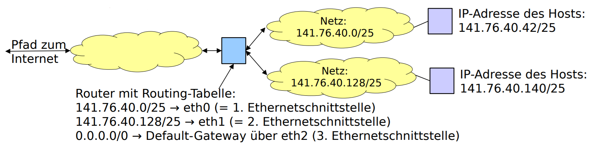
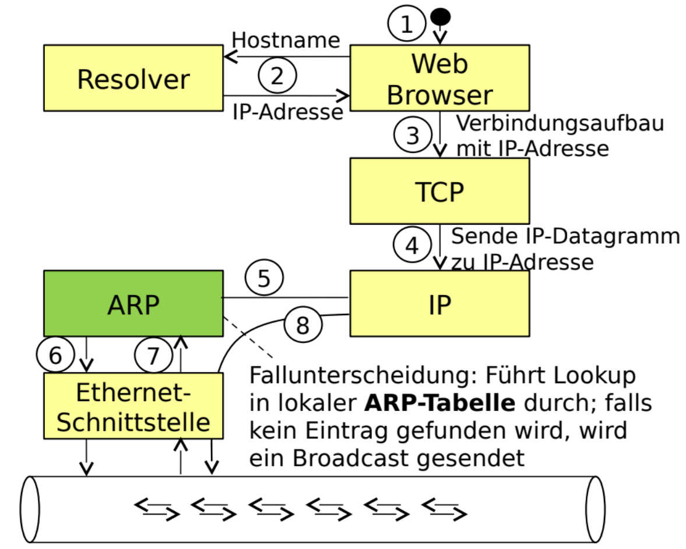

<!-- START doctoc generated TOC please keep comment here to allow auto update -->
<!-- DON'T EDIT THIS SECTION, INSTEAD RE-RUN doctoc TO UPDATE -->
**Inhaltsverzeichnis**

- [Rechnernetzkonzepte und -architekturen](#rechnernetzkonzepte-und--architekturen)
- [1. Einleitung / Übersicht](#1-einleitung--übersicht)
  - [1.1 Veranstaltungsziele](#11-veranstaltungsziele)
  - [1.2 Inhaltlicher Teil](#12-inhaltlicher-teil)
    - [1.2.1 Kommunikationsszenario](#121-kommunikationsszenario)
    - [1.2.2 Standardisierung](#122-standardisierung)
    - [Internet Engineering Taskforce](#internet-engineering-taskforce)
      - [Arbeitsgruppen  / IETF-Areas](#arbeitsgruppen---ietf-areas)
    - [1.2.3 Begrifflichkeiten](#123-begrifflichkeiten)
    - [1.2.4 ISO / OSI Referenzmodell](#124-iso--osi-referenzmodell)
      - [7 Anwendungsschicht](#7-anwendungsschicht)
      - [6 Darstellungsschicht](#6-darstellungsschicht)
      - [5 Sitzungsschicht](#5-sitzungsschicht)
      - [4 Transportschicht](#4-transportschicht)
      - [3 Vermittlungsschicht](#3-vermittlungsschicht)
      - [2 Sicherungsschicht](#2-sicherungsschicht)
      - [1 Bitübertragungsschicht](#1-bitübertragungsschicht)
    - [1.2.5 TCP / IP-Modell](#125-tcp--ip-modell)
    - [1.2.6 Protokoll-Header](#126-protokoll-header)
    - [1.2.7. Kopplungselemente](#127-kopplungselemente)
      - [**Switches**](#switches)
      - [**Router**](#router)
      - [**Weitere Kopplungselemente**](#weitere-kopplungselemente)
    - [1.2.8 Topologien](#128-topologien)
    - [Tooling - Wireshark](#tooling---wireshark)
- [Netzzugangsschicht](#netzzugangsschicht)
  - [Übersicht zu Ethernet](#übersicht-zu-ethernet)
  - [Aufbau eines Ethernet Frames](#aufbau-eines-ethernet-frames)
  - [Namen von Netzwerkschnittstellen unter Linux](#namen-von-netzwerkschnittstellen-unter-linux)
  - [Switches](#switches-1)
    - [Architekturtypen](#architekturtypen)
    - [Kenngrößen](#kenngrößen)
    - [Spanning-Tree-Protocol](#spanning-tree-protocol)
      - [STP - Port Fast/Fast Link](#stp---port-fastfast-link)
      - [Rapid Spanning Tree Protocol](#rapid-spanning-tree-protocol)
    - [Virtuelles LAN](#virtuelles-lan)
      - [Tag-basierte VLANs](#tag-basierte-vlans)
      - [Inter-VLAN-Routing](#inter-vlan-routing)
      - [STP und VLAN](#stp-und-vlan)
    - [Transparent Interconnection of lots of links (TRILL)](#transparent-interconnection-of-lots-of-links-trill)
    - [Stacking](#stacking)
  - [Internetprotokoll und Hilfsprotokolle](#internetprotokoll-und-hilfsprotokolle)
    - [IPv4-Header](#ipv4-header)
    - [Fragmentierung](#fragmentierung)
    - [IPv4-Adressierung](#ipv4-adressierung)
    - [Address Resolution Protocol (ARP)](#address-resolution-protocol-arp)
      - [Einordnung](#einordnung)
      - [Protokolldetails](#protokolldetails)
  - [ICMP](#icmp)
    - [Praxisübung](#praxisübung)

<!-- END doctoc generated TOC please keep comment here to allow auto update -->

# Rechnernetzkonzepte und -architekturen

*16.11.2020*

# 1. Einleitung / Übersicht
## 1.1 Veranstaltungsziele
Wissensvermittlung zu:
- Übersichtswissen über Rechnernetze
- Komponenten und Protokolle im Internet
- Planung von Netzwerken
- Konfiguration von Netzwerken

Prüfungsleistung:
- wenn möglich schriftliche Prüfung
- letzte Einheit ist für Prüfungsvorbereitung vorgesehen

Hilfsmittel bei Prüfung:
- wahrscheinlich 1 DIN A4 - Zettel handschriftlicher eigener Notizen


## 1.2 Inhaltlicher Teil
### 1.2.1 Kommunikationsszenario


Bei Abruf einer Website durch Host A von Server A sind vielfältige Technologien zur Realisierung des Szenarios erforderlich.

**Physische Verbindung**
Auf welchem Weg gelangen die Daten von Host zu Server und zurück?

**Weiterleitung von Daten über das Internet**
- Protokolle, Header, ...

Wie müssen diese Daten gestaltet sein, damit sie verwendet werden können?

**Weiterleitung der Daten ans richtige Zielsystem**
Wie läuft das Routing ab?


### 1.2.2 Standardisierung

- ISO
- ITU
- IEEE
    - Fokus auf den "unteren" Schichten, nah an Physik
    - Ethernet, Netzwerkkarten, ...
- IETF
    - Standardisierung der Protokolle
    - HTTP, UDP, TCP, Mailprotokolle
    - ist kein Berufsverband, sondern Freiwilligenorganisation

### Internet Engineering Taskforce

- Publikationsformat der IETF sind RfC's (Request for Comments)
- RFC haben eindeutige, fortlaufend vergebene Nummern
- so ist UDP z.B. durch RFC 768 spezifiziert
- recht praxisnahe Beschreibung der Standards

#### Arbeitsgruppen  / IETF-Areas

- IETF-Arbeitsgruppen sind einem von 7 Bereichen (Areas) zugeordnet
    - Applications and Real-Time
    - Internet
    - Security
    - Operations and Management
    - Routing
    - General
    - Transport


### 1.2.3 Begrifflichkeiten

**Übertragungsmodi**

|verbindungsorientiert| verbindunglos|
|----|-----|
|Information über Existenz einer Beziehung liegt vor|Information über Existenz einer Beziehung liegt **nicht** vor|
|Beziehung zwischen Sender und Empfänger| Kommunikation kann ohne Verbindungsaufbau begonnen werden|
|z.B. TCP| z.B. UDP|


|leitungsvermittelt| paketvermittelt|
|----|----|
|Feste Durchschaltung zwischen Sender und Empfänger| Gemeinsame Nutzung von Leitungen|
|Ermöglicht Zusicherung von Eigenschaften (Quality of Service- Parameter)|Daten werden in Pakete aufgeteilt, die (direkt oder indirekt) Informationen für die Zuordnung zu einem Empfänger beinhalten|
|zu beachten: es müssen dann soviele Leitungen vorhanden sein, wie genutzt werden sollen|zu beachten: Überlastsituationen können auftreten|


Im Großen und Ganzen ist "das Internet" paketvermittelt, Leitungsvermittlung kann in Spezialfällen vorhanden sein


### 1.2.4 ISO / OSI Referenzmodell  <!-- hochgradig Prüfungsrelevant-->


#### 7 Anwendungsschicht
- Durch anwendungsspezifische Protokolle verwendet

#### 6 Darstellungsschicht
- Umwandlung von Daten in unabhängiges Format

#### 5 Sitzungsschicht
-
#### 4 Transportschicht
- fügt Zusatzinformationen in die Pakete ein, um die Verwendung auf Empfängerseite zu definieren


#### 3 Vermittlungsschicht
- Weiterleitung über lokale Netze hinaus / zwischen verschiedenen Netzen
- unabhängig vom Typ der verwendeten Netze

#### 2 Sicherungsschicht
- einzelne Bitfolgen werden als Frames erfasst
- Redundanzinformationen werden hinzugefügt um Fehlererkennung und -korrekturen (auch auf Empfängerseite) zu ermöglichen (z.B. Paritätsbits)
-  Beispielverfahren: CRC (Cyclic Redundancy Check)


#### 1 Bitübertragungsschicht
- einzelne Bits in physikalische Signale umwandeln und umgekehrt
- Modulation und Demodulation

### 1.2.5 TCP / IP-Modell

 Integriert das Referenzmodell, verwendet dazu 4 Schichten.
 Siehe dazu Folie 14.

### 1.2.6 Protokoll-Header

Siehe Folie 15

### 1.2.7. Kopplungselemente


#### **Switches**
- verbinden Netzsegmente (Broadcast-Domains) und leiten Pakete zwischen diesen weiter
- sind Layer 2 - Kopplungselemente
- Netzwerkkarten im gleichen Netzsegment können sich gegenseitig direkt addressieren (per MAC-Adresse)
- speichern intern eine Zuordnung zwischen Ausgangsports und MAC-Adressen
- Alternative Namen: Bridge, L2-Switch

#### **Router**

- leiten Pakete zwischen unterschiedlichen Netzen weiter
- bei Weiterleitungsentscheidung wird IP-Adresse ausgewertet (Lookup in Routing-Tabelle)
- Alternativ auch: Layer-3-Switch

#### **Weitere Kopplungselemente**

- Hub, Repeater, Application-Layer-Gateway

**Kleiner Einschub, nicht komplett:**
```sh
ip addr show

ip neigh
# zeigt Nachbarn in ARP-Tabelle an
# IPv4, IPv6 und MAC-Adresse

ip r

ip route
```

### 1.2.8 Topologien

Unterscheidung zwischen physikalischer und logischer Topologie.
Physikalisch dabei die tatsächlich vorhandenen (physischen) Netzwerkkomponenten und ihrer Verbindungen.
Logisch dabei die Kommunikationsbeziehungen und der Struktur des Datenflusses.

Grafische Aufarbeitung versch. Topologien auf Folie 17

Zu beachten: Gibt es SPF (single point of failure) im Netz? Wenn ja: Ausfallsicherheit gering

**hier fehlen noch Dinge**

### Tooling - Wireshark

- nützliches Tool zur Darstellung von Kommunikationsvorgängen in Netzwerken
- es ist eine Filterfunktionalität vorhanden um gezielt nach IP-Adressen, Protokollen, Ports,... zu suchen
- dabei verwendete Bibliothek: **LIBPCAP**

Auch verwendetes Tool: Scapy

# Netzzugangsschicht

## Übersicht zu Ethernet

- Ursprünglich für LAN-Kommunikation vorgesehen
- Klassisch: Steuerung des Zugriffs auf den Kanal über CSMA/CD-Algorithmus (bei Punkt-zu-Punkt obsolet)
- Seit den 1980iger Jahren verschiedene Varianten etabliert, die sich bzgl.
Übertragungsraten, Kabeltypen und Leitungskodierung unterscheiden
	- Datenraten von 10 Mbit/s bis 400 Gbit/s, ...
	- Leitungskodierung u.a.: Manchester-Code, 4B5B-Code, 8b10b-Code, ...
	- Kabeltypen u.a.: Koaxialkabel, Twisted-Pair-Kabel, Multimode
Lichtwellenleiter, Singlemode Lichtwellenleiter, ...
- Alternative: z.B. Infiniband

## Aufbau eines Ethernet Frames


- Präambel: Synchronisation zwischen Kommunikationspartnern
- SFD: Start of Frame Delimiter (fest Bitfolge zur Identifikation des Frame-Anfangs)
- Quell-/Zieladresse: global eindeutige 6-Byte-Adresse
- Nutzdaten: maximal 1500 Bytes Nutzdaten (Header höherer Schichten + Daten)
- Typ-Feld: Typ-Feld der nächsthöheren Netzwerkschicht (z.B. `0x0800` für IPv4) - alternativ Längenfeld
- Padding: Gewährleistet Minimalgröße von 64 Byte
- CRC-Checksum: 32-Bit-Prüfsumme über das Frame (von Zieladresse bis Padding-Feld)

## Namen von Netzwerkschnittstellen unter Linux

- Alt: `ethX` bzw. `wlanX` (an MAC gebunden -> Probleme bei Tausch)
- Neu: Consistent Network Device Naming (z.B. `enp0s25`)
	- Ethernetinterface (en), das an PCI-Bus (p) an Slot 25 hängt

## Switches

- Multiport Kopplungselemente, das Frames nur an den Port weiterleitet über den der Empfänger erreichbar ist
- Speicherung von Adressen in Source-Address-Table (SAT)
- **Cut-Through Switches:** Nach Analyse der MAC-Adresse sofortiges Durschalten zum entsprechenden Port (Weiterleitung ohne Zwischenspeicherung = geringe Latenz, kein Einfluss auf Datenrate)
- **Store-and-Forward Switches:** Frame wird am Eingangsport und Ausgangsport gepuffert (größere Latenz, Möglichkeit zur Zwischenverarbeitung der Daten)

### Architekturtypen

- **Shared Memory:** CPU kopiert Daten nach Extraktion der Zieladresse in den korrekten Ausgangspuffer
- **Bus-System:** Empfangener Port leitet Frame über gemeinsamen Bus an richtigen Ausgangsport
- **Switching-Matrix:** Physische Durchschaltung von Ein- und Ausgabeleitungen

### Kenngrößen

- Datenrate der verschiedenen Ports
- Datenrate des Backplanes (der internen Busse)
- Port-Typen
- Maximale Größe des SAT
- Managementinterface (CLI/WEB UI/ SNMP)
- Unterstützte RFCs und IEEE-Standards
- Bandbreitenmanagement
- Preis

### Spanning-Tree-Protocol <!--wahrscheinliche Prüfungsaufgabe-->

- STP etabliert sich innerhalb des Netzes einen Spannbaum durch das Blockieren von Ports, die Zyklen erzeugen würden
- Blockierter Port: Eingehender und ausgehender Traffic wird verworfen, Kanal ansonsten voll funktionsfähig
- STP reagiert automatisch auf Link-Fehler und berechnet einen neuen Spannbaum unter Berücksichtigung ausgefallener Verbindungen (-> Aktivierung blockierter Ports im neuen Spannbaum)

**Ablauf**

1. Root-Bridge bestimmen: alle Bridges senden Priorität und MAC an alle (höchste Priorität / geringste MAC wird Root)
2. Bestimmung zur kürzesten Pfade zur Root-Bridge (Pfadlänge wird an jedem Switch unter Berücksichtigung der Datenrate automatisch inkrementiert)
3. Deaktivieren aller Ports, die nicht Root sind

**Begriffe**

- Root-Port: Switch Port, der am nächsten zur Root-Bridge liegt
- Designated Port: Alle Ports, die kein Root-Port und nicht blockiert sind  
- Non-Designated Port: Ports in blockiertem Zustand um Zyklen zu verhindern  

#### STP - Port Fast/Fast Link

- STP weist Konvergenzprobleme auf: Netzwerk erst nach etwa 30 Sekunden funktionstüchtig (Probleme beispielsweise mit PXE Boot)
- Switches bieten Speziellen Modus für Ports an denen Endsysteme angeschlossen sind (Port geht sofort bei Aktivierung in Forwarding State)
- Herstellerspezifische Terminologie: PortFast (Cisco), Fast Link (NetGear)

#### Rapid Spanning Tree Protocol

- Proaktiver Ansatz bei dem effizient auf Alternativpfade gewechselt werden kann

### Virtuelles LAN

- Physisches Netzwerkdesign steht häufig mit logischem Netzwerkdesign in Konflikt
- logische Einteilung des Netzes auf Ebene der Switche (Aufteilung in Broadcast-Domänen; erhöhte Sicherheit)

**Varianten**

- Portbasierte VLANs: jeder Port kann Mitglied exakt eines VLANs sein
- Tag-basierte VLANs: Frames werden mit ID eines VLANs getaggt, wodurch über einen Port mehrere VLANs realisiert werden können
- dynamische/inhaltsbasierende VLANs: Zuordnung zu VLANs anhand verwendeter Protokolle (weniger verbreitet)

#### Tag-basierte VLANs

- Erweiterung der Ethernet-Frames um einen Tag zur Identifikation des VLANs zu dem das Frame gehört

**Aufbau** (4 Bytes)


- **Tag Protocol Identifier:** fixer Hex-Wert
- **Priority Code Point:** Prioritätsinformationen
- **Drop Eligible Indicator:** Identifiziert Frames, die bei Überlast verworfen werden können
- **VLAN Identifier:** ID des zugehörigen VLANs ($2^{12}-2$ = max. 4096 VLANs)

#### Inter-VLAN-Routing

**Ansatz 1**

- Routing zwischen VLANs ohne zusätzliche Softwareunterstützung durch in unterschiedlichen VLANs befindliche Physikalische Schnittstellen eines Routers möglich
- Problem: hoher Aufwand für Hardware (für jedes VLAN physische Schnittstelle plus Verkabelung)


- **Ansatz 2:** Einsatz von virtuellen Interfaces zur Vermeidung des hohen Aufwandes für separate Schnittstellen
<!-- Gerne Prüfungsfrage: Voraussetzungen/Konfigurationsschritte -->

#### STP und VLAN

> STP weiß nix von VLANs

- klassischer Ansatz nutzt die verfügbaren physischen Verbindungen nicht optimal aus
- Lösung: Multiple Spanning Tree Protocol (jedes VLAN hat eigenen ST + ein Internal Spanning Tree für alle VLANs)

### Transparent Interconnection of lots of links (TRILL)

- Ethernet-Frames werden in einen TRILL-Header gekapselt
- Routing dieser Frames auf deren Basis auf L2 (nächster Hop wird durch umgebenen L2-Header angegeben)
- Nutzung von Intermediate System to System zur Ermittlung von Pfaden zwischen Rbridges
- TRILL-Header besitzt HOP-Count-Feld um Routing-Schleifen zu vermeiden
- Entfernung des THRILL-Headers vor Auslieferung an das Zielsystem

### Stacking

- Stackfähige Switsches können miteinander zu einer Gruppe verbunden werden (einzelnes logisches Gerät, ansprechen über einzelne IP)
- Vorteile: Skalierbarkeit (Anzahl der Ports einfach ), vereinfachte Netzwerkschnittstelle (Konfiguration von nur einem logischem Gerät), Vergrößerter Durchsatz (Stacking über Port mit hoher Datenrate)
- Nachteil: Platzbedarf, höherer Stromverbrauch mehrerer Geräte, Kopplung als neue Fehlerquelle

<!--
# 3. Vermittlungsschicht: Internet Protocol
# 4. Transportschicht: User Datagram Protocol und Transmission Control Protocol
# 5. Routing
# 6. Anwendungsschicht
# 7. Software-defined Networking
# 8. Netztechnologien
-->

## Internetprotokoll und Hilfsprotokolle

- Schicht 3; von Übertragungsmedium unabhängig
- Overlay über L2, bildet davon unabhängiges Netz
- Ermöglicht Adressierung von "Knoten"
- zwei Versionen verbreitet: IPv4 und IPv6
- IP-Paket wird trotz Hops nicht verändert (Ausnahme: NAT)
- eine IP-Adresse ist nicht einem Host zugewiesen, sondern einem NIC
  - Workaround: Loopback-Interface, zur Adressierung von Localhost
- *casts:
  - Unicast: Senden an exakt einen NIC
  - Broadcast: Senden an alle NICs
  - Multicast: Senden an Teilmenge
  - Anycast: Senden an alle NICs, aber nur einer antwortet

### IPv4-Header


- Version: 4 Bits, Protokollversion
- Internet Header Length (IHL): 4 Bits, Länge des Headers in 32 Bit Wörtern, Standardwert 5 --> 5 * 32 Bit = 20 Byte
- Differenciated Service Code Point (DSCP): 6 Bit, Prioritätsklassen
- Explicit Congestion Notification (ECN): 2 Bit, Meldung von Überlast, von Layer 4 gesteuert, wird damit rückläufig zu sender kommuniziert
- Total Length: 16 Bit, Gesamtlänge des Datagramms / Fragments in Bytes
- Identification: 16 Bit, ID des Datagramms
- Flags: 3 Bit:
  - Bit 0: reserviert (RFC3514)
  - Bit 1: Don't Fragmen (DF)
  - Bit 2: More Fragments (MF)
- Fragment Offset: 13 Bit, Offset in 8 Byte Blöcken, die Daten innerhalb des urspr. Paket hatten
- Time to Live (TTL): 8 Bit, Lebenszeit des Pakets, in Praxis maximale Anzahl der Hops
- Protocol: 8 Bit, im Datenbereich verwendetes Protokoll, Bsp. in Linux: ``/etc/protocols``
- Header Checksum: Prüfsumme für (nur) IP-Header
- Options: Zusatzdaten für bspw. Routing oder Zeitstempel
  - Bsp Source Routing: Sender gibt exakte Route an; ermöglicht Angriffsfläche für DoS-Attacken

### Fragmentierung


- 1:1 Übersetzung von IP-Paket und ETH-Frame
- Maximum Transmission Unit (MTU): Maximalgröße des ETH-Payloads
  - ETH-Payload enthält auch IP-Header,... --> nicht tatsächliche Nutzdatengröße
  - größer: weniger Overhead, anfälliger für Fehler, höherer Speicherbedarf in Netzwerkkomponenten
  - kleiner: weniger Latenz, mehr Overhead
- wenn IP-Paket größer als MTU: muss fragmentiert werden
  - Ergebnis sind n vollwertige IP-Pakete inkl. Header
  - alle Pakete gleiche Identification Nummer  (zum Rekonstuieren des urspr. Paket)
  - Flags:
    - MF-Flag = 1 bei allen außer dem letzten Paket
    - Fragment Offset: zählt Byteposition hoch`

### IPv4-Adressierung

- Struktur: 0 bis n Bits Netzadresse, 32-n Bit Hostadresse (NIC-Adresse)
- Notation: ``adresse/n`` --> Classless Inter Domain Routing Notation (CIDR)
- Netzanteil ermöglicht Ausbildung einer hierarch. Struktur, skalierbar
- Einteilung von IPv4-Adressen in öff. Adressen (innerhalb des Intenets eindeutig, durch zentrale Instanz vergeben) und private Adressen (innerh. eines lokalen Netzes eindeutig)
- insbesondere durch IPv4-Adress-Knappheit werden öff. Adressen durch Network Address Translation (NAT) auf mehrere Hosts abgebildet
- Routing:



### Address Resolution Protocol (ARP)

#### Einordnung



- ARP ermittelt zu IP-Adressen und weiteren Adressfamilien die zugehörigen Hardwareadressen
- Request-Reply-Protokoll
- ermittelte Zuordnung für best. Zeitraum in ARP-Tabelle gespeichert
- wenn Ziel-NIC außerhalb des eigenen Netzwerks: Ermittlung der MAC-Adresse des **Gateways**, nichts dahinter
  - siehe folgendes Bild:


#### Protokolldetails

//TODO: Bild Folie 7

//TODO: ausfüllen

## ICMP

- Internet Control Message Protocol dient der Kommunikation von Fehlern und Abfrage von Statusinformation in (fast immer) IP-basierten Netzwerken
- ausgewählte Typen:
  - 0: Echo Reply: Antwort auf Echo Request
  - 3: Destination Unreachable: Ziel nicht erreichbar mit folgenden Codes:
    - 0 - Net unreachable
    - 3 - Port unreachable
    - 4 - Fragmentation needed and Don't Fragmen (DF) was set
  - 5: Redirect: siehe unten
  - 9: Router Advertisement: dient automatischen Discovery von Routern
  - 11: Time Exceeded: TTL-Feld aus IP-Datagramms abgelaufen
  - 13: Timestamp: TODO
- Aufbau:
  - 8 Bit Typ (s.o.)
  - 8 Bit Code (s.o.)
  - 16 Bit Prüfsumme
  - weitere Inhalte abhängig von Typ / Code

Beispiel: ICMP-Redirect

- wird von einem Gateway versendet, wenn es feststellt, dass ein Router im gleichen Netz liegt, sodass direkt mit diesem kommuniziert werden kann
- bietet Angriffsfläche: kann verwendet werden, um kompromittierten Router in den Pfad zu zwingen
- per Default in vielen Systemen deaktiviert

### Praxisübung

Verknüpfung von 3 Network Namespaces:


- 3 Namespaces erstellen:

```bash
sudo ip netns add ns1
sudo ip netns add ns2
sudo ip netns add ns3

sudo ip netns list # zur Prüfung
```

- virtuelle Ethernet-Interfaces erstellen:

```bash
sudo ip link add veth1 netns ns1 type veth peer name veth2 netns ns2 # erstellt veth1 in ns1 und veth2 in ns2
sudo ip link add veth3 netns ns2 type veth peer name veth4 netns ns3
```

- Namespace betreten und Interface aktivieren:

```bash
sudo ip netns exec ns1 /bin/bash
ip link set veth1 up
```

- diesen Schritt für alle Interfaces wiederholen
- allen VEth-Interfaces die gewünschten Adressen vergeben: (für alle Interfaces wiederholen)

```bash
sudo ip netns exec ns1 /bin/bash
sudo ip addr add 192.168.42.5/24 dev veth1
```

- Routen zwischen den Namespaces anlegen:

```bash
sudo ip netns exec ns1 /bin/bash
ip route add 192.168.23.0/24 via 192.168.42.254
```

- diesen Schritt für alle Namespaces / gewünschten Routen wiederholen
- Kernel anweisen, für das Router-Namespace das Routing zu aktivieren:

```bash
sudo ip netns exec ns2 /bin/bash
echo 1 > /proc/sys/net/ipv4/ip_forward
```

- mit bspw. Ping überprüfen, ob Verbindung funktioniert
