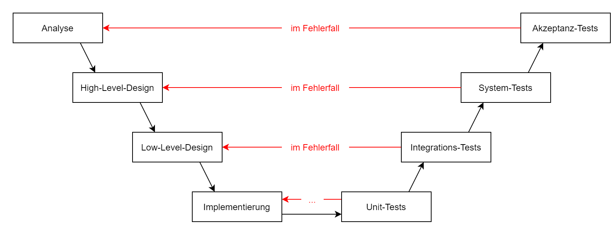

<!----------
title: "Systemanalyse"
date: "Semester 3"
keywords: [Systemanalyse, DHGE, Semester 3]
---------->

Systemanalyse
=============

<!-- START doctoc generated TOC please keep comment here to allow auto update -->
<!-- DON'T EDIT THIS SECTION, INSTEAD RE-RUN doctoc TO UPDATE -->
**Inhaltsverzeichnis**

- [Einführung / Überblick](#einf%C3%BChrung--%C3%BCberblick)
  - [User Story Format](#user-story-format)
  - [Was gehört alles zur Systemanalyse?](#was-geh%C3%B6rt-alles-zur-systemanalyse)
- [Regeln für Software-Entwicklung](#regeln-f%C3%BCr-software-entwicklung)
  - [(1) Klartext](#1-klartext)
    - [Wasserfallmodell](#wasserfallmodell)
    - [Agil](#agil)
  - [(2) Gründliche Vertragsgestaltung](#2-gr%C3%BCndliche-vertragsgestaltung)
    - [Wasserfallmodell](#wasserfallmodell-1)
    - [Agil](#agil-1)
  - [(3) Wandelnde Anforderungen: Wie gehe ich damit um?](#3-wandelnde-anforderungen-wie-gehe-ich-damit-um)
    - [Change Request Prozess:](#change-request-prozess)
- [Systementwicklung im Software-Engineering](#systementwicklung-im-software-engineering)
  - [Vorgehensmodelle](#vorgehensmodelle)
    - [Phasenmodell](#phasenmodell)
    - [Iteriertes Phasenmodell](#iteriertes-phasenmodell)
    - [Evolutionäre SW-Entwicklung](#evolution%C3%A4re-sw-entwicklung)
    - [Spiralen Modell](#spiralen-modell)
    - [V-Modell](#v-modell)
    - [Eine Ausprägung des V-Modells: "V-Modell XT"](#eine-auspr%C3%A4gung-des-v-modells-v-modell-xt)
    - [Extreme Programming (XP)](#extreme-programming-xp)
- [SCRUM](#scrum)
  - [Empirische Prozess Kontrolle](#empirische-prozess-kontrolle)
  - [SCRUM-Prozess](#scrum-prozess)
  - [User-Story](#user-story)
  - [Rollen im SCRUM-Prozess](#rollen-im-scrum-prozess)
    - [Product Owner](#product-owner)
    - [Entwickler Team](#entwickler-team)
    - [SCRUM-Master](#scrum-master)
  - [Vorgehen in SCRUM](#vorgehen-in-scrum)
    - [Daily SCRUM Event](#daily-scrum-event)
    - [Sprint *Planning* Event](#sprint-planning-event)
    - [Sprint *Review* Event](#sprint-review-event)
    - [Sprint *Retro*spektive Event](#sprint-retrospektive-event)
  - [Policies](#policies)
    - [Definition of Done](#definition-of-done)
    - [DoR: Definition of Ready](#dor-definition-of-ready)
  - [SCRUM-Manifest](#scrum-manifest)
    - [Häufige / gern gemachte Fehler bezüglich des Manifests](#h%C3%A4ufige--gern-gemachte-fehler-bez%C3%BCglich-des-manifests)
  - [Vor- und Nachteile von SCRUM](#vor--und-nachteile-von-scrum)
  - [SCRUM-Ban als SCRUM Derivat](#scrum-ban-als-scrum-derivat)
- [Story Board](#story-board)
- [Prototype vs. Pretotype](#prototype-vs-pretotype)
  - [Pretotype-Methoden: Fail Early](#pretotype-methoden-fail-early)
- [Design-Thinking](#design-thinking)
  - [4 Prozess-Schritte](#4-prozess-schritte)
  - [Hinweise](#hinweise)
- [Requirement Engineering / Aufwandsanalyse](#requirement-engineering--aufwandsanalyse)
  - [Aufwandsschätzung](#aufwandssch%C3%A4tzung)
    - [LOC (Lines of Code) als Basis im klassischen Fall](#loc-lines-of-code-als-basis-im-klassischen-fall)
    - [weitere Faktoren](#weitere-faktoren)
    - [Magisches Dreieck / Teufelsquadrat](#magisches-dreieck--teufelsquadrat)
  - [Empirische Schätzung](#empirische-sch%C3%A4tzung)
    - [Expertenschätzung](#expertensch%C3%A4tzung)
    - [Delphi-Methode](#delphi-methode)
    - [Divide et Impera (Teile und Hersche)](#divide-et-impera-teile-und-hersche)
    - [SCRUM-Poker](#scrum-poker)
    - [High-Low-Showdown](#high-low-showdown)
  - [Algorithmische Schätzverfahren](#algorithmische-sch%C3%A4tzverfahren)
    - [COCOMO](#cocomo)
    - [Function-Point-Methode](#function-point-methode)
- [Objektorientierung](#objektorientierung)
  - [Überblick](#%C3%BCberblick)
    - [UML: Unified Modelling Language](#uml-unified-modelling-language)
    - [Diagramme](#diagramme)
    - [Eigenschaften der Objektorientierung](#eigenschaften-der-objektorientierung)
  - [Klassendiagramm](#klassendiagramm)
  - [Objekt-Diagramm](#objekt-diagramm)
  - [Klassen-Diagramm mit Assoziationen](#klassen-diagramm-mit-assoziationen)
  - [Verhaltensdiagramme](#verhaltensdiagramme)
  - [Zustandsdiagramme](#zustandsdiagramme)
  - [Aktivitätsdiagramm](#aktivit%C3%A4tsdiagramm)

<!-- END doctoc generated TOC please keep comment here to allow auto update -->

<!--newpage-->

# Einführung / Überblick

- Wir bekommen ein Problem vom Nutzer → Lösung durch Programmierung
  - (1) Woher kommt die Problembeschreibung?
  - (2) Beschreibt sie wirklich das Problem des Nutzers?
  - (3) Was will der Nutzer denn **wirklich** damit machen?

## User Story Format

> Als ...
>
> möchte ich ...
>
> um ... zu

- selber so formulieren und einfordern
- bestenfalls bekommt man die Problembeschreibung direkt so
- Struktur des Programms ist dem Nutzer quasi egal
- der Nutzer erwartet eine Korrektheit der Lösung => TESTEN
- neue Anforderungen → und dann?
- **mehrere Entwickler:** wie wird die Aufgabe vernünftig geteilt?

## Was gehört alles zur Systemanalyse?

- Anforderungen / Anforderungsanalyse
- Strukturierung der Entwicklung
- Entwurf + Entwicklung
- Betrieb der Lösung
- Wartung der Lösung
- Qualitätssicherung (Testen)

# Regeln für Software-Entwicklung

## (1) Klartext

### Wasserfallmodell

- lineares Modell
- Phasen
- Lastenheft (Was möchte der Kunde bekommen?)
- Pflichtenheft (Was hat der Entwickler verstanden, was macht er?)

### Agil

- iteratives Modell
- feste Struktur & klare Regeln → jedoch adaptierbar
- Backlog → Aufgabensammlung
- Refinement Prozess! → **Kommunikation ist wichtig**

## (2) Gründliche Vertragsgestaltung

### Wasserfallmodell

- 1/2 Jahr rechtsichere Fomulierung des Lastenhefts
- gleiche Begriffe zu Beginn des Lastenhefts abklären
- 3\. Person ließt, versteht und korrigiert → unterschreibt

### Agil

- Backlog + Refinement

## (3) Wandelnde Anforderungen: Wie gehe ich damit um?

Zum Beispiel: keine Zusatzleistungen bzw. E-Mail/mündlich
=> am Ende: was zählt?

### Change Request Prozess:

Request → Impact, Analysis → Approve / Deny → Implementation → Business

**14 Tage Cycle:** Planning, Review, Retro

**MMM:** Mensch, Maschine, Methode  
Zuerst schauen: "Habe ich die richtigen Mitarbeiter?"  
Danach schauen: "Habe ich die richtige Hardware/Software?"  
Zuletzt die Methode hinterfragen

# Systementwicklung im Software-Engineering

> orientiert sich an der Auto-Produktion

- Autoproduktion:

  - kalkulierbare Kosten + Risiken (Planung und Produktion sind getrennt)
  - vorhersagbares Ergebnis (Industrialisierung)
  - Qualität (ständiges Messen)

- Software Produktion

  - Kosten sind **nicht** zuverlässig vorhersagbar
  - viele Fehlschläge in der Branche
  - schlecht quantifizierbar

-> **Systematisierung** & **Krisenerkenntnisse** werden notwendig

**Grundlagen:**

- Softwaretechnik: praktisches Erstellen on Software
- Informatik: Methoden & Theorie

-> führen zur:

**Softwareentwicklung**

- Phasen
  - zeitlich befristete Abschnitte
- Vorgehensmodelle
  - Leitfaden bzw. Standards
  - definieren Phasen

## Vorgehensmodelle

### Phasenmodell

**5 Phasen** -> Stufenmodell

```
Analyse
└─ Design
  └─ Programmierung
    └─ Integration / Test
      └─ Einsatz / Wartung
```

**Analyse-Phase**

- Funktionsumfang
- User Interface
- Leistungsverhalten
- Termine

Lastenhaft (vom Auftraggeber) als Grundlage -> Pflichtenheft wird (vom Auftragnehmer) erstellt

> Mit der Erstellung des Pflichtenhefts beginnt die **Design-Phase**

- die innere Struktur der Software wird festgelegt -> Komponentenzerlegung benennen (Teile und Herrsche Prinzip)

> Achtung: Fehlerfortpflanzung!

**Programmierung**

- Komponenten werden anhand des Entwurfs implementiert
- Programmieren im Kleinen (alternative Benennungen / Kodierungen)

-> Module (einzeln getestete Quelltexte)
  - nicht selbständig lauffähig

> auch hier kann wieder eine Fehlerfortpflanzung stattfinden!

**Integration / Test**

- nacheinander Einzelkomponenten hinzugefügt
- weitere Tests (Integrations-Tests) (Abnahme-Tests)
- Installation, dann ist das Gesamtsystem vorhanden und ein sog. Systemtest kann durchgeführt werden
  - Systemtest: Konsistenz bezüglich der Produkt-Definition wird überprüft

**Einsatz / Wartung**

- dauert bis zum Abschalten der Software
- Fehlerkorrektur
- Anpassungen an andere System-Umgebungen
- Änderungen und Erweiterungen der Funktionalitäten

MVPs fehlen

> Einzelphasen sind für sich betrachtet nichts schlechtes!
> aber Rückkopplungen?

**Vor-und Nachteile des Phasen-/Wasserfallmodells**

| Vorteile                              | Nachteile                                           |
| ------------------------------------- | --------------------------------------------------- |
| Gesamtkosten + Aufwand zu Beginn klar | wenig Flexibilität bezüglich Änderungsmöglichkeiten |
| Phasenpipelining möglich              | keine Rückkopplungen                                |
| Einzelabschnitte                      | Testen nur am Ende                                  |
| Einzelabschnitte sind wenig komplex   | für komplexe Aufgaben / große Teams ungeeignet      |
|                                       | kein experimentelles Vorgehen                       |
|                                       | Kunde ist nicht wirklich involviert                 |
|                                       | Fail Early wird nicht unterstützt                   |

> Viele Vorteile können auch Nachteile sein (und vice-versa)
> je nachdem welche Ziele verfolgt werden und in welchem Stil man arbeiten möchte

### Iteriertes Phasenmodell

```
Analyse
└─ Design
  └─ Programmierung
    └─ Integration / Test
      └─ Einsatz / Wartung
```

Hier wird immer wieder in eine Phase "zurück gesprungen", falls etwas nicht passt.

> Prototyp zur Akzeptanz-Analyse ist möglich! (zu Prototyp später mehr)

**PDCA-Prinzip:** Planning -> Doing -> Checking -> Acting (und wieder von vorn)

> Das PDCA-Prinzip wird später genauer behandelt

### Evolutionäre SW-Entwicklung

**evolutionär:**

- Bewährtes weiterentwickeln
- unnötige Features abschalten

-> Weiterentwicklung des Prototypen

-> Problem:
- ständige Änderungen im Quellcode
- evolutionäre Dokumentation

| Vorteile                               | Nachteile              |
| -------------------------------------- | ---------------------- |
| entspricht der natürlichen Entwicklung | fehlender Prozess      |
| kann Resourcen-sparend sein            | unendliche Entwicklung |
|                                        | Anarchie               |

> Eine unendliche Entwicklung kann natürlich auch von Vorteil sein (bspw. bei SAAS)

### Spiralen Modell

| (1) | **ZIELE**, Alternativen, Rahmenbedingungen | (2) | Evaluierung der Alternativen, **RISIKEN** abschätzen, reduzieren |
| --- | ------------------------------------------ | --- | ---------------------------------------------------------------- |
| (4) | **PLAN** für nächsten Zyklus               | (3) | **REALISIERUNG** + Überprüfung                                   |

**USP:** Risikobetrachtung

- Weiterentwicklung des Wasserfallmodells
- zyklische Wiederholung der Phasen -> Annäherung an Gesamt-Ziel
- Ziele ändern sich auch während des Projektfortschritts -> Spiralen-Modell versucht darauf zu reagieren

**Genereller Ablauf:**

- **Zyklus 1:** (1) Planung -> (2) Risiko, Prototyp 1 -> (3) Anforderungen -> (4) Entwicklungsplan
- **Zyklus 2:** (1) Ziele, Alternativen, Rahmenbedingungen -> (2) Risiko, Prototyp 2 -> (3) Grob-Entwurf -> (4) Testplan
- **Zyklus 3:** (1) Ziele, Alternativen, Rahmenbedingungen -> (2) Risiko, Prototyp 3 (betriebsfähig) -> (3) Fein-Entwurf, Code, Integrieren, Testen -> ...

| Vorteile                             | Nachteile                                |
| ------------------------------------ | ---------------------------------------- |
| frühe Korrektur-Möglichkeit          | Weglassen von Elementen nicht vorgesehen |
| Risiko wird (zwangsweise) betrachtet | spätes echtes Produkt                    |
| frühe Fehlersichtbarkeit ist Möglich | unflexibel                               |
| klarer Ablauf                        | zeitlich anspruchsvoll                   |

### V-Modell

> bisher Vorgehensmodelle zur Verbesserung von Zeit, Kosten, Leistung
>
> Flächeninhalt von Dreieck (Zeit, Kosten, Leistung) ist konstant
>
> -> Zeit + Kosten + Leistung können nicht gleichzeitig verbessert werden

<!-- width=400px -->

| Vorteile                                              | Nachteile                                                                                                         |
| ----------------------------------------------------- | ----------------------------------------------------------------------------------------------------------------- |
| klarer Ablauf (nächster Schritt bei Fehler wird klar) | Fehler in der Anaylse-Phase erst sehr spät sichtbar (früher mehr Kommunikation mit dem Kunden und MVP als Lösung) |
| klare Test-Struktur vorgegeben                        |                                                                                                                   |
| Iterationen bis alle Tests der Phase OK sind          |                                                                                                                   |

### Eine Ausprägung des V-Modells: "V-Modell XT"

- Ursprung: militärscher Bereich
- **Ziele:**
  - (1) Kosten transparent machen -> Kosten-Limitierung wird möglich
  - (2) Mindeststandard an Qualitäts-Maßnahmen zu garantieren
  - (3) Vergleichbarkeit von Angeboten Dritter
- **V Modell-93:** Richtschnur für IT-Vorhaben in BRD
- **V Modell-93:** Objekt-Orientierung
- **V Modell XT:** "Extreme Tailoring"
  - an Bedürfnisse anpassbar
  - Auftraggeber mit eingebunden
  - stärkere Modularisierung
  - mehr in Richtung AGIL

2015: 900 A4 Seiten PDF-Doku => 500 Seiten

**3 Säulen:** Meta-Modell, freie Inhalte, Werkzeuge

**Meta-Modell**
- Rollen
- Produkte
- Beziehungen (Aktivitäten)

feste Inhalte + optionale Bestandteile

Produkt-orientierte Arbeitsweise + Tailoring

Auftrag-Geber / Auftrag-Nehmer im Sprachgebrauch + Schnittstellen (Synchronisations-Punkte)

**Werkzeuge**
- V-Modell XT-Editor (für Anpassungen)
- V-Modell XT-Projekt-Assistenten (Tailoring)
- XML-Technologie baiserend

|                     |                                                                                |
| ------------------- | ------------------------------------------------------------------------------ |
| produktorierentiert | nicht *wie*, sondern *was* "hergestellt" wird                                  |
| Produkte            | Software-Code, Modelle, Dokumentationen, Zwischenergebnisse (auch als SW-Code) |

für alle Produkte gibt es sog. Entscheidungspunkte (Milestones)
- inklusive Aussagen zur Qualitätskontrolle
- DoD

> DoR: "Definition of Ready"  
> DoD: "Definition of Done"

Tailoring -> Projekt für Softwaresysteme oder Projekt für Beschaffung  
(unterscheiden sich: mithilfe des Projekt-Assistenten können die relevanten Teile bestimmt werden)

-> 4 Typen von Projekten werden unterschieden

Auftraggeber Projekt (AG): Vergabe von Entwicklungsaufträgen  
Auftragnehmer Projekt (AW): Entwicklung  
AG/AW: ohne Vertragsverhältnis (z.B. Fach + Developer Abteilung sitzen zusammen)  
Organisationsspezifische Projekt

es gibt Produkte außerhalb des eigenen Projekts (sog. externe Produkte)  
-> Fertigstellung und Übergabe legen Kommunikationspfade fest

**Kommunikationspfade:**
Wer, Was, Wann

| Vorteile                                              | Nachteile                                                    |
| ----------------------------------------------------- | ------------------------------------------------------------ |
| gute Strukturvorgabe                                  | sehr komplex                                                 |
| Kosten sind transparent falls keine Änderungen kommen | Reaktion auf Änderungen nicht vorgesehen                     |
| sehr generisch gehalten                               | sehr generisch gehalten                                      |
| viele Anpassungsmöglichkeiten (aber ad libitum) ->    | es gibt keinen Prozess, der nach Verbesserungen sucht        |
|                                                       | vage Anforderungen führen nicht zu einem V-Modell XT Projekt |

### Extreme Programming (XP)

- leichtgewichtiges Vorgehensmodell
- für kleine / mittlere Teams geeignet
- bei vagen Anforderungen gut geeignet
- schnelle Änderungen der Anforderungen

> XP setzt bewährte Techniken im extremen Maße ein
1. Paar-Programmierung  
   kontinuirliche Review
2. Testen  
   kontinuirliches Testen
3. Refactoring  
   kontinuirliches Design / Redesign
4. Feedback an Kunden  
   kurze Release Zyklen

- Story (einfache Lösung)-> neue Aufgabe, ist das Problem zu Komplex müssen die Stories neu definiert werden
- Paar Bildung für Aufgaben -> Testentwurf -> Test nicht erfolgreich, wieder zurück zu Programmieren in Paaren
- Ist der Code zu kompliziert -> Umstrukturierung -> resultiert in vereinfachtem Code
- Es wird überprüft ob CI (Continuous Integration) Tests erfolgreich sind (wenn nicht -> zurück zum Pair Programming)
- Tests erfolgreich -> Abnahme Tests, wenn erfolgreich -> Abnahme
- Wenn Abnahme Tests nicht erfolgreich sind -> zurück zur neuen Aufgabe
- bei Problemen können auch Paare neu eingeteilt werden

<!-- Hier würde sich eine Grafik anbieten -->

> - durch Stories und Tests getrieben  
> - Programmierung steht im Mittelpunkt  
> - viele Release Zyklen

**Zu 1. (Paar-Programmierung)**  
__Beispiel 1999 Utah:__  
13 Einzelprogrammierer  
14 Paar-Programmierer  
4 Aufgaben in 6 Wochen  
am Ende: Test der Programme  
-> Paare hatten bessere Qualität und waren schneller fertig.  
Paare hatten mehr Vertrauen in ihre Programme, hatten mehr Spaß und waren effizienter

> ABER: Die Chemie in den Paaren muss stimmen!

Weitere Beispiele: Windows 2000, Crysler Payroll-System

**Zu 2. (Testen)**
- Testfälle erstellen **bevor** Komponente implementiert wird
- alle Tests laufen automatisch ab
- Fehlerfall => zuerst neuen Test entwerfen, dann Fehler beheben
- Testbarkeit => Entkopplung der Subsysteme

**Zu 3. (Refactoring)**
- "Alte Zöpfe ruhig abschneiden!"
- XP = so einfach wie möglich
- Design ist richtig <-> alle Tests sind OK, keine Redundanzen, Anzahl an Klassen / Methoden ist minimal
- systematisches Redesign
  1. Extract Methods: Code in Methoden auslagern
  2. Move Methods: Methoden wandern von Klasse zu Klasse
  3. Magic-Numbers (verhindern): symbolische Konstanten   
     Beispiel: `if (filesOpen > MAXFILES)` anstatt `if (filesOpen > 3)`
  4. Conditionals in Polymorphismus überführen

**Zu 4. (Feedback an Kunden / kurze Release Zyklen)**
- ganz nah am Kunden zu sein ist wichtig

**Vor-und Nachteile**

Allgemeine Kriterien:
- Kosten / Kosten
- Qualität der Ergebnisse
- Flexibilität
- gegenseitiges Lernen
- Overhead (Betreuung, Komplexität)
- Tests
- Kommunikationsprobleme sichtbar

| Vorteile                                                      | Nachteile                           |
| ------------------------------------------------------------- | ----------------------------------- |
| geringere Anschaffungskosten                                  | Zeit-aufwändig                      |
| Code Qualität                                                 | Personal-aufwändig                  |
| Flexibilität (bezüglich neuer Nutzerwünsche, umstrukturieren) | Update Häufigkeit / Kundenakzeptanz |
| Teams <--                                                     | Corona                              |

# SCRUM

## Empirische Prozess Kontrolle

**PDCA Prinzip:**  
Plan -> Do -> Check -> Act -> (zurück zu Plan)

> - kurze Planungszeit, schnell in das Doing übergehen und nach kurzer Zeit prüfen  
> - soll zu einer besseren Lösung führen

- transparenter Prozess
- Doing + Überprüfung + Anpassung
- häufige Wiederholung

## SCRUM-Prozess

- (1) Produkt-Vision, gemeinsame Idee muss zunächst existieren
- -> ein Workshop führt zu (2) einem Produkt-Backlog, gefüllt mit Epics
> ein Epic ist ein höheres Anforderungsniveau -> keine Details -> nicht sofort umsetzbar  
> Der Backlog enthält <= 150 Epics (wenn mehr -> zwei Produkte (Empfehlung))  
> in der Regel besteht ein Epic aus 1-8 User-Stories
- Der Product Owner ist für die "Vision" und die Reihenfolge der Epics verantwortlich
- Jeder soll/darf Epics in das Backlog "füttern" dürfen

## User-Story

> Als ... möchte ich ... um ...

- Erklärung eines Features aus Sicht einer Person, die dieses Feature verwenden will
- Wert für den Kunden
- Ziel
- Jeder User-Story werden eine Priorität und sog. Story-Points zugeordnet
> Story-Points sind eine Aufwandsschätzung, die jedoch **nicht** die geschätzen Arbeitsstunden darstellen
- desweiteren enthält die User-Story eine Risikoabschätzung
- hinterher wird an der User-Story der tatsächliche Aufwand dokumentiert

Tests auf der "Rückseite":  
Angenommen ... <Vork.> wenn ... <Aktion> dann ... <Ergebnis>  
> Realisierbar mit: JIRA, ..., Empfehlung für den Anfang: taktile Variante (Papier)

## Rollen im SCRUM-Prozess

### Product Owner

- muss eine "Brücke" zwischen Business und Development herstellen
- muss ROI (Return of Investment) gewährleisten
- ist die Schnittstelle zum Kunden -> muss die Kundenbedürfnisse verstehen und einordnen
- **Value:** muss Kriterien für den Value definieren und ihn erhöhen -> Was? Warum?
- ist für Sprint Reviews verantwortlich
- muss Backlog Prioritäten setzen

**Aus praktischer Erfahrung ist der PO:**

- ein Full-Time Job  
- eine Authoritätsperson  
- genau eine Person

### Entwickler Team

- besteht idealerweise aus 7+-2 Mitarbeiter
- selbstorganisierend
- Mitarbeiter ist typischerweise "I-shaped" -> hat auf einem Gebiet extrem tiefes Wissen  
  das Ziel ist jedoch ein "T-shaped" Mitarbeiter -> hat ein breites Wissen, mit einem Spezialbereich
- sind Macher
- sind nach außen geschützt

### SCRUM-Master

- Kümmerer (kümmert sich um Probleme seiner Mitarbeiter)
- Diener + Führer in einer Person
- Prozessbeobachter
- dokumentiert u.A. den Fortschritt der Entwicklung
- hilft dem Team, Probleme zu lösen
- idealerweise ist der SCRUM-Master ein fachfremder Mitarbeiter

## Vorgehen in SCRUM

1. Vision -> Produktbacklog: im Produktbacklog ist die oberste Aufgabe die Wichtigste
2. Sprint-Planning: **Team** erstellt ein Sprint-Backlog aus dem Produkt-Backlog (Definition eines Sprint-Ziels)
3. Bearbeitung des Sprints (meist 14 Tage)
	- Daily Meeting (jeder im Team erzählt ganz kurz, woran er gerade arbeitet)
	- am Ende des Sprints: Sprint Review (bezieht sich konkret auf den Inhalt des Sprints)
	- Retrospektive (bezieht sich auf den Prozess des Sprints, realisierbar durch KSSP) -> zurück zu 2.

> Die 4 festen Events sind nicht abwählbar (vs. Aussage: beim SCRUM kann vieles an Bedürfnisse vom Team angepasst werden)

### Daily SCRUM Event

- Koordination des Teams bezüglich des Sprint-Ziels
- Entwickler Team
- am Kanboard
- geführt wird es vom SCRUM-Master (!)
- Timebox! 15 Minuten und nicht länger!
- 3 Fragen:
  - Was habe ich getan?
  - Was werde ich tun?
  - Was hat mich behindert
- Product Owner darf als Gast dabei sein

> Im Burn-Down-Chart ist die Reduzierung der Tasks anfangs oft sehr langsam, da noch kein/wenig Task-Grooming/Task-Refinement betrieben wurde.

### Sprint *Planning* Event

1. Verantwortlich: Product Owner
2. realistisches Sprint Ziel, vom Product Owner forumuliert  
   + Plan, wie das Ziel zu erreichen ist (von Product Owner + Team gemeinsam erarbeitet)
3. Product Owner sagt: **Was** gemacht werden soll  
   Team (mit Hilfe vom Scrum Master) sagt: **Wie**   
   --> Bekenntnis vom Team  
   --> Vorausblick
4. Ergebnis: Sprint-Backlog
5. Pairing-Tabelle kann verwendet werden

**Pairing-Tabelle** als Werkzeug:  
Ziel: eine realistische Aufteilung der Themen auf die Mitarbeiter  
--> Realisierung durch eine einfache (Excel) Tabelle  
--> es wird schnell klar, ob Mitarbeiter zu wenige oder zu viele Themen bearbeiten sollen  
--> die Machbarkeit des Sprints wird frühzeitig sichtbar

- pro Zeile ein Thema
- Anzahl der Themen soll ca Anzahl Mitarbeiter / 2
- Spalten den Mitarbeitern zuordnen
- Verantwortliche (zu den Themen) zuordnen
- pro Mitarbeiter habe ich Informationen: Zu viele Verantwortlichkeiten? Zu viele Themen?
- pro Zeile: Informationen, wie viele Mitarbeiter im Thema involviert sind
- **ZIEL:** Probleme frühzeitig sichtbar machen! (und im Idealfall lösen)

> Die Anzahl der Zeilen (Themen) ist künstlich beschränkt! (da T-shaped Mitarbeiter --> die Mitarbeiter sollen voneinander lernen können)

### Sprint *Review* Event

> hier werden **inhaltliche** Aspekte des Sprints betrachtet


1. Verantwortlich: Product Owner
2. Was *wollte* das Team erreichen?  
   Was *hat* das Team erreicht?  
   --> Gibt es eine Differenz? (PD**C**A)--> für die nächste Planung verwenden (PDC**A**)
3. Tools: Burn-Down-Chart

### Sprint *Retro*spektive Event

> hier wird nur der **Prozess** betrachtet

1. Teilnehmer: Team + Scrum Master + ggf. Product Owner (kann explizit ausgeschlossen werden)
2. Verantwortlich: Scrum Master
3. Zeit: ca 2 Stunden
4. Ablauf:  
   (A) Bühne frei (keine Tabuthemen!)  
   (B) Daten sammeln  
   (C) genaues Beleuchten der Themen + Clustern  (PD**C**A)
   (D) Entscheiden, was das Wichtigste ist? (PDC**A**) --> 1 Task für die nächste Iteration festlegen (**P**DCA)  
   (E) Schluss

## Policies

### Definition of Done

Hilfe um zu klären, wann eine Aufgabe erledigt ist (wann sie vom Review ins Done "geschoben" werden kann)

**Aspekte aus dem Unternehmen:** bspw. die Aufgabe ist eigentlich fertig, aber die Abrechnung fehlt  
**Aspekte aus dem Team:** bspw. die Aufgabe ist eigentlich gelöst aber die Kommentare sind schwer verständlich

--> Qualitätsanspruch

Das ganze nennt sich **Definition Of Done**. Ein Dokument vom Team.

**Aufbau eines Definition of Done**

| Kategorien           | Aufgaben / Beschreibung | leicht messbare Kriterien |
| -------------------- | ----------------------- | ------------------------- |
| Tests                | Software wurde getestet | Abdeckungsgrad            |
|                      | Integrations-Tests      |                           |
|                      | System-Tests            |                           |
|                      | Akzeptanz-Tests         |                           |
| Server Konfiguration | Server eingerichtet     | Ping-Zeit                 |
|                      | DNS Eintrag erstellt    | Nameserver-Lookup Antwort |
|                      | Port definiert          | Port-Range                |

- DoD gehört dem Team!
- Qualitätsanspruch

### DoR: Definition of Ready

ist eine Menge an Kriterien, mit denen ich entscheiden kann, wann ich eine Aufgabe bearbeiten kann (starten kann)

| Kategorie                   | Beschreibung       | Messbare Kriterien                       |
| --------------------------- | ------------------ | ---------------------------------------- |
| Abhängigkeiten (thematisch) | Zeitpunkt richtig? | Vorgänger Aufgabe ist im Done seit 20.11 |
|                             |                    | Abhängigkeitsliste ist leer              |
| Resourcen                   |                    |                                          |
| Formalien                   |                    |                                          |
| Klarheit                    | keine Unklarheiten | Name 1, Name 2                           |
|                             |                    | Rückfrageliste ist leer                  |


## SCRUM-Manifest

ist eine öffentliche Erklärung von Zielen / Absichten im SCRUM-Prozess als **Entscheidungshilfe** für ganzheitliche Transformationen (agile Prozesse, Geschäftsarchitekturen, liquide Netzwerkstrukturen, ...) gegenüber dem Klammern an alten Strukturen.

- **Individuen** stehen ***über*** den **Tools und Prozessen**
- **Produkt** steht ***über*** der **Dokumentation**
- **Zusammenarbeit** steht ***über*** **Vertragsverhandlungen**
- **Änderungen** stehen ***über*** dem **Plan**

### Häufige / gern gemachte Fehler bezüglich des Manifests

- als Anleitung betrachtet, statt es als Manifest "zu leben"
- es steht nicht "statt" sondern "über" in den Rubriken
- zu viele Prozessoptimierungen anstelle alte Silostrukturen aufzubrechen (und um den Menschen sich zu kümmern)
- "Die Landkarte ist nicht das Gebiet": Strategien wesentlicher als die Umsetzung => Probleme
- man braucht **angeblich** keinen Plan

## Vor- und Nachteile von SCRUM

| Vorteile                                                   | Nachteile                             |
| ---------------------------------------------------------- | ------------------------------------- |
| Manifest übersichtlich -> gut ins Team integrierbar        |                                       |
| Anpassungsfähigkeit                                        | Schulungsaufwand                      |
| integrierte Verbesserung                                   |                                       |
| Team-Gedanke                                               |                                       |
| Eigenverantwortung des Teams -> Entlastung des Managements |                                       |
| Schnelle Anforderungsänderungen sind möglich               |                                       |
| Transparenz                                                |                                       |
| Planbarkeit bei eingespieltem Team                         | Planbarkeit erst nach `i` Iterationen |
| weniger Schulden für die Zukunft                           | hoher Zeitaufwand für Meetings        |

## SCRUM-Ban als SCRUM Derivat

**Kanban**

- Tabelle zur Visualisierung des Arbeitsflusses
- Pull-Prinzip
- die Arbeit wird/ist begrenzt (pro Spalte: WIP-Limit)
- Anzahl der Zeilen sind auch zu begrenzen (= der Anzahl an Themen, i.d.R <= Anzahl Mitarbeiter / 2)
- zeitlich nicht begrenzt (reines Kanban)

**SCRUM**

- begrenzte Bearbeitungszeit (z.B. 2 Wochen)
- klare Aussagen zu: Wann kommt das neue Release und was beinhaltet es?

**SCRUM-Ban**

- Kombination aus beiden Methoden
- manche Karten folgen dem SCRUM, manche dem KANBAN (d.h. dürfen länger dauern)
- Art der Karte **zu Beginn** festgelegt

# Story Board

- aus Filmindustrie: zeichnerische Version des Drehbuchs
- in SWE: Visualisierung des Plans, der einzelnen Inhalte skizziert (d.h. **Nutzersicht**)
- Handlungsweisen des Nutzers werden in Blöcke abgebildet


**Beispiel** für eine Powerpoint Anwendung

| Öffnen            | Texte verfassen | Präsentation   | Konfigurieren  | Grafiken verwenden |
| ----------------- | --------------- | -------------- | -------------- | ------------------ |
| Vorlagenauswahl   | Textblock       | Slide anzeigen | Workflow Modus | PNG                |
| altes Dokument    | Font Änderung   | Timer          | Wizard         | JPG                |
| 2 alte -> 1 neues | Größe Font      | Animationen    | klassisch      | Blockgrafik        |
| Import            | Größe Block     | Ereignisse     | Dark-Mode      | Smart Art          |
| Read Only Mode    | RS-Prüfung      |                | Sprachen       | Einfärben          |
| Speichern         | Tabellen        |                |                | Zuschneiden        |
| Export            |                 |                |                |                    |

- Liste wird mit dem Nutzer durchgegangen -> Sortierung der Features innerhalb der Spalten nach Priorität
- dann kann abgegrenzt werden, was alles in MVP 1, 2, 3 etc. enthalten sein soll
- beim nächsten Gespräch können die nächsten Meilensteine festgelegt werden
- Der Nutzer ist involviert und kann Änderungen des Plans anfordern

> möglicherweise wird diese Liste auch vom Nutzer direkt erstellt -> jedoch eher selten

# Prototype vs. Pretotype

**Prototyp**

- funktionsfähiges, vereinfachtes Versuchsmodelle eines geplanten Produktes
- praktische Erfahrungen
- klären von Anforderungen
- Ziel: Funktioniert es wie gedacht? Kann ich es überhaupt entwickeln?
- **Gefahr:** wird nicht wieder weggeworfen, als Doku-Ersatz missbraucht, Aufwand zu hoch

**Pretotype**

> Fake it till you make it

- es wird so getan, als wäre eine Funktion vorhanden
- Ziel: Bedarf einer Lösung, Art und Weise der Nutzung, Erfolgskriterien für ein Produkt benennen
- Teil der Fail-Early-Idee
- **nicht**, wie ein Produkt erfolgreich (kostengünstig, schnell, hohe Genauigkeit, ...) entwickelt werden kann (das wäre nur beim Prototyp der Fall)

## Pretotype-Methoden: Fail Early

1. Mechanical Turk... Computer wird durch Mensch ersetzt  
   (Manulating, Wizard of Oz, Flintstoning)
2. Pinocchio ... form and fit validation  
   leblose Produkt-Vision zum **begreifen**
3. MVP ... überlebensfähiges Produkt, um viel über die Erwartungen der Nutzer zu erfahren
4. Potemkinsche Dorf ... "Fake Door"
5. Infiltrator ... benutzt bestehendes Setting, um das Produkt zu platzieren und der Kunde wird beobachtet
6. Pretend-To-Own ... benötigte Produkte leihen und so tun, als würden sie dem Anbieter gehören
7. PBSK ... Papier, Bleistift, Schere, Kleber

# Design-Thinking

ist eine Methode für den Innovationsprozess

**Idee**:

Iterationen, Prozesse & Objekte bewusst gestalten, die sich streng an den Bedürfnissen des zukünftigen Nutzers orientieren

Fail Early!

## 4 Prozess-Schritte

1. **Inspiration**  
   verstehen (Interviews), beobachten (direktes beobachten von Kunden)  
   Was soll entwickelt werden?  
   Für wen ...  
   Welche Rahmenbedingungen?  
   Was ist der Endzustand?
2. **Ideen**  
   verknüpfen  
   sprudeln zu lassen  
   Kreativitäts-Techniken (SEAN-Baum...)
3. **Testen**  
   Pretotype  
   Prototype  
   Tests
4. **Machen**

## Hinweise

1. Bildlich arbeiten!
2. früh und oft scheitern!
3. Quantität ist wichtig!  
   viele Herangehensweisen sammeln, aber nicht bis in die letzte Tiefe verfolgen
4. wilde Ideen zulassen & ermutigen!
5. insgesamt kundenorientiert

# Requirement Engineering / Aufwandsanalyse

<!-- Hier fehlt noch was -->
## Aufwandsschätzung

- Hauptbestandteil der Entwicklungskosten: Personal (Gehalt + Verwaltung)
- **Faustregeln**: 50k Euro pro Mitarbeiter pro Jahr
	- **konkreter Fall**: 1500h à 100 Euro -> 150k Euro
	- **konkreter Fall**: 1500h à 100 Euro $\rightarrow$ 150k Euro

> Faustregeln sollten auf den konkreten Fall runtergerechnet werden!

### LOC (Lines of Code) als Basis im klassischen Fall

- Mitarbeiter * LOC / Monat = Mann-Monate berechenbar

**Beispiel**

- Software Produkt mit geschätzten 21.000 LOC
- Durchschnittliche Produktivität pro MA: 3500 LOC/Jahr

$$
\frac{21000 \,\mathrm{LOC}}{7500 \,\mathrm{LOC}} \cdot \mathrm{Jahr}=6\,\mathrm{MJ}
$$

**Problem**

- Schätzungen für LOC-Projektumfang schwierig
- Festlegung auf 3500 LOC pro MA und Jahr auch arbiträr
- Programmierer arbeiten nicht in Vollzeit an ihrem Code, andere Tätigkeiten (Doku, Kommunikation, Ausbildung, Post, ...)
- Daher für viele MA sehr unterschiedliche Zahlen

**Möglichkeit 1**

- iterative, empirische Begutachtung für Teamzahlen
- also zunächst den Betrieb betrachten, Kennzahlen ableiten und darauf Berechnungen aufsetzen
- wenn Teamstrukturen sich ändern, ändern sich die Zahlen womöglich

**zu beachten**

- nicht der beste Bewertungsmaßstab für Aufwand und Leistung
- Bewertung nach LOC schafft möglicherweise falsche Anreize (nur mehr Code, nicht besserer Code)
- LOC entspricht nur der Quantität

**Verwendung des Kosten-Leistung-Zeit Dreiecks:**

1. Zieldefinition beim Projekt-Start
2. Steuerung bei Änderungen

**Dreieck wird zum Quadrat (mit den Ecken)**: Inhalt, Qualität, $\frac{1}{Kosten}$, $\frac{1}{Zeit}$

### weitere Faktoren

- Einbezug und Schätzung von Komplexität ist nötig $\rightarrow$ vereinfachte Schätzung mit *Schulnotenprinzip* (1..6)
  - auch möglich: 3-Teilung (kleine, mittlere, große Komplexität)
- Programmiersprache
- Lesbarkeit/Wartbarkeit/Erweiterbarkeit als Qualitätsmaß einbeziehen
  - Problem: es entstünde ein hochkomplexes Funktionsgebirge, daher nicht praktisch anwendbar
- Skills und Anzahl der Mitarbeiter
- rechtliche Rahmenbedingungen
- verwendete Technologien
- Kommunikation
- Organisationsform
- Vorgehensmodell
- Erfahrungen im Team

$$f(Qualitätsmaße) \hat{=}Kennzahlen \rightarrow Aufwand=g(LOC) \cdot f_1(Q,Ma...Ma) \cdot ... \cdot f_m(Q, Ma ... Ma)$$

> hochkomplexes Funktionsgebirge, eher nicht praktisch anwendbar!
> Das Optimum zwischen produktiver Anteil pro MA und Kommunikativer Anteil der Zeit wird gesucht.

### Magisches Dreieck / Teufelsquadrat

<!-- width=500px -->

**Idee**

- nicht alle Kriterien sind gleichsam erfüllbar
- wichtig ist die Prioritätensetzung und -evaluierung

**Verwendung**

- Zieldefinition bei Projektstart
- Steuerung bei Änderungen

## Empirische Schätzung

- basieren auf: Erfahrungen, Vergleich mit bisherigen Projekten

### Expertenschätzung

- $\oplus$ "Experten" mit Erfahrung in gleichartigen Projekten
- $\oplus$ einfach + wenig zeitaufwändig
- $\ominus$ entscheidende Fehleinschätzungen möglich $\rightarrow$ wichtig: wann wird Fehler sichtbar?

### Delphi-Methode

- mehrere unabhängige Experten
- mehrere Runden
- $\oplus$ Schätzungen kovergieren i.d.R.
- $\oplus$ eliminiert Ausreiser
- $\ominus$ relativ hoher Aufwand

### Divide et Impera (Teile und Hersche)

- Zerlegung
- Teilaufgaben schätzen $\Rightarrow$ i.d. Regel kann ich das besser

**Vorteil**: Meilensteine

$\Rightarrow$ **Achtung**: Aufwand für das Zusammenführen beachten!

### SCRUM-Poker

**Motivation**

- (allgemein) je früher im Projekt desto unschärfer wird die Schätzung
- komplexe Aufgaben $\Rightarrow$ schwierig zu schätzen
- Laien verfälschen die Aussage
- Restriktionen von Außen $\Rightarrow$ unrealistische Bewertungen

**$\Rightarrow$Lösung: Planning Poker**

- Schätzmethode für (agile) Teams
- keine direkte Zeit+Geld Aussagen kommen als Ergebnis heraus

$\Rightarrow$ d.h. Story-Points

- Kategorien werden angestrebt
- Basis wird festgelegt, i.d.R. mit 1 Story Point
- Spaßfaktor $\Rightarrow$ Teamgeist
- i.d.R. für $7 \pm 2\,\mathrm{MA}$ konzipiert
- Kartenset (Kartenwert von unten aus meist Fibonacci, höher dann gröber)
- Mögliche Kartenwerte (Beispiele)
  - Kartenwert kann mit Fragezeichen versehen $\rightarrow$ man ist unsicher, was den Aufwand angeht
  - Karten können Kategorien (klein, mittel, groß...) eingeordnet werden
  - **P**ausen-Karte (manchmal mit Kaffeetasse dargestellt): triviale Aufgabe
  - 0: Aufgabe ist quasi schon erledigt
  - 0.5: Kaum Aufwand
  - 1-5: klein
  - 8-20: mittel
  - 40-100: XL

**Ablauf**:

1. Scrum-Master liest die Aufgabe vor
2. Fragen sind erlaubt (ggf. an den Product-Owner) $\rightarrow Timebox \leq 1 Min$, Aufgabe von Scrum-Master! Keine bewertenden Aussagen zulassen!
3. alle Karten umdrehen
4. Minimal + Maximal begründen ihre Wahl
   
   *alle* Anderen haben Redeverbot
5. zurück zu 2. $\rightarrow$ i.d.R. maximal 2 Iterationen

> bei Einigkeit nach 3. kann direkt zur nächsten Aufgabe gesprungen werden (also 1.)

**Eigenschaften**

1. Teams sind besser als Experten (i.d.R.)
2. Diversität in Gruppen wird benötigt

   $\rightarrow$ je unterschiedlicher das Wissen in der Gruppe, desto smarter ist die Gruppe

3. Publikums-Frage wird zu 95% richtig beantwortet
4. keine $\alpha$-Tier-Meinungen in der Schätzung
5. keine Autoritäts-Meinungen dabei
6. alle sind mit im Boot $\Rightarrow$ Engagement
7. zeitaufwendig
8. keine Planung sondern Schätzung!
9. nur Debatten bei unterschiedlichen Meinungen
10. alle haben eine Stimme

### High-Low-Showdown

- Ziel: Stories (Aufgaben, Epics) eingeteilt in XS, S, M, L, XL 
- 100 Stories in 15 Min kategorisieren
- Ablauf: 
  - jeder Teilnehmer bekommt gleichzeitig 5 Stories
  - jeder ordnet diese den Kategorien zu
  1. Einzelperson: begründet Zuordnung & legt diese Story in die "Sammelstelle"
  2. nächste Einzelperson: entweder 1. oder ordnet alte Zurordnung *neu* zu
  3. maximal 2 Umsortierungen pro Karte
  4. die nächste Einzelperson geht zu 2. 

$\Rightarrow$ **Ergebnis**: Gruppe von Aufgaben, die ähnlichen Aufwand haben

> bei Gruppen mit ähnlichem Hintergrund sind statt T-Shirt-Größen auch Scrum-Poker-Zahlen möglich

**Aufgabe $\rightarrow$ evaluieren**

Beispiel:
| Kat 1 (bspw. Nutzeranzahl)    | Kat 2 (Prod. Ausfall) | Kat 3 (SLA) |
| ----------------------------- | --------------------- | ----------- |
| M (mittlere Anzahl betroffen) | S                     | S           |

$\Rightarrow$ wenn ich $\geq 2\,\mathrm{M}$ habe $\Rightarrow$ Dringend

$\Rightarrow$ wenn ich $\geq 1\,\mathrm{XL}$ habe $\Rightarrow$ Dringend

## Algorithmische Schätzverfahren

$\rightarrow$ Kosten-Funktion & Durchlauf-Funktion sollen berechnet werden

**Vor:** Eingangsvariablen müssen zutreffend geschätzt werden

$\Rightarrow$ Erfahrungen (bzw. Idee der agilen Entwicklung, {viele kleine Iterationen, Daten sammeln} $\Rightarrow$ Grundlage)

**bei *richtiger* Kalibrierung**: sehr gute Prognosen

ohne Maßzahlen von alten projekten **keine** zuverlässigen Aussagen

> hier wird nicht *gesteuert*, sondern lediglich *geregelt* ("einfach machen und dann überprüfen")

**2 Methoden werden hier mal betrachtet:**

### COCOMO
   
"Constructive-Cost-Method"

geschätzte Produktgröße in Form von: 

Lines-of-Code $=l$

Mann-Monate $=MM$

Entwicklungszeit $=t$

Aufwandsanalyse $=t_{AA}$

$l\rightarrow COCOMO \rightarrow MM,t$ 

$t_{easySW}=2.5(2.4\cdot (\frac{l}{1000})^{1.05})^{0.38}+t_{AA}$

$\rightarrow$ einfache Software in stabiler Umgebung

@Lit: Gleichungen für Unternehmen kalibrieren

> Vorstellbar als Käse $\copyright$

Präzisierung der Schätzung:

- Unternehmensspezifische Kostenfaktoren
- Projektspezifische Kostenfaktoren

$MM_{korrigiert}=K_u \cdot K_p \cdot MM$

**Kostentreiber**
- Zuverlässigkeit
- Komplexität IO
- Komplexität Datenstrukturen
- Team...
- Management-Zeitdruck
- ...

### Function-Point-Methode

- anstatt Codezeilen zu schätzen $\Rightarrow$ Evaluierung von Eingangsgrößen von Funktionen
- somit entsteht ein ralatives Maß zur Bewertung von Funktionen $\rightarrow$ `function-points`
- $\copyright$ A. Albrecht 1979 bei IBM
- *wenn* Kosten pro Funktion Point bekannt, dann ist eine Kostenschätzung möglich

**Idee**:

1. Zähle logische Transaktionen (einer Funktion):
   - Dateneingabe
   - Datenausgabe
   - Anzahl an Anfragen
   - Schnittstellen zu externen Datenbeständen
   - interne Datenbankanfragen (im weitesten Sinne)

<!-- width=500px -->

2. Werte werden gewichtet
   - S $\rightarrow$ einfach
   - M $\rightarrow$ mittel
   - L $\rightarrow$ komplex

3. Beispiel-Tabelle für Dateneingabe

| Anzahl Datenelemente         | 1-4 | 5-15 | >15 |
| ---------------------------- | --- | ---- | --- |
| **Anzahl an Datenbeständen** | -   | -    | -   |
| 0..1                         | S   | S    | M   |
| 2                            | S   | M    | L   |
| >2                           | M   | L    | L   |

> International Function Point User Group (IFPUG)

4. Gesamtergebnis

<!-- width=500px -->

|                        | S         | M          | L          |
| ---------------------- | --------- | ---------- | ---------- |
| Dateneingabe           | $\cdot 3$ | $\cdot 4$  | $\cdot 6$  |
| Datenausgabe           | $\cdot 4$ | $\cdot 5$  | $\cdot 7$  |
| Anfragen               | $\cdot 3$ | $\cdot 4$  | $\cdot 6$  |
| Externe Schnittstellen | $\cdot 5$ | $\cdot 7$  | $\cdot 10$ |
| Interne Schnittstellen | $\cdot 7$ | $\cdot 10$ | $\cdot 15$ |

Funktion Point Roh-Wert wird mit dieser Tabelle verrechnet und führt so zum Gesamtergebnis!

$Function Points = FP_{Roh}* Korrekturfaktoren$

- Bis zu 14 Einflussfaktoren als Korrekturfaktoren:

> **Achtung!** falls Aufwand pro Funktion-Point bekannt $\Rightarrow$ Aufwand "berechenbar"

- Beispiel Faustregel von Jones:
  - $MM=FP^{0.4}=\sqrt[5]{FP^2}\hat{=}t$
  - $Anzahl_{MA}=\frac{FP}{150}$

# Objektorientierung

## Überblick

### UML: Unified Modelling Language

- an sich keine wirkliche "Sprache", eher Form der Visualisierung
- verwendet für:
   - Spezifikation ... $+/-$
   - Konstruktion ... $-$
     - eher nicht geeignet, da die Umsetzung außer Acht gelassen wird
   - Visualisierung ... $+$ (wenn automatisch generiert)
   - Dokumentation ... $+$ (wenn automatisch generiert)
- Eigenschaft: nicht eindeutige Darstellung $\Rightarrow$ Begleit-Text wird notwendig

### Diagramme
- Strukturdiagramme
  - Klasse
  - Objekt
  - Paket
  - Komponente
  - Deployment
- Verhaltensdiagramme
  - Zustand
  - Aktivität
  - Interaktion
    - Sequenz
    - Kommunikation
  - Use Case

<!-- width=500px -->

### Eigenschaften der Objektorientierung

- Klasse:
  - Bauplan für Datensammlung und Funktionen für deren Bearbeitung
- Objekt:
  - Instanz einer Klasse
  - konkrete Ausprägung des Bauplans
- Kapselung:
  - Begrenzung des Zugriffs auf Klassen
  - `public`,`private`, `protected`, ...
- Vererbung:
  - Klassen können auf Basis anderen Klassen erstellt werden
  - diese neuen Klassen enthalten (`erben`) dann die Eigenschaften und Methoden der ursprünglichen Klasse
- Polymorphismus:
  - Typ des Objektes entscheidet sich erst zur Laufzeit anhand der übergebenen Parameter

## Klassendiagramm

- Ziele:
  - mehrere Klassen "unabhängig" von der Implementierungs-Sprache abbilden
  - statische Infos der Klasse einbeziehen
  - Beziehungen zu anderen Klassen darstellen

<!-- width=200px -->

- Vorgehen:
  - Klasse in Rechteck fassen, oberes Feld Klassenname
  - darunter die Eigenschaften, hier:
    - alle Member-Variablen mit ihrem Typ
      - z.B. `name: string`
    - zusätzlich noch mit `+` für `public` oder `-` für `private`, `#` für `protected` markieren
    - statische Variablen werden unterstrichen
  - darunter noch die Methoden der Klasse
  - in UML noch umfassende Kennzeichnung als Klassendiagramm (optional)
- Tooling: [Plant UML](https://planttext.com)
- Beispiel-Klasse in Plantuml-Syntax:

```pantuml
@startuml
class TIER {
  - lebt : bool
  - farbe : string
  - alter : int
  + setLebt(bool):void
  + getLebt():bool
  + setFarbe(string): void
  + getFarbe():bool
  + getAlter(): int
  + setAlter(int): void
}
@enduml
```

Ableitungen:

```txt
# HUND erbt von TIER
HUND -up-|> TIER
```

## Objekt-Diagramm 

- beschreibt Instanz einer Klasse

<!-- width=200px -->

## Klassen-Diagramm mit Assoziationen
- Beziehungen zwischen Klassen werden dargestellt (Vererbung ist damit nicht gemeint)
<!-- width=200px -->
- Kardinalität angebbar
  - `*`: beliebig
  - `a...b`: mindestens `a` maximal `b`
  - `a`: genau `a` viele

- Komposition: gleiche Lebenszeiten

<!-- width=200px -->

- Aggregation: unabhängige Lebenszeiten

<!-- width=200px -->

Beispiel: Hier hat eine Destruktion von A auch eine Destruktion von B zur Folge.

<!-- width=200px -->

Navigierbarkeit wird mit Pfeilen dargestellt

- $\rightarrow$ in eine Richtung navigierbar
- $*\rightarrow$ keine Navigierbarkeit von B nach A

Beispielaufgabe: 

<!-- width=200px -->

## Verhaltensdiagramme

- Sequenzdiagramm
  - aktive Form des Objekt-Diagramms
  - Zeit läuft von oben nach unten
  - Darstellung der Beteiligten durch Rechteck 
  - Nachrichten durch Linien dargestellt
    - synchrone Nachricht $\rightarrow$ Pfeil mit festem Strich & ausgemalt
    - Antwort $\rightarrow$ Pfeil, gestrichelt & nicht ausgemalt
    - asynchrone Nachricht $\rightarrow$ wie Antwort
    - Mit ausgemaltem Punkt auf einer Seite des Pfeils wird ausgedrückt, dass Sender bzw. Empfänger unbekannt ist

<!-- width=200px -->

## Zustandsdiagramme

- State Machine
- Abstrakte Automaten

$\rightarrow$ Durch Ereignisse werden Transitionen ausgelöst.

- ein ausgemalter Kreis kennzeichnet den Start
- ein ausgemalter Kreis mit Umrandung kennzeichnet das Ende
- Zustände werden mit Kästchen dargestellt
- Pfeile stellen die Transitionen (Übergänge) dar
- An den Pfeilen werden die Ereignisse vermerkt

<!-- width=200px -->

Hier ein Beispiel von Zuständen, die durch einen Standesbeamten "gesteuert" werden
<!-- width=200px -->

## Aktivitätsdiagramm

- Ausschnitt aus Programmablauf

<!-- width=200px -->

**Objektorientierte Analyse**

- Informationen (Daten, Eigenschaften)
- Funktionalität (Verhalten, Methoden)

$\Rightarrow$ Voraussetzung: Makroperspektive

- $\rightarrow$ Lastenheft
- $\rightarrow$ Backlog

$\Rightarrow$ Eigenschaften (statisches Modell) + Änderungen (dynamisches Modell)

OO-Analyse $\rightarrow$ OO-Design $\rightarrow$ OO-Programmierung

OO-Design aus der OO-Programmierung automatisch generieren lassen $\rightarrow$ zur Überprüfung

In der OO-Analyse bereits Objekte erkennen (Muster)

- Klassen ableiten
- Klassen strukturieren
- Zusammenarbeit festlegen
